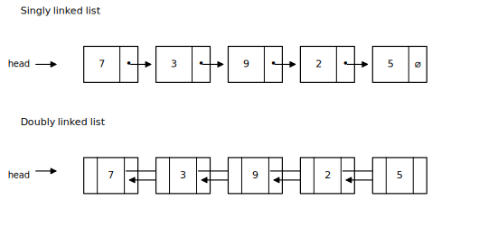
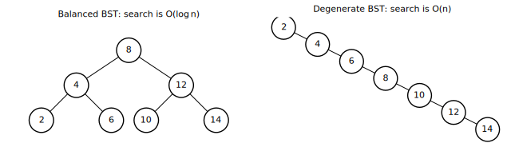
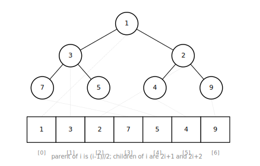
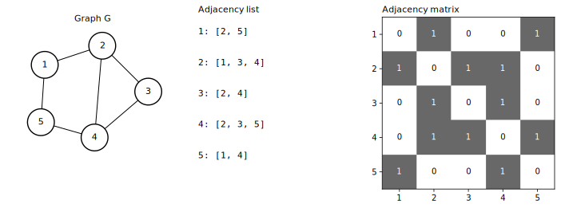
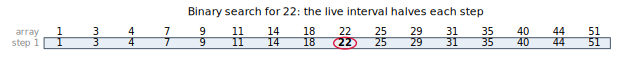
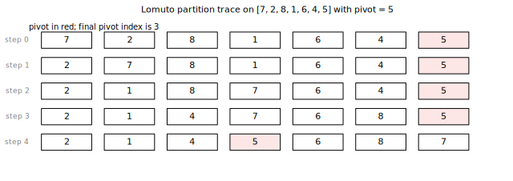
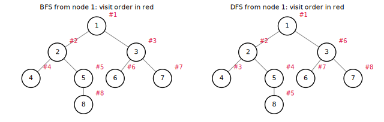
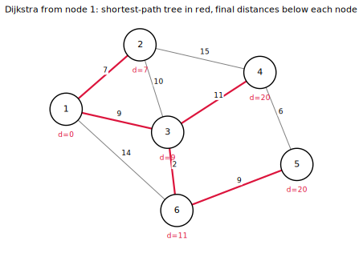
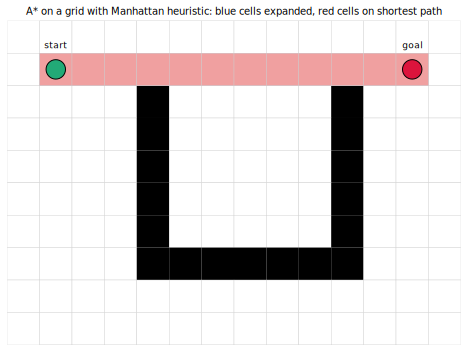
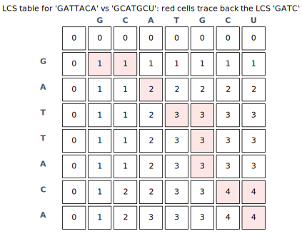

+++
title = "Algorithms and Data Structures"
date = 2026-05-18
description = "A practical tour of the foundational data structures and algorithms every programmer should know, with complexity analyses and Python implementations."

[taxonomies]
tags = ["algorithms", "data-structures", "computer-science"]
categories = ["notes"]

[extra]
math = true
+++

## Why complexity matters

A program is correct when it returns the right answer, and good when it returns that answer quickly without wasting memory. Algorithm analysis quantifies the second half. The standard tool is _asymptotic_ complexity, a bound on how the running time or memory usage grows as the input gets large, expressed in a notation that hides constants and lower-order terms.

We care about asymptotics because constants depend on the machine, the compiler, the language, and even what the cache happened to hold last microsecond. The shape of the growth, in contrast, is intrinsic to the algorithm. A linear-time program will eventually beat a quadratic-time program on any sufficiently large input, regardless of how clever the constant factor is.


For functions $f, g: \mathbb{N} \to \mathbb{R}\_{\ge 0}$:

1. $f(n) = O(g(n))$ if there exist constants $C > 0$ and $n\_0$ with $f(n) \le C\, g(n)$ for all $n \ge n\_0$. The function $g$ is an asymptotic upper bound for $f$.
2. $f(n) = \Omega(g(n))$ if there exist $c > 0$ and $n\_0$ with $f(n) \ge c\, g(n)$ for all $n \ge n\_0$. The function $g$ is an asymptotic lower bound.
3. $f(n) = \Theta(g(n))$ if both $f(n) = O(g(n))$ and $f(n) = \Omega(g(n))$ hold, ie, the growth rates match up to constants.
   

Time and space are reported separately because they trade off. Recursive depth costs stack frames; caching intermediate results costs heap memory; using a more compact representation often multiplies the time per operation by a logarithm. Every analysis below states both.


A single operation can be slow even if the average over a long sequence is fast. The canonical example is the dynamic array (Python's `list`): appending costs $O(1)$ most of the time, but every so often the backing buffer doubles in size, which is an $O(n)$ copy. The amortised cost per append is still $O(1)$, because each copy is paid for by the $n$ cheap appends that preceded it. This kind of accounting lets us report a meaningful per-operation cost without lying about the occasional spike. The heap's build operation and quicksort's worst case will both invoke similar reasoning.


The rest of this post pairs each data structure with the algorithms that use it, gives the time and space costs with one-sentence justifications, and shows a small Python implementation. The Python is meant to be read, not benchmarked: the standard library's `collections`, `heapq`, and `bisect` modules are what you should reach for in production. The point here is to know what they do.

## Linked lists

A linked list stores a sequence as a chain of nodes, each holding a value and a reference to the next node. Compared to an array, it gives up random access to gain $O(1)$ insertion and deletion at any point where you already hold a node reference. The trade-off shows up wherever the access pattern is "walk forwards and edit": LRU caches, undo histories, the run queues inside a kernel scheduler.

{{ include_code(path="content/blog/algorithms-and-data-structures/plots.py", syntax="python", start=21, end=60) }}

`push_front` and `pop_front` work in constant time because they touch only the head pointer. `push_back` walks to the end and costs $O(n)$; the standard fix is to keep a tail pointer too, after which `push_back` becomes $O(1)$. `find` is $O(n)$ in the worst case because the only way to locate a value is to traverse. `reverse` is $O(n)$ time and $O(1)$ extra space: the three-pointer dance reuses the existing nodes and just flips each `next` field as it walks.

A _doubly_ linked list adds a `prev` pointer, which costs an extra pointer per node but lets you walk the list in both directions and delete a known node without first finding its predecessor:

{{ include_code(path="content/blog/algorithms-and-data-structures/plots.py", syntax="python", start=62, end=67) }}

<figure>

<figcaption>A singly linked list (top) walks one way; a doubly linked list (bottom) walks both ways at the cost of an extra pointer per node.</figcaption>
</figure>


The two structures are duals. Arrays give $O(1)$ indexed access and amortised $O(1)$ append at the cost of $O(n)$ insertion or deletion in the middle, because everything to the right of the inserted slot has to shift. Linked lists give $O(1)$ insertion or deletion at a known node at the cost of $O(n)$ indexed access. Memory tells a similar story: arrays are contiguous and cache-friendly, lists are scattered across the heap and require an extra pointer per element. Choose by access pattern. If you index, use an array. If you splice or stitch, use a list.


## Trees and binary trees

A tree is a connected acyclic graph with one node designated as the root. Every other node has exactly one parent, and the depth of a node is the number of edges on the path back to the root. Trees model anything with a hierarchy: filesystems, expression syntax, taxonomies, the call stack of a running program.

A _binary tree_ restricts each node to at most two children, conventionally called `left` and `right`. The restriction unlocks a clean array-of-pointers representation and makes recursive algorithms easy to express. The most useful specialisation is the _binary search tree_ (BST), which adds an ordering invariant: every node's left subtree contains strictly smaller values and its right subtree contains strictly larger values. The invariant gives logarithmic search on balanced trees, because at each step you can rule out an entire subtree.

{{ include_code(path="content/blog/algorithms-and-data-structures/plots.py", syntax="python", start=69, end=96) }}

The cost of `bst_search` is $O(h)$ where $h$ is the tree's height, because the loop descends at most one node per level. On a balanced tree of $n$ nodes, $h = \lceil \log\_2 n \rceil$, giving $O(\log n)$ search. On a degenerate tree (think of inserting $1, 2, 3, \ldots, n$ in order: every right child is the next value and the tree becomes a linked list), $h = n$ and search is $O(n)$.

<figure>

<figcaption>Same values, very different shapes. The BST invariant fixes the relative position of left and right children, not the overall balance.</figcaption>
</figure>

Practical BST implementations therefore rebalance after insertions and deletions. AVL trees enforce a strict height-balance constraint at each node; red-black trees enforce a weaker colour-based constraint that allows looser balancing in exchange for cheaper rotations. Both keep operations in $O(\log n)$ worst case. Python does not ship a balanced BST, but `sortedcontainers.SortedList` and `bisect` on top of a sorted array are common stand-ins.

Tree traversals come in three orders depending on when the root is visited relative to its subtrees. _Preorder_ visits the root, then recurses left, then right, which is useful for serialising a tree. _Inorder_ recurses left, visits the root, then recurses right; on a BST this returns the values in sorted order, which the `inorder` function above demonstrates. _Postorder_ recurses both children before visiting the root, which is useful when a node's work depends on its descendants (think computing subtree sums or freeing a tree). A fourth order, _level-order_, visits the tree breadth-first; we defer it to the BFS section because it is BFS on the tree.


Search, insert, and delete cost $O(h)$ time and $O(h)$ recursion-stack space, where $h$ is the tree height. On a balanced tree, $h = \Theta(\log n)$; on a degenerate chain, $h = \Theta(n)$. Storage is $\Theta(n)$ regardless of shape: one node per value, each holding two child pointers.


## Heaps

A binary heap is an array dressed up as a tree. The array represents a complete binary tree (every level filled left to right except possibly the last), and the parent/child relationships are read directly from the indices: the parent of index $i$ sits at $(i - 1) / 2$, and the children of $i$ sit at $2i + 1$ and $2i + 2$. The _heap property_ adds an ordering rule on top of the shape: in a _min-heap_, every parent is less than or equal to both of its children. Therefore the minimum lives at the root, ready to be read in $O(1)$.

{{ include_code(path="content/blog/algorithms-and-data-structures/plots.py", syntax="python", start=98, end=135) }}

`push` appends to the end (preserving the complete-tree shape) and then sifts up, swapping with the parent until the heap property is restored. `pop` removes the root, moves the last element into its place, and sifts down. Both operations touch at most one node per level of the tree, so they cost $O(\log n)$ because a complete binary tree of $n$ nodes has height $\lfloor \log\_2 n \rfloor$. Storage is $\Theta(n)$: one array slot per value, no per-node pointer overhead.

<figure>

<figcaption>The tree view is conceptual; the array is the actual data. Index arithmetic is the bridge.</figcaption>
</figure>

Building a heap from an arbitrary unsorted array is the textbook example of a non-obvious complexity result. The naive approach, $n$ successive pushes, costs $O(n \log n)$. The smarter approach starts from the last internal node and calls `_sift_down` on each node up to the root, which is what the constructor above does. This costs $O(n)$, not $O(n \log n)$. The reason is that nodes near the leaves do almost no work (a leaf-level node never sifts at all, and there are $n / 2$ such nodes), while nodes near the root do logarithmic work but there are only a handful of them. Summing the per-level work gives a geometric series in $n$, which converges to a constant times $n$.


A heap is what you want whenever the question is "give me the smallest (or largest) element still pending". It powers Dijkstra and A\* later in this post, the event loop of a discrete-event simulator, the K-smallest-elements problem (use a max-heap of size $K$), and Huffman coding. Python's `heapq` module is a min-heap on a regular list using exactly the index arithmetic shown above.


## Graphs

A graph $G = (V, E)$ is a set of vertices $V$ together with a set of edges $E \subseteq V \times V$. Edges may be _directed_ (one-way streets, dependency relations) or _undirected_ (friendships, road segments with two-way traffic), and may carry a numerical _weight_ (a distance, a cost, a probability). Graphs are the most general of the structures in this post, and most non-trivial algorithms in routing, planning, networking, and data integrity reduce to a graph problem.

Two representations dominate. The _adjacency list_ stores, for each vertex, the list of its outgoing neighbours (and edge weights, if any). The _adjacency matrix_ stores a $|V| \times |V|$ matrix whose entry $(i, j)$ is the weight of the edge from $i$ to $j$, or infinity if no such edge exists.

{{ include_code(path="content/blog/algorithms-and-data-structures/plots.py", syntax="python", start=137, end=164) }}

<figure>

<figcaption>The same graph in three views. The matrix is symmetric because the graph is undirected.</figcaption>
</figure>

The right choice between the two depends on how the graph is queried and how dense it is. The list uses $\Theta(V + E)$ space, because every vertex contributes one bucket and every edge contributes one entry. The matrix always uses $\Theta(V^2)$ space, because every potential edge has a slot, populated or not. On _sparse_ graphs (where $E$ is closer to $V$ than to $V^2$, which is most real-world graphs), the list is dramatically more compact and faster to iterate. On _dense_ graphs, where most pairs are connected, the matrix wins on cache behaviour and on edge-existence queries.


For a graph on $V$ vertices and $E$ edges, the adjacency list uses $\Theta(V + E)$ storage and answers a "list the neighbours of $u$" query in $\Theta(\deg u)$ time, but checking whether a specific edge $(u, v)$ exists requires scanning $u$'s neighbour list at the same cost. The adjacency matrix uses $\Theta(V^2)$ storage regardless of edge count and answers the edge-existence query in $\Theta(1)$, but listing the neighbours of $u$ takes $\Theta(V)$ because the algorithm has to scan a whole row including the non-edges. Iterating all edges is $\Theta(V + E)$ on the list and $\Theta(V^2)$ on the matrix. Most graph algorithms in this post iterate neighbours rather than test individual pairs, so the adjacency list is the default and is what the rest of the post uses.


## Binary search

Binary search is the prototypical example of how sorting unlocks logarithmic search. Given a sorted array and a target, repeatedly compare against the middle element and discard the half that cannot contain the target. After $k$ iterations the live region has shrunk by a factor of $2^k$, so finding (or ruling out) the target takes at most $\lceil \log\_2 n \rceil$ comparisons.

{{ include_code(path="content/blog/algorithms-and-data-structures/plots.py", syntax="python", start=166, end=178) }}

The loop maintains the invariant that, if the target exists in the array, it lies in the half-open interval $[lo, hi)$. Initially $lo = 0$ and $hi = n$, so the invariant holds vacuously. Each iteration either returns the matching index, or shrinks the interval by replacing one of the endpoints with `mid + 1` or `mid`. The interval halves in size every iteration, so the loop runs at most $\lceil \log\_2 n \rceil + 1$ times before $lo \ge hi$ and we conclude the target is absent.

<figure>

<figcaption>Each step circles the midpoint of the live interval and discards the half on the wrong side of it.</figcaption>
</figure>

Solving the recurrence $T(n) = T(n / 2) + O(1)$ gives $T(n) = O(\log n)$ directly: at each level of the recursion we do constant work, and there are $\log\_2 n$ levels. Space is $O(1)$ because the iterative version above keeps only two indices.


The boundary conditions of binary search are infamous. The version above uses the half-open convention $[lo, hi)$ with initial $hi = n$; many textbooks use the closed convention $[lo, hi]$ with initial $hi = n - 1$ and the loop condition `lo <= hi`. Both are correct if you stay consistent; the bugs come from mixing them. The half-open form generalises more cleanly to "find the leftmost index whose value is at least the target", which is `bisect_left` in Python's standard library.


## Quicksort

Quicksort sorts an array in place by repeatedly partitioning around a chosen pivot. The Lomuto scheme picks the last element as the pivot, sweeps a pointer through the rest of the array swapping anything at most the pivot to the front, and finally places the pivot in the boundary slot. After the partition, every element to the left of the pivot is at most the pivot and every element to the right is at least the pivot, so the pivot is in its final sorted position and the two sides can be sorted independently.

{{ include_code(path="content/blog/algorithms-and-data-structures/plots.py", syntax="python", start=180, end=201) }}

<figure>

<figcaption>Each step of the partition swaps the next element at most the pivot into the growing "small" prefix. The final step swaps the pivot into its sorted position.</figcaption>
</figure>

The randomised pivot (the `k = int(rng.integers(...))` line) is the small piece of magic that makes quicksort behave well in practice. With a fixed pivot, the worst case (already sorted input, every pivot is the maximum, every partition splits into 0 and $n - 1$) costs $T(n) = T(n - 1) + O(n) = O(n^2)$. With a randomly chosen pivot, the expected split is balanced and the recurrence becomes $T(n) = 2\, T(n / 2) + O(n) = O(n \log n)$. The $O(n)$ work per level pays for the partition sweep, and the $\log n$ levels come from halving the input size each time.

Space cost is the call-stack depth, which is $O(\log n)$ in the expected case and $O(n)$ in the worst case. The in-place partition itself uses only $O(1)$ extra memory. Tail-call elimination, available in Python only by hand-rolling an explicit stack, can bound the worst-case stack at $O(\log n)$ by always recursing on the smaller side first.


Any comparison-based sort, ie, any algorithm that decides the order by asking "is $a < b$?", must perform $\Omega(n \log n)$ comparisons in the worst case. The argument is a decision-tree counting bound: there are $n!$ possible orderings of the input, the algorithm must produce a different sequence of comparison outcomes for each, and a binary tree with $n!$ leaves has depth at least $\log\_2 n! = \Theta(n \log n)$ by Stirling's approximation. Quicksort, mergesort, and heapsort all meet this bound up to constants. Sorts that beat it (radix sort, counting sort) only work because they do something other than compare, such as bucketing by digit.


## Breadth-first and depth-first search

BFS and DFS share a single skeleton: keep a frontier of vertices waiting to be explored, repeatedly pop one out, mark it visited, and push its unvisited neighbours. The only difference is the data structure: BFS uses a FIFO queue, so it explores in the order vertices were discovered (oldest first) and visits all hop-distance-1 neighbours before any hop-distance-2 neighbours. DFS uses a LIFO stack (or the program's call stack, if recursive), so it dives down one path as far as possible before backtracking.

{{ include_code(path="content/blog/algorithms-and-data-structures/plots.py", syntax="python", start=203, end=213) }}

BFS uses `collections.deque` so that `popleft` is $O(1)$; a plain Python list would make it $O(n)$. The `seen` set is checked _before_ pushing, not after popping, so that each vertex enters the queue at most once.

{{ include_code(path="content/blog/algorithms-and-data-structures/plots.py", syntax="python", start=215, end=241) }}

DFS comes in two forms. The recursive version is short and matches the textbook definition exactly, but its stack depth equals the longest path explored, which is $\Theta(V)$ in the worst case; Python's default recursion limit of $1000$ makes this a real problem on large graphs. The iterative version trades the call stack for an explicit `stack` list, which moves the depth into the heap and avoids the limit. The `reversed(...)` in the iterative version is cosmetic: it makes the visit order match the recursive version, which is convenient when comparing the two implementations.

<figure>

<figcaption>Same graph, two traversal orders. BFS walks level by level; DFS plunges down one branch before backtracking.</figcaption>
</figure>

Both algorithms cost $O(V + E)$ time on an adjacency-list graph. Every vertex is popped exactly once because the `seen` check guarantees it. Every edge is examined at most twice (once from each endpoint, on an undirected graph) because each edge appears in exactly two adjacency lists. Space is $O(V)$ for the `seen` set, plus $O(V)$ in the worst case for the frontier (BFS can have an entire level queued at once; DFS can have an entire root-to-leaf path on its stack). On an adjacency-matrix graph, the time becomes $O(V^2)$ because finding the neighbours of a vertex costs $O(V)$.

The applications split along the queue-vs-stack divide. BFS is the right tool for shortest paths in unweighted graphs, level-order tree traversal, and exploring "all locations reachable in at most $k$ steps". DFS is the right tool for topological sort, finding connected components, detecting cycles, computing biconnected components, and (with extra bookkeeping) Tarjan's strongly-connected-components algorithm. Most non-trivial graph algorithms have a BFS or DFS at their core.

## Dijkstra's algorithm

Dijkstra solves the single-source shortest-path problem on graphs with non-negative edge weights. It generalises BFS: where BFS expands the closest unsettled vertex by hop count, Dijkstra expands the closest unsettled vertex by total weight. The substitution is what makes a priority queue (heap) the natural data structure.

{{ include_code(path="content/blog/algorithms-and-data-structures/plots.py", syntax="python", start=243, end=259) }}

The algorithm maintains a tentative distance from the source to each vertex, initially $\infty$ for everyone except the source itself. It repeatedly pops the unsettled vertex with the smallest tentative distance, _relaxes_ each outgoing edge (if `dist[u] + w(u, v) < dist[v]`, update and remember the new path), and then treats that vertex as settled. The correctness invariant is: at the moment a vertex is popped, its tentative distance equals its true shortest-path distance. Any alternative path would have to leave the settled set, traverse a vertex with strictly larger tentative distance, and come back, which can only make the total longer because all weights are non-negative.

The implementation uses the standard "lazy deletion" trick: when a shorter path to a vertex is found, the new `(distance, vertex)` tuple is pushed without removing the stale one already in the heap. The `if d > dist[u]: continue` check at the top of the loop discards the stale entries when they bubble to the top. The alternative, a decrease-key operation that lowers an existing entry's priority in place, is faster asymptotically but requires either a more complex heap or auxiliary bookkeeping that `heapq` does not provide.

<figure>

<figcaption>Dijkstra from node 1 on a small weighted graph. The red edges form the shortest-path tree; the numbers below each node are the final distances.</figcaption>
</figure>

Cost is $O((V + E) \log V)$ with a binary heap. In the worst case each of the $E$ edges triggers a heap push, so the heap holds $O(E)$ items and each push or pop costs $O(\log E) = O(\log V)$ (since $E \le V^2$, so $\log E = O(\log V)$). The $V$ initial pushes plus the $E$ relaxations plus $E + V$ pops, each at $\log V$, gives the stated bound. With a Fibonacci heap, decrease-key becomes amortised $O(1)$ and the bound improves to $O(E + V \log V)$, but in practice the binary heap wins because of constant factors.


Dijkstra's correctness relies on non-negative weights. With a negative edge, a longer-in-hops path can have a lower total weight, and a vertex that has already been settled might actually have a shorter path that goes through some unsettled vertex first. The Bellman-Ford algorithm handles negative weights at the cost of $O(V E)$ time, and additionally detects negative cycles. Johnson's algorithm reweights the graph using Bellman-Ford once to make it Dijkstra-safe, then runs Dijkstra from every source for all-pairs shortest paths.


## A\*

A\* (pronounced "A-star") is Dijkstra augmented with a _heuristic_ that estimates the remaining cost to the goal. Where Dijkstra expands vertices in order of distance from the source, A\* expands them in order of $f(n) = g(n) + h(n)$, with $g(n)$ the actual distance from the source (same as Dijkstra's tentative distance) and $h(n)$ a heuristic estimate of the distance from $n$ to the goal. When $h$ is informative, A\* explores far fewer vertices than Dijkstra by ignoring those whose total estimated cost is clearly suboptimal.

{{ include_code(path="content/blog/algorithms-and-data-structures/plots.py", syntax="python", start=261, end=291) }}

The example operates on a 4-connected grid with unit edge costs and an obstacle layout. The heuristic is _Manhattan distance_, $|r\_1 - r\_2| + |c\_1 - c\_2|$, which is the true minimum number of grid steps between two cells when no obstacles intervene and movement is restricted to the four cardinal directions.

<figure>

<figcaption>A\* on a grid with a Manhattan heuristic. Blue cells are those A\* expanded; red cells form the final shortest path. A breadth-first search would expand every reachable cell.</figcaption>
</figure>

The heuristic must satisfy two properties to guarantee optimality. _Admissibility_ means $h(n) \le h^{\ast}(n)$, the true remaining cost; the heuristic never overestimates. _Consistency_ (or monotonicity) means $h(n) \le c(n, n') + h(n')$ for every neighbour $n'$ of $n$, where $c$ is the edge cost. Consistency implies admissibility and additionally guarantees that the first time A\* pops a vertex, its $g$-value is already optimal, so no vertex is ever expanded twice. Manhattan distance on a uniform 4-connected grid is consistent. Euclidean distance is consistent on a graph whose edge costs equal Euclidean lengths.

Asymptotic cost is the same as Dijkstra's in the worst case, $O((V + E) \log V)$. The whole point of A\* is the _constant factor_. With a perfect heuristic (one equal to $h^{\ast}$), only the cells on the shortest path get expanded; with an uninformative one (such as $h \equiv 0$), A\* degenerates back to Dijkstra. In practice, robotics and game pathfinding use A\* with hand-tuned heuristics because the constants matter more than the big-O when planning runs sixty times a second.

## Dynamic programming

Dynamic programming (DP) is the technique of solving a problem by combining the solutions to a small number of smaller, overlapping subproblems. It applies when the problem exhibits two properties together: _optimal substructure_ (an optimal solution can be written in terms of optimal solutions to subproblems) and _overlapping subproblems_ (the same subproblems are needed by many branches of the recursion). Caching the subproblem answers turns an exponential-time recursion into a polynomial-time table fill.

There are two flavours, both computing the same answer. _Top-down_ (memoisation) writes the natural recursive solution and adds a cache, so each subproblem is solved at most once. _Bottom-up_ (tabulation) iterates in an order that fills the cache without recursion, which avoids stack overhead and sometimes allows space optimisation by discarding rows of the table that are no longer needed.

The Fibonacci numbers illustrate the technique with no algorithmic content of their own:

{{ include_code(path="content/blog/algorithms-and-data-structures/plots.py", syntax="python", start=293, end=314) }}

The naive recursion computes $F\_n$ in $\Theta(\phi^n)$ time where $\phi = (1 + \sqrt{5}) / 2 \approx 1.618$, because the recursion tree has approximately $F\_n$ leaves and $F\_n$ grows like $\phi^n$. Memoising reduces this to $O(n)$ time and $O(n)$ space, because each of the $n + 1$ subproblems is computed once. The tabulated `fib_tab` further shaves space to $O(1)$ by keeping only the rolling pair $(F\_{i - 1}, F\_i)$ instead of the whole table. The $O(n)$ time is itself dominated by the $O(\log n)$ multiplications of $n$-digit numbers, so the wall-clock cost is technically $O(n^2)$ in arbitrary precision; we usually pretend integer arithmetic is $O(1)$.

The 0/1 knapsack problem is the standard worked example of "real" DP. Given $n$ items with weights $w\_i$ and values $v\_i$, and a capacity $W$, choose a subset (each item taken at most once, hence "0/1") that maximises total value subject to total weight at most $W$.

{{ include_code(path="content/blog/algorithms-and-data-structures/plots.py", syntax="python", start=316, end=326) }}

The table entry `dp[i][c]` holds the best value achievable using items $1$ through $i$ with capacity $c$. The recurrence is "either skip item $i$ (inherit `dp[i - 1][c]`), or take it (gain $v\_i$ and lose $w\_i$ of capacity, going to `dp[i - 1][c - w_i] + v_i`)". The table has $(n + 1)(W + 1)$ entries each filled in $O(1)$ time, giving $O(n W)$ time and space. A 1D space optimisation iterates `c` from `W` down to `w_i` and writes back into the same row, dropping the cost to $O(W)$ memory.


$O(n W)$ looks polynomial, but $W$ enters as a numerical value, not as a bit-length. Doubling the capacity from $10^9$ to $2 \cdot 10^9$ doubles the running time even though the input representation only grew by one bit. Algorithms with this property are called _pseudo-polynomial_, and knapsack remains NP-hard because any genuinely polynomial algorithm (one whose running time is polynomial in $\log W$, the number of bits) would resolve P vs NP.


The longest common subsequence (LCS) of two strings $x$ and $y$ is the longest string that appears as a subsequence (not necessarily contiguous) of both. It is the heart of `diff` tools, biological sequence alignment, and spell-checkers that rank suggestions by edit similarity.

{{ include_code(path="content/blog/algorithms-and-data-structures/plots.py", syntax="python", start=328, end=347) }}

The entry `dp[i][j]` is the LCS length of the prefixes `x[:i]` and `y[:j]`. The recurrence is "if the last characters match, the LCS is one longer than the LCS of the strings without that character; otherwise it is the better of dropping the last character of $x$ or of $y$". The table is $(m + 1)(n + 1)$ entries, each filled in $O(1)$, giving $O(m n)$ time and space. Reconstructing the LCS itself walks the table from the bottom-right corner back to the origin, choosing at each step the predecessor that produced the current cell's value, which costs an additional $O(m + n)$ time and produces the string in reverse.

<figure>

<figcaption>The LCS table for two short strings, with the cells visited during traceback shaded. Reading the matches off the staircase reconstructs the LCS.</figcaption>
</figure>


The two preconditions matter. Optimal substructure tells you that the recursion exists; overlapping subproblems tells you that caching it is worthwhile. Without overlap, plain divide-and-conquer (like mergesort) is enough and a cache buys nothing. Without optimal substructure, the subproblem answers cannot be combined into a global optimum and the technique does not apply at all. When both hold, the algorithm-design work reduces to identifying the right state space and the right transition, which is more art than science but gets easier with practice.


## Where to next

Several structures and algorithms with permanent residency on a CS curriculum have been left out for length: balanced BSTs (AVL, red-black), hash tables (chaining vs open addressing, the load-factor analysis), union-find (the $\alpha(n)$ inverse-Ackermann bound is one of the most beautiful results in algorithm analysis), Bellman-Ford and Floyd-Warshall for shortest paths with negative weights, segment trees and Fenwick trees for range queries, suffix arrays and tries for string indexing, and the entire randomised-algorithms toolkit (skip lists, Bloom filters, treaps). The comparison-sort lower bound and the master theorem for divide-and-conquer recurrences deserve their own posts. Each is a relatively short walk from what is here.

The single most useful follow-up is to internalise the cost analyses and start recognising the patterns at the level of "this problem looks like a graph; this one looks like a DP; this one looks like a priority-queue sweep". Most engineering work in this space is recognition, not invention.
