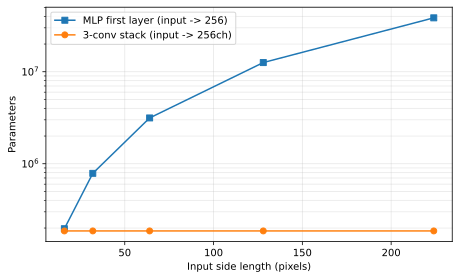
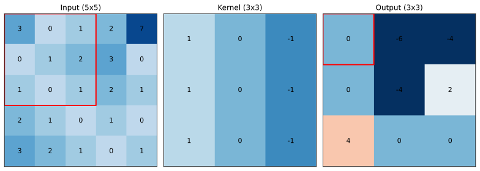
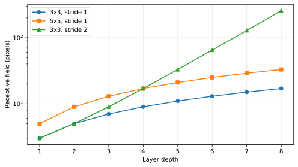
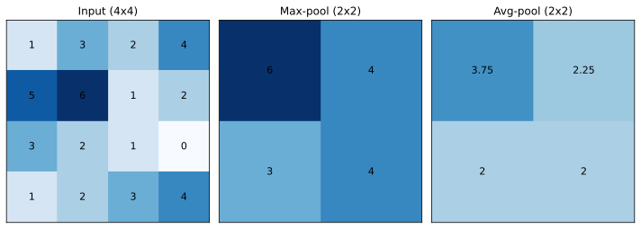
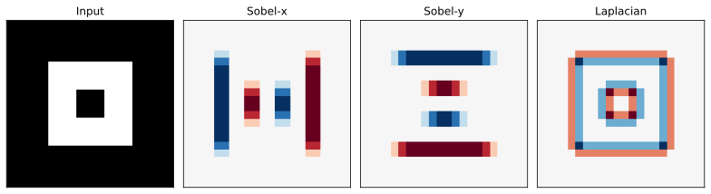
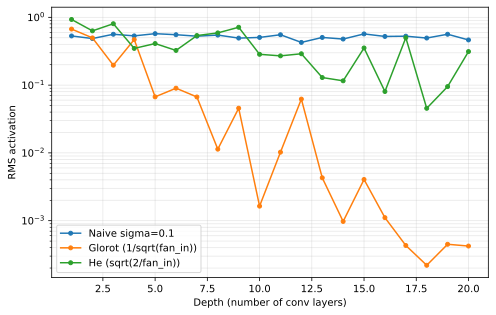

+++
title = "Convolutional Networks"
date = 2026-05-13
description = "A short note on convolutional networks: convolution as a layer, translation equivariance, receptive fields, pooling, channels, backpropagation through convolution, initialisation, and the regularisation knobs that differ from a vanilla MLP."

[taxonomies]
tags = ["machine-learning", "supervised-learning", "deep-learning", "computer-vision"]
categories = ["notes"]

[extra]
math = true
+++

## From MLPs on images to convolutions

The [neural-network](/blog/neural-network/) post built a model that maps a vector $\mathbf{x} \in \mathbb{R}^{D}$ to a prediction by composing affine maps with elementwise non-linearities. That construction is universal in the sense of universal approximation, but it ignores everything we know about the structure of the input.

Take a single $32 \times 32$ RGB image, the standard CIFAR resolution. As a vector it sits in $\mathbb{R}^{3072}$. A first hidden layer of width $1024$ already needs $3072 \times 1024 \approx 3.1$ million parameters, before any of the deeper layers. Worse, every weight in that layer is independent: the parameter that decides how much pixel $(0, 0, R)$ contributes to hidden unit $7$ is unrelated to the parameter for the same red channel one pixel to the right. The model has no idea that those two pixels are spatially adjacent, that an edge in one corner of the image and an identical edge in another corner are the same kind of feature, or that small translations of the input ought to leave the answer essentially unchanged.

Convolutional networks fix exactly this. The hidden layer is replaced by a **convolution**: a small bank of filters is slid across the input, computing the same dot product at every spatial location. Two structural properties follow directly. **Weight sharing** drops the parameter count from "input pixels times hidden units" to "kernel size times channel counts," independent of image size. **Translation equivariance** guarantees that a shifted input produces a correspondingly shifted output, so the same filter detects the same feature regardless of where it appears.

<figure>

<figcaption>A first MLP layer mapping image to a $256$-dim hidden vector grows quadratically with input side length. A three-layer stack of $3 \times 3$ convolutions ending in $256$ channels has the same parameter count regardless of input size, because the kernels are tied across spatial positions.</figcaption>
</figure>

The rest of the network is unchanged from the MLP picture: stack convolutional layers with non-linearities, end in a regression or classification head from the [linear-regression](/blog/linear-regression/) and [logistic-regression](/blog/logistic-regression/) posts, train by backpropagation against the same loss. What changes is the layer itself, the gradient that flows through it, the right way to initialise it, and a handful of regularisation choices that look different from the fully-connected case.

## The convolution operation

Treat the input to a layer as a 3D tensor $\mathbf{x} \in \mathbb{R}^{H \times W \times C\_{\text{in}}}$ with spatial dimensions $H \times W$ and $C\_{\text{in}}$ channels. A **kernel** (or **filter**) is a 4D tensor $\mathbf{w} \in \mathbb{R}^{k\_H \times k\_W \times C\_{\text{in}} \times C\_{\text{out}}}$ with spatial size $k\_H \times k\_W$, the same input-channel count as the input, and $C\_{\text{out}}$ output channels. The bias is a vector $\mathbf{b} \in \mathbb{R}^{C\_{\text{out}}}$.

The discrete 2D **convolution layer** computes, for each output position $(i, j)$ and each output channel $c$,


y_{i, j, c} = \sum_{u=0}^{k_H - 1} \sum_{v=0}^{k_W - 1} \sum_{d=0}^{C_{\text{in}} - 1} w_{u, v, d, c}\, x_{i + u, j + v, d} \,+\, b_{c}.


This is what deep-learning libraries call "convolution," but it is properly **cross-correlation**: the kernel is applied without flipping. True signal-processing convolution flips the kernel along both spatial axes; the difference is irrelevant in a learnt model because the optimiser will absorb the flip into the weights. We follow library convention throughout.

The output spatial size depends on three knobs. **Stride** $s$ moves the kernel by $s$ pixels between consecutive evaluations rather than $1$. **Padding** $p$ pads the input with zeros on each side before applying the kernel; common choices are **valid** ($p = 0$, the output shrinks) and **same** ($p = (k - 1) / 2$ for odd $k$, the output keeps the input spatial size at stride $1$). **Dilation** $r$ inserts $r - 1$ zeros between the kernel taps, expanding the receptive field without adding parameters. With these knobs the output spatial size is


H_{\text{out}} = \left\lfloor \frac{H + 2p - r(k_H - 1) - 1}{s} \right\rfloor + 1,


and an analogous formula in the width dimension.Dumoulin and Visin{{ reference(key="dumoulin2016guide") }} work through every combination of stride, padding, and dilation in pictures. It is the canonical reference whenever an off-by-one error appears.

<figure>

<figcaption>A $3 \times 3$ kernel applied to a $5 \times 5$ input with valid padding produces a $3 \times 3$ output. The highlighted output value is the elementwise product of the kernel with the highlighted input window, summed over the window.</figcaption>
</figure>

The convolution is an affine map followed (eventually) by an activation. Stacking convolutional layers and inserting elementwise non-linearities $\phi$ between them gives the same forward-pass shape as the MLP, with the matrix product replaced by the convolution and the per-unit pre-activation replaced by the per-spatial-location pre-activation:


\mathbf{z}^{(\ell)} = \mathbf{w}^{(\ell)} * \mathbf{a}^{(\ell-1)} + \mathbf{b}^{(\ell)},



\mathbf{a}^{(\ell)} = \phi^{(\ell)}\big(\mathbf{z}^{(\ell)}\big),


with $\mathbf{a}^{(0)} = \mathbf{x}$ and $*$ standing for the cross-correlation in {{ eqref(id="conv-output") }}. Everything in the [neural-network](/blog/neural-network/) post about loss functions, output heads, and the empirical risk transfers verbatim. What we owe is justification for the architectural choice, the gradients of the new layer, and the initialisation and regularisation that suit it.

## Translation equivariance and weight sharing

The structural argument for convolution is that it bakes in the right symmetry for image-like data. A function $f$ acting on images is **translation equivariant** if shifting its input by an integer offset shifts its output by the same offset:


f\big(T_{(\Delta i, \Delta j)} \mathbf{x}\big) = T_{(\Delta i, \Delta j)} f(\mathbf{x}),


where $(T\_{(\Delta i, \Delta j)} \mathbf{x})\_{i, j, c} = x\_{i - \Delta i,\, j - \Delta j,\, c}$ on the (formally infinite) integer grid. The right-hand $T$ acts on the output spatial axes.


For any kernel $\mathbf{w}$, bias $\mathbf{b}$, and input $\mathbf{x}$, the cross-correlation in {{ eqref(id="conv-output") }} satisfies
$$\mathbf{w} * T\_{(\Delta i, \Delta j)} \mathbf{x} \,+\, \mathbf{b} = T\_{(\Delta i, \Delta j)} \big(\mathbf{w} * \mathbf{x} \,+\, \mathbf{b}\big),$$
on the infinite grid (and on a finite grid up to boundary effects).



Substitute $x'\_{i, j, d} = x\_{i - \Delta i,\, j - \Delta j,\, d}$ into {{ eqref(id="conv-output") }}:

$$
\begin{aligned}
y'\_{i, j, c}
&= \sum\_{u, v, d} w\_{u, v, d, c}\, x\_{i + u - \Delta i,\, j + v - \Delta j,\, d} + b\_c \\\\
&= y\_{i - \Delta i,\, j - \Delta j,\, c}.
\end{aligned}
$$

The bias is independent of position, so it contributes the same constant before and after the shift. Stacked convolutional layers preserve the property by composition: $f \circ g$ commutes with translation whenever both $f$ and $g$ do. $\square$


Equivariance is what justifies weight sharing. The same kernel detects the same feature whether it appears at $(0, 0)$ or at $(15, 22)$, and the parameter count therefore depends only on the kernel size and the channel widths, not on the input resolution. By contrast, the dense MLP has no analogous symmetry: the parameter coupling pixel $(0, 0)$ to hidden unit $j$ is independent of the parameter coupling pixel $(15, 22)$ to the same unit, so the model has to relearn every feature at every position from data.


Translation equivariance moves the output by the same shift as the input; **invariance** would mean the output does not change at all. Pure convolutions are equivariant, never invariant. Image classifiers achieve approximate invariance by following the convolutional stack with a global pooling step that collapses the spatial axes (typically a global average pool just before the final classification head). Other useful symmetries, ie rotation and reflection, are not built in by standard convolution and are usually injected through data augmentation or specialised group-equivariant layers.


## Receptive field

A unit in layer $\ell$ depends on a contiguous window of pixels in the input, the **receptive field** of that unit. Its size grows as more layers are stacked: the receptive field of a unit in the second conv layer is the union of the kernel windows of every unit in the first layer that feeds it. For a stack of layers with kernel sizes $k\_\ell$, strides $s\_\ell$, and dilations $r\_\ell$, the receptive field at the output of layer $L$ obeys the recurrence


\mathrm{RF}_{\ell} = \mathrm{RF}_{\ell - 1} + \big(r_\ell (k_\ell - 1)\big) \cdot \prod_{j < \ell} s_j, \qquad \mathrm{RF}_{0} = 1.


Three regimes are worth seeing in one picture. Stacking $3 \times 3$ kernels at stride $1$ grows the receptive field linearly with depth ($\mathrm{RF}\_\ell = 2\ell + 1$). Replacing each of those by a single $5 \times 5$ kernel at stride $1$ doubles the slope. Switching to stride $2$ between layers compounds the strides and grows the receptive field exponentially in depth.

<figure>

<figcaption>Receptive field versus depth for three configurations. Stride-$2$ stacks reach the entire input quickly at the cost of spatial resolution; stride-$1$ stacks need many layers to cover even moderate-sized inputs.</figcaption>
</figure>

The practical consequence is that very deep, stride-$1$, $3 \times 3$ stacks (the VGG{{ reference(key="simonyan2015vgg") }} archetype) need many layers to "see" a whole image, while strided or pooled stacks reach the same effective receptive field with far fewer layers. The trade-off is between spatial resolution at deep layers (good for dense-prediction tasks) and contextual reach (good for classification).

## Pooling

A **pooling layer** summarises each non-overlapping spatial window of its input by a fixed aggregation, with no learnable parameters. The two standard choices are max-pooling and average-pooling.


For a $k \times k$ window with stride $s$, the max-pool output is
$$y\_{i, j, c} = \max\_{0 \le u, v < k} x\_{s i + u,\, s j + v,\, c},$$
and the average-pool output is
$$y\_{i, j, c} = \frac{1}{k^{2}} \sum\_{0 \le u, v < k} x\_{s i + u,\, s j + v,\, c}.$$
Both reduce the spatial size to $\big\lfloor (H - k) / s \big\rfloor + 1$ in each spatial dimension and act per channel.


<figure>

<figcaption>Max-pool keeps the strongest activation in each window; average-pool keeps the mean. The output is half the spatial size in each direction at $k = s = 2$.</figcaption>
</figure>

Pooling has two effects. It increases the receptive field of subsequent layers without adding parameters, and it reduces the resolution that downstream layers must process, freeing up compute for more channels or more depth. Max-pool also injects a small amount of translation invariance within the pooling window, since shifting the input by less than the window does not change which value is the maximum. Average-pool is gentler and is the standard choice for the **global pooling** layer that collapses the final spatial map into a per-channel vector before the classification head.

Modern architectures often skip pooling and let strided convolutions do the down-sampling instead, since the latter is learnt and the former is not. The trade-off is parameters and computation against the small amount of free invariance that pooling provides, and the resulting architectures are otherwise indistinguishable.

## Channels and the multi-channel kernel

The kernel shape $k\_H \times k\_W \times C\_{\text{in}} \times C\_{\text{out}}$ deserves a closer look. Each output channel $c$ has its own bank of $C\_{\text{in}}$ spatial kernels of size $k\_H \times k\_W$. The output value at position $(i, j, c)$ is the sum, over input channels, of a 2D cross-correlation between the input channel $d$ and the spatial kernel $w\_{:, :, d, c}$, plus the bias. Equivalently, every output channel is a learnt linear combination of $C\_{\text{in}}$ spatial filters, one per input channel.

The parameter count of one convolutional layer is


P_{\text{conv}} = k_H \cdot k_W \cdot C_{\text{in}} \cdot C_{\text{out}} + C_{\text{out}}.


The bias is the trailing $C\_{\text{out}}$ term. The fully connected equivalent of a layer that maps a $H \times W \times C\_{\text{in}}$ feature map to one of size $H \times W \times C\_{\text{out}}$ would have $H^{2} W^{2} C\_{\text{in}} C\_{\text{out}}$ parameters; the convolutional version replaces every spatial-position pair by a single shared $k\_H \times k\_W$ window, dropping the parameter count by a factor of $H W / (k\_H k\_W)$ which can be three or four orders of magnitude on a typical image.

One special case is worth a name. A $1 \times 1$ convolution has $C\_{\text{in}} \cdot C\_{\text{out}} + C\_{\text{out}}$ parameters and acts as a per-position fully-connected layer along the channel axis. It is the standard tool for adjusting channel widths between blocks (the bottleneck construction in ResNet, the projection step in MobileNet, and the channel-mixing layer in modern transformer-style vision models).

<figure>

<figcaption>Three hand-designed $3 \times 3$ filters applied to a toy input. Sobel-x highlights vertical edges, Sobel-y highlights horizontal edges, and the Laplacian highlights any edge regardless of orientation. A trained CNN learns its own bank of filters of this kind in the first layer; deeper layers recombine them into more abstract patterns.</figcaption>
</figure>

## Backpropagation through convolution

Backpropagation through a convolutional layer reuses the chain rule from the [neural-network](/blog/neural-network/) post; the only thing to compute is the per-layer Jacobian of the convolution itself. As before, define $\boldsymbol{\delta}^{(\ell)} = \partial \ell / \partial \mathbf{z}^{(\ell)}$, the gradient of the loss with respect to the pre-activation of layer $\ell$, propagated by the recurrence in {{ mref(kind="proposition", id="bp-recurrence") }} of the [neural-network](/blog/neural-network/) post (with the matrix multiplication replaced by the structure-aware operations below).


Let $\mathbf{a}^{(\ell-1)}$ be the input to layer $\ell$ and $\boldsymbol{\delta}^{(\ell)}$ the gradient of the loss with respect to the pre-activation $\mathbf{z}^{(\ell)}$. Then
$$\frac{\partial \ell}{\partial w^{(\ell)}\_{u, v, d, c}} = \sum\_{i, j} \delta^{(\ell)}\_{i, j, c}\, a^{(\ell-1)}\_{i + u,\, j + v,\, d}.$$
In tensor form, the gradient w.r.t. the kernel is itself a cross-correlation between the input feature map and the upstream gradient map, summed over spatial positions.



Differentiate {{ eqref(id="conv-output") }} with respect to $w^{(\ell)}\_{u, v, d, c}$. The pre-activation $z^{(\ell)}\_{i, j, c'}$ depends on $w^{(\ell)}\_{u, v, d, c}$ only when $c' = c$, with derivative $a^{(\ell-1)}\_{i + u,\, j + v,\, d}$. The chain rule then gives

$$
\begin{aligned}
\frac{\partial \ell}{\partial w^{(\ell)}\_{u, v, d, c}}
&= \sum\_{i, j, c'} \frac{\partial \ell}{\partial z^{(\ell)}\_{i, j, c'}} \cdot \frac{\partial z^{(\ell)}\_{i, j, c'}}{\partial w^{(\ell)}\_{u, v, d, c}} \\\\
&= \sum\_{i, j} \delta^{(\ell)}\_{i, j, c}\, a^{(\ell-1)}\_{i + u,\, j + v,\, d}.
\end{aligned}
$$

Summing the spatial axes is the cross-correlation between $a^{(\ell-1)}\_{:, :, d}$ and $\delta^{(\ell)}\_{:, :, c}$. $\square$



With the same notation,
$$\frac{\partial \ell}{\partial a^{(\ell-1)}\_{i, j, d}} = \sum\_{u, v, c} w^{(\ell)}\_{u, v, d, c}\, \delta^{(\ell)}\_{i - u,\, j - v,\, c},$$
where $\delta^{(\ell)}\_{i, j, c}$ is taken to be zero outside the valid output region. In tensor form, the input gradient is the **full convolution** of $\boldsymbol{\delta}^{(\ell)}$ with the kernel flipped along both spatial axes.



Differentiate {{ eqref(id="conv-output") }} with respect to $a^{(\ell-1)}\_{i, j, d}$. The pre-activation $z^{(\ell)}\_{i', j', c}$ depends on $a^{(\ell-1)}\_{i, j, d}$ only when $i' + u = i$ and $j' + v = j$ for some $(u, v)$ in the kernel support. Re-indexing $i' = i - u$ and $j' = j - v$ gives the claimed sum. The minus signs in the indices are exactly what flips the kernel; the zero-padding outside the valid region of $\boldsymbol{\delta}^{(\ell)}$ is what makes the operation a **full** convolution rather than a valid one. $\square$


The bias gradient is the simplest of the three: $\partial \ell / \partial b^{(\ell)}\_{c} = \sum\_{i, j} \delta^{(\ell)}\_{i, j, c}$, the sum of the upstream gradients over all spatial positions of channel $c$.

The pre-activation gradient $\boldsymbol{\delta}^{(\ell-1)}$ then comes from the input-gradient formula combined with the per-elementwise-activation chain rule from {{ mref(kind="proposition", id="bp-recurrence") }} of the [neural-network](/blog/neural-network/) post:


\boldsymbol{\delta}^{(\ell - 1)} = \frac{\partial \ell}{\partial \mathbf{a}^{(\ell-1)}} \odot \phi^{(\ell-1)\prime}\big(\mathbf{z}^{(\ell-1)}\big).


The complete forward and gradient computations for a valid 2D convolution fit in twenty-odd lines of NumPy, with three nested loops over the output positions:

{{ include_code(path="content/blog/convolutional-network/plots.py", syntax="python", start=14, end=41) }}


For a layer with input shape $H \times W \times C\_{\text{in}}$, kernel $k \times k$, and $C\_{\text{out}}$ output channels at stride $1$, the time per example is $O(H W k^{2} C\_{\text{in}} C\_{\text{out}})$ for the forward pass and the same for the backward pass: each output position pays a $k^{2} C\_{\text{in}} C\_{\text{out}}$ multiply-add, and the gradient computation has the same shape. Activation memory is $O(B H W C)$ summed over layers, dominated by the early high-resolution feature maps. Memory is the practical constraint that pushes practitioners toward strided convs and aggressive channel reduction in early layers.


### A worked example by hand

To make the kernel-gradient formula concrete, consider a single training step on a tiny problem: a $4 \times 4$ single-channel input, a $3 \times 3$ single-channel kernel applied with valid padding and stride $1$, no bias, no activation, and a scalar target equal to the sum of the four output values squared (so the loss is $\ell = \tfrac{1}{2} \lVert \mathbf{y} \rVert^{2}$, which makes the upstream gradient $\boldsymbol{\delta} = \mathbf{y}$). The input and kernel are


\mathbf{x} = \begin{pmatrix} 1 & 0 & 1 & 0 \\ 0 & 1 & 0 & 1 \\ 1 & 0 & 1 & 0 \\ 0 & 1 & 0 & 1 \end{pmatrix}, \qquad \mathbf{w} = \begin{pmatrix} 1 & 0 & -1 \\ 1 & 0 & -1 \\ 1 & 0 & -1 \end{pmatrix}.


**Forward pass.** Each output value is the sum of the elementwise product of the kernel with the corresponding $3 \times 3$ window of $\mathbf{x}$. The valid output is $2 \times 2$:


y_{0, 0} = \sum_{u, v} w_{u, v}\, x_{u, v} = (1)(1) + (1)(0) + (1)(1) + (-1)(1) + (-1)(0) + (-1)(1) = 0,


and similarly $y\_{0, 1} = 0$, $y\_{1, 0} = 0$, $y\_{1, 1} = 0$. The pattern in $\mathbf{x}$ is symmetric and the kernel is the vertical-edge detector, so it returns zero on a checkerboard with no oriented edges. The loss is $\ell = 0$, the upstream gradient $\boldsymbol{\delta} = \mathbf{y}$ is the zero matrix, and a single training step would leave the weights untouched.

**A non-trivial case.** Replace the input with a vertical edge,


\mathbf{x}' = \begin{pmatrix} 0 & 0 & 1 & 1 \\ 0 & 0 & 1 & 1 \\ 0 & 0 & 1 & 1 \\ 0 & 0 & 1 & 1 \end{pmatrix},


and recompute. Each $3 \times 3$ window straddles the edge in either column $0$-$2$ or column $1$-$3$. For the first column the window contains zero on the left two columns and ones on the right column, so $y'\_{i, 0} = -3$ for both $i$. For the second column the window contains zero in the left column and ones in the right two, so $y'\_{i, 1} = -3$ for both $i$.The kernel rewards left columns and penalises right columns, so a left-to-right increase in intensity produces a negative response. Flip the kernel sign and you get a right-to-left detector, which would return $+3$ on the same input. The choice is arbitrary; the network can absorb a sign flip into the next layer's weights. Hence


\mathbf{y}' = \begin{pmatrix} -3 & -3 \\ -3 & -3 \end{pmatrix}, \qquad \ell = \frac{1}{2} \lVert \mathbf{y}' \rVert^{2} = 18, \qquad \boldsymbol{\delta} = \mathbf{y}'.


By {{ mref(kind="proposition", id="conv-grad-kernel") }}, the gradient with respect to the kernel is the cross-correlation of $\mathbf{x}'$ with $\boldsymbol{\delta}$. Each $\partial \ell / \partial w\_{u, v}$ sums over the four output positions:


\frac{\partial \ell}{\partial w_{u, v}} = \sum_{i, j} \delta_{i, j}\, x'_{i + u,\, j + v} = -3 \sum_{i = 0}^{1} \sum_{j = 0}^{1} x'_{i + u,\, j + v}.


For $(u, v) = (0, 0)$ the four input values are all zero, so $\partial \ell / \partial w\_{0, 0} = 0$. For $(u, v) = (0, 2)$ the four input values are all one, so $\partial \ell / \partial w\_{0, 2} = -3 \cdot 4 = -12$. Filling in the full $3 \times 3$ matrix,


\frac{\partial \ell}{\partial \mathbf{w}} = \begin{pmatrix} 0 & -6 & -12 \\ 0 & -6 & -12 \\ 0 & -6 & -12 \end{pmatrix}.


Two sanity checks fall out for free. The leftmost column of the gradient is zero because the leftmost columns of every receptive field in $\mathbf{x}'$ contain only zeros, so the corresponding kernel entries have no influence on the loss. The signs match what the kernel would need to do to drive the loss down: the right column of $\mathbf{w}$ already has weight $-1$ that detects the bright right column of the input; an SGD step would push it more negative, sharpening the edge response further. The middle column would acquire a small negative weight for the same reason. The full SGD step is $\mathbf{w} \leftarrow \mathbf{w} - \eta \nabla \mathbf{w}$, and the procedure repeats with the next minibatch.

## Initialisation

Convolutional layers face the same vanishing/exploding gradient problem as MLPs: stack many of them with poorly scaled weights and the activations either decay to zero or blow up exponentially in depth. The fix is the same too, with one twist: the **fan-in** of a convolutional unit is not the layer width but $k\_H \cdot k\_W \cdot C\_{\text{in}}$, the number of incoming weights to a single output unit at one spatial position.


For a convolutional layer with kernel size $k\_H \times k\_W$, $C\_{\text{in}}$ input channels, and a ReLU activation downstream, draw the kernel entries i.i.d. from $\mathcal{N}\big(0,\, 2 / (k\_H k\_W C\_{\text{in}})\big)$. Initialise biases to zero.



Assume the input activations are i.i.d. with zero mean and variance $\sigma^{2}\_{\text{in}}$, and the kernel entries are independent with zero mean and variance $\sigma^{2}\_{w}$. The pre-activation at a single output unit is the sum of $k\_H k\_W C\_{\text{in}}$ independent products of mean-zero terms, so its variance is $k\_H k\_W C\_{\text{in}} \cdot \sigma^{2}\_{w} \cdot \sigma^{2}\_{\text{in}}$. Passing through a ReLU sets half the units to zero in expectation; the conditional variance of the survivors is $\sigma^{2}\_{w} \cdot \sigma^{2}\_{\text{in}} \cdot k\_H k\_W C\_{\text{in}} / 2$. Setting that equal to $\sigma^{2}\_{\text{in}}$ to preserve the activation variance through the layer gives $\sigma^{2}\_{w} = 2 / (k\_H k\_W C\_{\text{in}})$. He, Zhang, Ren, and Sun{{ reference(key="he2015delving") }} introduced this scaling and showed that it lets very deep ReLU CNNs train without batch normalisation. $\square$


The Xavier (Glorot) variant uses $\sigma^{2}\_{w} = 1 / (k\_H k\_W C\_{\text{in}})$ and is the right choice when the activation is $\tanh$ or sigmoid. Either way, the moral is that **fan-in for a conv layer counts spatial extent**: bigger kernels need smaller weights for the same activation variance, and ignoring the factor of $k\_H k\_W$ produces the early signal-blow-up problem in deep stride-$1$ stacks.

<figure>

<figcaption>RMS activation of a $3 \times 3$ conv stack as a function of depth, for three initialisation schemes. He init keeps the signal flat across twenty ReLU layers; the naive choice of $\sigma = 0.1$ decays exponentially.</figcaption>
</figure>

## Regularisation in convolutional networks

Every regularisation knob from the [neural-network](/blog/neural-network/) post applies here, but the right defaults are different.

**Weight decay** is unchanged: add $\tfrac{\lambda}{2} \lVert \boldsymbol{\theta} \rVert^{2}$ to the loss (or equivalently use AdamW), with $\lambda \in [10^{-4}, 10^{-2}]$ as a starting point. Because convolutional layers have far fewer parameters than equivalent dense layers, the absolute amount of regularisation that weight decay applies is smaller for the same $\lambda$, and CNNs can usually tolerate smaller values.

**Dropout** has a smaller role in convolutions. The activations within a single feature map are spatially correlated by construction, so independently zeroing pixels removes very little information: the surrounding pixels retain a near-perfect copy of what was dropped. Typical drop probabilities in convolutional layers are below $0.1$, and modern architectures often skip dropout in the convolutional trunk altogether, restricting it to the fully connected head if at all. **Spatial dropout** (dropping entire feature maps rather than individual pixels) addresses the redundancy issue and is the variant that actually regularises in conv stacks.

**Batch normalisation** is the standard choice in convolutional networks. The minibatch averages over $B \cdot H \cdot W$ activations per channel rather than $B$, so the batch statistics are far more reliable than in an MLP at the same batch size, and the per-channel scale and shift parameters $\gamma, \beta$ recover any expressivity that standardisation removes. The original observation that batch norm enables much higher learning rates and reduces sensitivity to initialisation was made on a CNN{{ reference(key="ioffe2015batchnorm") }}, and BN-augmented convolutional networks remain the easiest deep nets to train.

**Group normalisation**{{ reference(key="wu2018group") }} is the right alternative when batch sizes are small (high-resolution segmentation, video, or distributed training with one image per device). It splits the channel axis into $G$ groups and normalises each group separately, treating the $H \cdot W \cdot (C / G)$ activations within each group as a single unit. It does not share statistics across the batch, so its quality is independent of $B$, and on standard recognition benchmarks it matches or beats batch norm at $B \le 8$.

**Layer normalisation** is rarely used inside convolutional trunks. Its assumption that all $C$ channels at a given spatial location are on a comparable scale is dubious in early layers, where different channels detect very different features (edges of one orientation, colour blobs, textures). It works in the convolutional bottleneck of vision transformers because the channels there are already learnt embeddings that the architecture is free to keep on a comparable scale.


Use **batch normalisation** by default at $B \ge 32$ per device; it is the cheapest path to a deep CNN that trains. Switch to **group normalisation** at $G = 32$ when batch sizes are small. Skip layer normalisation in the convolutional trunk and reserve it for the transformer-style or fully connected parts of a hybrid architecture. The advice on weight decay and AdamW from {{ mref(kind="note", id="reg-defaults") }} of the [neural-network](/blog/neural-network/) post carries over without change.


**Data augmentation** is, in CNNs, the most effective regulariser of all. Random crops, horizontal flips, brightness and contrast jitter, and (more recently) cutout, mixup, and randaugment all exploit invariances of natural images that the architecture does not bake in directly. The convolutional bias toward translation equivariance handles small spatial shifts for free, but every other invariance has to come from the data, either implicitly through augmentation or explicitly through specialised layers.


Five issues bite in practice. **Aliasing from large strides** occurs when high-frequency content survives the convolution but the stride samples it too sparsely; the result is sensitive to single-pixel shifts of the input. Anti-aliasing filters (low-pass blurring before stride) and small strides ($s \le 2$) mitigate it. **Edge effects with valid padding** make a deep stride-$1$ stack shrink the spatial size noticeably after many layers; same-padding ($p = (k - 1) / 2$ for odd $k$) avoids this and is the standard choice in modern designs. **Checkerboard artefacts** appear in transposed convolutions used for upsampling when the kernel size is not a multiple of the stride; use bilinear upsample followed by a stride-$1$ convolution instead. **Over-pooling** discards spatial information that downstream layers might still need; replace pooling with strided convs in dense-prediction tasks. **Bias under batch normalisation** is redundant: the per-channel shift parameter $\beta$ in batch norm subsumes any bias the convolutional layer would learn, so the convolution before a batch-norm layer can drop its bias term safely.


## What's next

Vanilla convolutional networks remain the workhorse for image classification, dense prediction, and any other task where the input has spatial structure on a regular grid. Three directions extend the picture in this post. **Residual connections** (the ResNet construction) add an identity shortcut around each conv block and let networks reach hundreds of layers without the optimisation difficulties that plagued deep VGG-style stacks. **Depthwise separable convolutions** factor the multi-channel kernel into a per-channel spatial filter followed by a $1 \times 1$ pointwise mixer, saving most of the parameters and computation in mobile-class architectures. **Vision transformers** drop the convolution in favour of attention, replacing translation equivariance with the soft permutation symmetry of the attention layer. Each of these deserves its own note.
