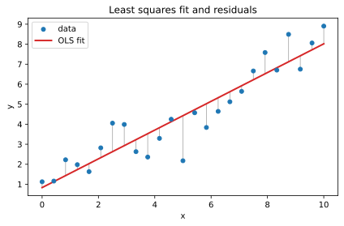
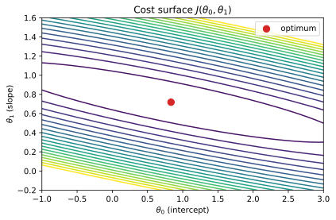
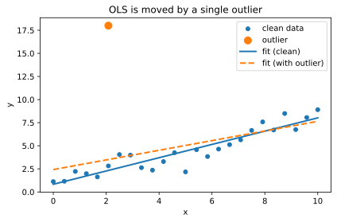
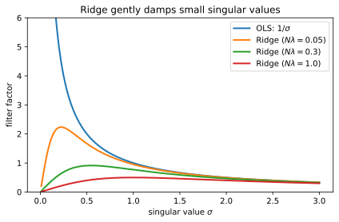
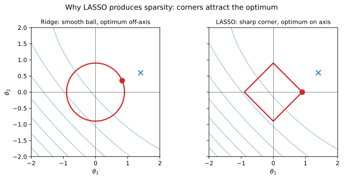
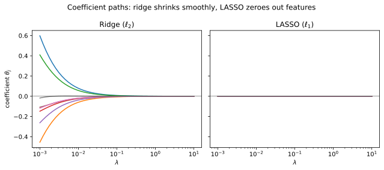

+++
title = "Linear Regression"
date = 2026-04-19
description = "A short note on linear regression, its motivation and properties."

[taxonomies]
tags = ["machine-learning", "supervised-learning", "regression"]
categories = ["notes"]

[extra]
math = true
+++

## Univariate linear regression

Consider the following problem.
We want to predict a single scalar output $y \in \mathbb{R}$ from a single input $x \in \mathbb{R}$ using a model $f_{\theta}:\mathbb{R} \to \mathbb{R}$ with parameters vector $\boldsymbol{\theta}$.
We assume the relationship between inputs and outputs is non-deterministic, ie, we cannot model it in closed form easily.
So, we will take a data-driven approach.
Our goal is then finding the parameters of the best possible linear model that represents this mapping.
A linear model in $x$ takes the form:


f_\theta(x) = \theta_0 + \theta_1 x


where $\theta_0$ is the intercept (or bias) and $\theta_1$ is the slope, so $\boldsymbol{\theta} = (\theta_0, \theta_1)$.

<figure>

<figcaption>The best-fit line minimises the sum of squared vertical residuals (grey segments).</figcaption>
</figure>

### Maximum likelihood estimation

For this task, we have collected a supervised dataset of input/output pairs denoted $\mathcal{D}\=\\{(x\_i, y\_i)\\}\_{i=1}^N$.
We can view the relationship between inputs and outputs through its conditional probability distribution $Pr(y\mid x)$.
We also know that each observed training output $y_i$ should have high probability under its corresponding distribution $Pr(y_i|x_i, \phi)$ where $\phi$ is a set of unknown parameters that fully characterizes the distribution.
Let's rewrite the probability as $Pr(y_i|\phi_i)$, with $\phi_i=f_{\theta}(x_i)$.
The model can predict the distribution parameters either partially or fully.
Hence, let's pick the model parameters $\theta$ so that they maximise the joint probability of observing _all_ $N$ training outputs given their inputs.
This is the maximum likelihoodThe expression $Pr(y \mid x)$ can represent either a probability or a likelihood depending on which argument is considered free: it is a probability when viewed as a function of $y$ with $x$ fixed, and a likelihood when viewed as a function of the model parameters with $y$ fixed. principle:


\hat{\theta}^{\ast} = \argmax_\theta \Big[ Pr\big(y_1, y_2, \ldots, y_N \mid x_1, x_2, \ldots, x_N, \theta\big)\Big]


You might look into this equation and have no clue how to solve it. And you are right, without further assumptions this joint distribution is intractable. Luckily, we can make one assumption that will simplify our lives a lot.


The training examples $(x_i, y_i)$ are independently and identically distributed.


Identically distributed means the form of the probability distribution $Pr(y_i \mid x_i, \theta)$ is the same for all samples. In this case, they share the same parametric family and the same parameters $\phi$.
Independence means the joint probability factorises into a product of individual terms:


Pr\big(y_1, \ldots, y_N \mid x_1, \ldots, x_N, \theta\big) = \overset{N}{\underset{i=1}{\Pi}} Pr\big(y_i \mid x_i, \theta\big)


Substituting back into our objective, we arrive at


\hat{\theta}^{\ast} = \argmax_{\theta} \Bigg[\overset{N}{\underset{i=1}{\Pi}} Pr\big(y_i | f_{\theta}(x_i)\big)\Bigg]


### The log-likelihood

As you may have noticed, this equation does not look convenient to optimise symbolically or numerically.
Probabilities lie between 0 and 1, and multiplying several of them may vanish very quickly, making it hard to represent with floating-point arithmetic due to its limited precision.
A trick to circumvent this is to apply a monotonic transformation (it preserves the ranking and does not change the solution) that makes the objective more computationally tractable.
One useful transformation is the log transform $\log(z)$.
By applying it to {{ eqref(id="mle") }}, we obtain:We use the property $\log \prod_i a_i = \sum_i \log a_i$, ie, the logarithm of a product equals the sum of the logarithms.


\begin{aligned}
\hat{\theta}^{\ast} &= \argmax_{\theta} \log \Bigg[\overset{N}{\underset{i=1}{\Pi}} Pr\big(y_i | f_{\theta}(x_i)\big)\Bigg] \\
&= \argmax_{\theta} \Bigg[\overset{N}{\underset{i=1}{\sum}} \log Pr\big(y_i | f_{\theta}(x_i)\big)\Bigg]
\end{aligned}


This is called the maximum log-likelihood criterion. Unlike the product of probabilities, the sum of log-probabilities does not suffer from numerical underflow, since each $\log Pr(\cdot)$ is a manageable negative number and their sum remains well within floating-point precision.

In machine learning, by convention, learning problems are formulated as a minimisation of a loss function. To convert our maximisation into a minimisation, it suffices to multiply the objective by $-1$ and change $\argmax$ to $\argmin$:


\hat{\theta}^{\ast} = \argmin_{\theta} \Bigg[-\overset{N}{\underset{i=1}{\sum}} \log Pr\big(y_i | f_{\theta}(x_i)\big)\Bigg]


This is known as the negative log-likelihood (NLL) loss.

### Choosing a distribution

Before we elaborate what loss functions are, let's solve this problem by picking a suitable distribution.
Consider the univariate normal distribution. It has support $y \in \mathbb{R}$ and parameters $\mu \in \mathbb{R}$ and $\sigma^2 \in \mathbb{R}^+$, ie, $\phi = (\mu, \sigma^2)$.
We can rewrite $Pr(y_i \mid x_i, \phi)$ as:


\begin{aligned}
Pr(y_i \mid x_i, \phi) &= \mathcal{N}(y_i \mid f_{\theta}(x_i), \sigma^2) \\
&= \frac{1}{\sqrt{2\pi\sigma^2}} \exp\left(-\frac{(y_i - f_{\theta}(x_i))^2}{2\sigma^2}\right)
\end{aligned}


In this simplified version, we let the model predict the mean $\mu_i = f_{\theta}(x_i)$ and treat $\sigma^2$ as a fixed constant. Substituting {{ eqref(id="gaussian-pdf") }} into the NLL objective {{ eqref(id="nll") }}:


\begin{aligned}
\hat{\theta}^{\ast} &= \argmin_{\theta} \Bigg[-\overset{N}{\underset{i=1}{\sum}} \log \bigg( \frac{1}{\sqrt{2\pi\sigma^2}} \\
&\qquad\qquad \cdot \exp\left(-\frac{(y_i - f_{\theta}(x_i))^2}{2\sigma^2}\right) \bigg)\Bigg] \\
&= \argmin_{\theta} \Bigg[-\overset{N}{\underset{i=1}{\sum}} \bigg(-\frac{1}{2}\log(2\pi\sigma^2) \\
&\qquad\qquad - \frac{(y_i - f_{\theta}(x_i))^2}{2\sigma^2}\bigg)\Bigg] \\
&= \argmin_{\theta} \Bigg[\overset{N}{\underset{i=1}{\sum}} \frac{(y_i - f_{\theta}(x_i))^2}{2\sigma^2} \\
&\qquad\qquad + \frac{N}{2}\log(2\pi\sigma^2)\Bigg]
\end{aligned}


Since $\sigma^2$ is constant with respect to $\theta$, both $\frac{1}{2\sigma^2}$ and $\frac{N}{2}\log(2\pi\sigma^2)$ are constants that do not affect the $\argmin$. We can drop them:


\hat{\theta}^{\ast} = \argmin_{\theta} \Bigg[\overset{N}{\underset{i=1}{\sum}} (y_i - f_{\theta}(x_i))^2\Bigg]


This is the mean squared error (MSE) criterion.Strictly speaking, the MSE divides by $N$: $\frac{1}{N}\sum_i (y_i - f_{\theta}(x_i))^2$. Since $N$ is a constant, it does not change the $\argmin$.

### Loss and cost functions


A loss function $\ell(y, \hat{y})$ measures the discrepancy between a predicted value $\hat{y}$ and the true value $y$.


A well-behaved loss function should satisfy at least the following properties:

1. **Non-negativity**: $\ell(y, \hat{y}) \geq 0$ for all $y, \hat{y}$.
2. **Zero at perfect prediction**: $\ell(y, \hat{y}) = 0 \iff y = \hat{y}$.
3. **Differentiability** (at least almost everywhere) with respect to $\hat{y}$, so that gradient-based optimisation can be applied.

Convexity in $\hat{y}$ is also desirable since it guarantees a unique global minimum and makes optimisation tractable.
The squared error $\ell(y, \hat{y}) = (y - \hat{y})^2$ satisfies all of these properties.


Let $\ell(y, \hat{y}) = (y - \hat{y})^2$. Then $\ell$ is:

1. non-negative,
2. zero if and only if $\hat{y} = y$,
3. infinitely differentiable, and
4. convex in $\hat{y}$.
   


Let $e = y - \hat{y}$.

**(i)** $\ell = e^2 \geq 0$ since the square of any real number is non-negative.

**(ii)** $\ell = e^2 = 0 \iff e = 0 \iff \hat{y} = y$.

**(iii)** $\ell$ is a polynomial in $\hat{y}$, hence infinitely differentiable. Its first and second derivatives are:
$\frac{\partial \ell}{\partial \hat{y}} = -2(y - \hat{y}), \qquad \frac{\partial^2 \ell}{\partial \hat{y}^2} = 2.$

**(iv)** A twice-differentiable function is convex if and only if its second derivative is non-negative everywhere. Since $\frac{\partial^2 \ell}{\partial \hat{y}^2} = 2 > 0$ for all $\hat{y}$, $\ell$ is (strictly) convex in $\hat{y}$. $\square$



A cost function $J(\theta)$ is the average loss over the training data: $J(\theta) = \frac{1}{N} \sum_{i=1}^N \ell\big(y_i, f_{\theta}(x_i)\big)$. The goal of learning is to find the parameters $\theta$ that minimise $J(\theta)$.


We can now dissect {{ eqref(id="mse") }} into these two components. The individual loss is the squared error $\ell(y_i, \hat{y}_i) = (y_i - \hat{y}_i)^2$, and the cost function is its average over the training set:


\begin{aligned}
\hat{\theta}^{\ast} &= \argmin_{\theta} J(\theta) \\
&= \argmin_{\theta} \frac{1}{N} \overset{N}{\underset{i=1}{\sum}} (y_i - f_{\theta}(x_i))^2
\end{aligned}


### Point estimation

You may have noticed that our model $f$ no longer predicts $y$ directly, but the mean $\mu$ of the normal distribution over $y$.
At inference time, however, we want a single best prediction given the inputs. This is called a _point estimate_.
A natural choice is the mode of the predicted distribution, ie, the value of $y$ that maximises the likelihood:


\hat{y} = \argmax_{y} Pr\!\left(y \mid f_{\hat{\theta}^{\ast}}(x), \sigma^2\right)


For the normal distribution, the mode coincides with the mean $\mu$. Therefore $\hat{y} = f_{\hat{\theta}^*}(x)$, and the model's output can be used directly as the point estimate.


Let $y \sim \mathcal{N}(\mu, \sigma^2)$. Then $\argmax_y Pr(y \mid \mu, \sigma^2) = \mu$.



The density of the normal distribution is $Pr(y \mid \mu, \sigma^2) = \frac{1}{\sqrt{2\pi\sigma^2}} \exp\left(-\frac{(y - \mu)^2}{2\sigma^2}\right)$. Since $\frac{1}{\sqrt{2\pi\sigma^2}}$ is a positive constant and the exponential is a strictly increasing function, maximizing the density is equivalent to maximizing the exponent:

$$\begin{aligned}
\argmax_y Pr(y \mid \mu, \sigma^2) &= \argmax_y \left(-\frac{(y - \mu)^2}{2\sigma^2}\right) \\
&= \argmin_y (y - \mu)^2
\end{aligned}$$

The function $(y - \mu)^2$ is a convex quadratic with a unique minimum. Setting its derivative to zero: $\frac{d}{dy}(y - \mu)^2 = 2(y - \mu) = 0$, which gives $y = \mu$. $\square$


### Closed-form solution

We can now substitute the linear model {{ eqref(id="linear-model") }} into the cost function {{ eqref(id="mse-cost") }}:


J(\theta_0, \theta_1) = \frac{1}{N} \overset{N}{\underset{i=1}{\sum}} (y_i - \theta_0 - \theta_1 x_i)^2


Since $J$ is a convex quadratic in $(\theta_0, \theta_1)$, it has a unique global minimum that we can find by setting the partial derivatives to zero.

<figure>

<figcaption>The MSE cost surface is a convex bowl in $(\theta_0, \theta_1)$ with a single minimum.</figcaption>
</figure>

**Partial derivative with respect to $\theta_0$:**


\frac{\partial J}{\partial \theta_0} = \frac{-2}{N} \overset{N}{\underset{i=1}{\sum}} (y_i - \theta_0 - \theta_1 x_i) = 0


Expanding the sum and dividing by $N$:


\theta_0^{\ast} = \bar{y} - \theta_1^{\ast}\, \bar{x}


where $\bar{x} = \frac{1}{N}\sum_{i=1}^N x_i$ and $\bar{y} = \frac{1}{N}\sum_{i=1}^N y_i$ are the sample means. This tells us the intercept adjusts so that the regression line passes through the point $(\bar{x}, \bar{y})$.

**Partial derivative with respect to $\theta_1$:**


\frac{\partial J}{\partial \theta_1} = \frac{-2}{N} \overset{N}{\underset{i=1}{\sum}} x_i\,(y_i - \theta_0 - \theta_1 x_i) = 0


Expanding and substituting {{ eqref(id="theta0-solution") }}:


\begin{aligned}
\overset{N}{\underset{i=1}{\sum}} x_i\, y_i - (\bar{y} - \theta_1^{\ast}\, \bar{x}) \overset{N}{\underset{i=1}{\sum}} x_i & \\
{} - \theta_1^{\ast} \overset{N}{\underset{i=1}{\sum}} x_i^2 &= 0 \\
\overset{N}{\underset{i=1}{\sum}} x_i\, y_i - N\bar{x}\bar{y} & \\
{} + \theta_1^{\ast}\!\left(N\bar{x}^2 - \overset{N}{\underset{i=1}{\sum}} x_i^2\right) &= 0
\end{aligned}


Solving for $\theta_1^{\ast}$ and recognising that $\sum_i x_i y_i - N\bar{x}\bar{y} = \sum_i (x_i - \bar{x})(y_i - \bar{y})$ and $\sum_i x_i^2 - N\bar{x}^2 = \sum_i (x_i - \bar{x})^2$, we obtain:


Expanding the right side, $\sum\_i (x\_i - \bar{x})(y\_i - \bar{y}) = \sum\_i x\_i y\_i - \bar{y} \sum\_i x\_i - \bar{x} \sum\_i y\_i + N \bar{x} \bar{y} = \sum\_i x\_i y\_i - N \bar{x} \bar{y}$, since $\sum\_i x\_i = N \bar{x}$ and $\sum\_i y\_i = N \bar{y}$. The second identity is the special case $y = x$.



\theta_1^{\ast} = \frac{\overset{N}{\underset{i=1}{\sum}} (x_i - \bar{x})(y_i - \bar{y})}{\overset{N}{\underset{i=1}{\sum}} (x_i - \bar{x})^2}


The numerator is the sample covariance between $x$ and $y$ (up to a factor of $N$), and the denominator is the sample variance of $x$. Together, {{ eqref(id="theta0-solution") }} and {{ eqref(id="theta1-solution") }} give the unique closed-form solution for the optimal parameters of univariate linear regression under the MSE criterion.

## Multivariate linear regression

We now generalise to a vector input $\mathbf{x} \in \mathbb{R}^D$, while keeping the output $y \in \mathbb{R}$ scalar. To keep the algebra clean, we absorb the bias term by augmenting each input with a leading $1$, so that $\tilde{\mathbf{x}} = (1, x_{1}, \ldots, x_{D})^{\top} \in \mathbb{R}^{D+1}$ and $\boldsymbol{\theta} = (\theta_{0}, \theta_{1}, \ldots, \theta_{D})^{\top} \in \mathbb{R}^{D+1}$. The model is then a single inner product:


\begin{aligned}
f_{\boldsymbol{\theta}}(\mathbf{x}) &= \theta_{0} + \theta_{1} x_{1} + \cdots + \theta_{D} x_{D} \\
&= \boldsymbol{\theta}^{\top} \tilde{\mathbf{x}}
\end{aligned}


### Matrix form of the cost function

The probabilistic story from the univariate case carries over unchanged: under the i.i.d. Gaussian assumption with the model predicting the mean, the NLL again reduces to a sum of squared errors. What changes is only the form of $f_{\boldsymbol{\theta}}$. Stacking the $N$ augmented training inputs row-wise into the _design matrix_ $\mathbf{X} \in \mathbb{R}^{N \times (D+1)}$ and the outputs into $\mathbf{y} \in \mathbb{R}^{N}$:


\mathbf{X} = \begin{bmatrix} 1 & x_{1,1} & \cdots & x_{1,D} \\ 1 & x_{2,1} & \cdots & x_{2,D} \\ \vdots & \vdots & \ddots & \vdots \\ 1 & x_{N,1} & \cdots & x_{N,D} \end{bmatrix}, \qquad \mathbf{y} = \begin{bmatrix} y_{1} \\ y_{2} \\ \vdots \\ y_{N} \end{bmatrix}


the vector of predictions is $\mathbf{X}\boldsymbol{\theta}$ and the vector of residuals is $\mathbf{y} - \mathbf{X}\boldsymbol{\theta}$. The cost function is the squared $\ell_{2}$ norm of the residual:


\begin{aligned}
J(\boldsymbol{\theta}) &= \frac{1}{N} \lVert \mathbf{y} - \mathbf{X}\boldsymbol{\theta} \rVert_{2}^{2} \\
&= \frac{1}{N} (\mathbf{y} - \mathbf{X}\boldsymbol{\theta})^{\top} (\mathbf{y} - \mathbf{X}\boldsymbol{\theta})
\end{aligned}


### The normal equations

Expanding {{ eqref(id="cost-multi") }} and dropping the $1/N$ factor (it does not affect the $\argmin$):


\begin{aligned}
N \cdot J(\boldsymbol{\theta}) &= \mathbf{y}^{\top} \mathbf{y} - 2\, \boldsymbol{\theta}^{\top} \mathbf{X}^{\top} \mathbf{y} \\
&\quad + \boldsymbol{\theta}^{\top} \mathbf{X}^{\top} \mathbf{X}\, \boldsymbol{\theta}
\end{aligned}


Taking the gradient with respect to $\boldsymbol{\theta}$ and setting it to zero:We use the identities $\nabla_{\boldsymbol{\theta}} (\boldsymbol{\theta}^{\top} \mathbf{a}) = \mathbf{a}$ and $\nabla_{\boldsymbol{\theta}} (\boldsymbol{\theta}^{\top} \mathbf{A} \boldsymbol{\theta}) = (\mathbf{A} + \mathbf{A}^{\top}) \boldsymbol{\theta}$, which equals $2 \mathbf{A} \boldsymbol{\theta}$ when $\mathbf{A}$ is symmetric.


\begin{aligned}
\nabla_{\boldsymbol{\theta}} J &= \frac{2}{N} \left( \mathbf{X}^{\top} \mathbf{X}\, \boldsymbol{\theta} - \mathbf{X}^{\top} \mathbf{y} \right) \\
&= \mathbf{0}
\end{aligned}


Rearranging gives the _normal equations_, so named because they say the residual $\mathbf{y} - \mathbf{X}\boldsymbol{\theta}$ is _normal_ (perpendicular) to every column of $\mathbf{X}$, ie, the fitted values $\mathbf{X}\boldsymbol{\theta}$ are the orthogonal projection of $\mathbf{y}$ onto the column space of $\mathbf{X}$:


\mathbf{X}^{\top} \mathbf{X}\, \boldsymbol{\theta} = \mathbf{X}^{\top} \mathbf{y}


When $\mathbf{X}^{\top} \mathbf{X} \in \mathbb{R}^{(D+1) \times (D+1)}$ is invertible (which requires $\mathbf{X}$ to have full column rank,The _rank_ of a matrix $\mathbf{A} \in \mathbb{R}^{m \times n}$ is the dimension of the vector space spanned by its columns. Equivalently, the maximum number of linearly independent columns (or rows; the row rank and column rank always agree). It satisfies $\mathrm{rank}(\mathbf{A}) \leq \min(m, n)$. We say $\mathbf{A}$ has _full column rank_ when $\mathrm{rank}(\mathbf{A}) = n$, meaning no column can be written as a linear combination of the others. For the design matrix $\mathbf{X}$, full column rank requires $N \geq D+1$ (more samples than parameters) _and_ that no feature is a linear combination of the others. Perfectly collinear features (eg, including both temperature in Celsius and Fahrenheit) drop the rank and make $\mathbf{X}^{\top} \mathbf{X}$ singular. ie, $N \geq D+1$ and the features to be linearly independent), we can solve in closed form:


\hat{\boldsymbol{\theta}}^{\ast} = (\mathbf{X}^{\top} \mathbf{X})^{-1} \mathbf{X}^{\top} \mathbf{y}


The matrix $(\mathbf{X}^{\top} \mathbf{X})^{-1} \mathbf{X}^{\top}$ is the _Moore-Penrose pseudoinverse_ of $\mathbf{X}$, often written $\mathbf{X}^{+}$. The "pseudo" prefix signals that we use it like an inverse even though $\mathbf{X}$ is rectangular and has no true inverse; it reduces to $\mathbf{X}^{-1}$ whenever the latter exists, and otherwise returns the minimum-norm least-squares solution. The univariate result of the previous section is recovered as the special case $D = 1$.


The cost $J(\boldsymbol{\theta}) = \frac{1}{N} \lVert \mathbf{y} - \mathbf{X}\boldsymbol{\theta} \rVert_{2}^{2}$ is convex in $\boldsymbol{\theta}$, and strictly convex when $\mathbf{X}$ has full column rank.



The Hessian of $J$ is $\nabla_{\boldsymbol{\theta}}^{2} J = \frac{2}{N} \mathbf{X}^{\top} \mathbf{X}$. For any $\mathbf{v} \in \mathbb{R}^{D+1}$, $\mathbf{v}^{\top} \mathbf{X}^{\top} \mathbf{X}\, \mathbf{v} = \lVert \mathbf{X} \mathbf{v} \rVert_{2}^{2} \geq 0$, so the Hessian is positive semidefinite and $J$ is convex. If $\mathbf{X}$ has full column rank, then $\mathbf{X} \mathbf{v} = \mathbf{0} \iff \mathbf{v} = \mathbf{0}$, the Hessian is positive definite, and $J$ is strictly convex with a unique minimiser. $\square$


### Numerical solution via matrix factorisation

In practice, one rarely forms $(\mathbf{X}^{\top} \mathbf{X})^{-1}$ explicitly. Forming the Gram matrix $\mathbf{X}^{\top} \mathbf{X}$ squares the condition number of $\mathbf{X}$, so even mildly ill-conditioned features become numerically catastrophic. Direct factorisations of $\mathbf{X}$ avoid this entirely.

#### QR factorisation

Any matrix $\mathbf{X} \in \mathbb{R}^{N \times (D+1)}$ with full column rank admits a _thin QR factorisation_, where the letters stand for an orthogonal matrix $\mathbf{Q}$ and a right (upper) triangular matrix $\mathbf{R}$:


\mathbf{X} = \mathbf{Q} \mathbf{R}


where $\mathbf{Q} \in \mathbb{R}^{N \times (D+1)}$ has orthonormal columns ($\mathbf{Q}^{\top} \mathbf{Q} = \mathbf{I}_{D+1}$) and $\mathbf{R} \in \mathbb{R}^{(D+1) \times (D+1)}$ is upper triangular and invertible.

In code, the entire QR-based solver fits in three lines, and the design matrix $\mathbf{X}$ never has to be squared:

{{ include_code(path="content/blog/linear-regression/plots.py", syntax="python", start=13, end=17) }} Substituting into the normal equations {{ eqref(id="normal-equations") }}:


\begin{aligned}
\mathbf{X}^{\top} \mathbf{X}\, \boldsymbol{\theta} &= \mathbf{X}^{\top} \mathbf{y} \\
\mathbf{R}^{\top} \mathbf{Q}^{\top} \mathbf{Q} \mathbf{R}\, \boldsymbol{\theta} &= \mathbf{R}^{\top} \mathbf{Q}^{\top} \mathbf{y} \\
\mathbf{R}^{\top} \mathbf{R}\, \boldsymbol{\theta} &= \mathbf{R}^{\top} \mathbf{Q}^{\top} \mathbf{y}
\end{aligned}


Since $\mathbf{R}^{\top}$ is invertible, we can left-multiply by $(\mathbf{R}^{\top})^{-1}$ to obtain the much simpler upper triangular system:


\mathbf{R}\, \boldsymbol{\theta} = \mathbf{Q}^{\top} \mathbf{y}


This avoids forming $\mathbf{X}^{\top} \mathbf{X}$ entirely. The condition numberThe _condition number_ of a matrix $\mathbf{A}$ measures how much the solution of $\mathbf{A}\mathbf{z} = \mathbf{b}$ can change in response to small perturbations in $\mathbf{b}$. For an invertible square matrix, $\kappa(\mathbf{A}) = \lVert \mathbf{A} \rVert\, \lVert \mathbf{A}^{-1} \rVert$, and using the spectral ($\ell_{2}$) norm this equals $\sigma_{\max}(\mathbf{A}) / \sigma_{\min}(\mathbf{A})$, the ratio of largest to smallest singular value. A value near $1$ is _well-conditioned_; values $\gg 1$ are _ill-conditioned_ and amplify numerical error: roughly $\log_{10} \kappa$ digits of accuracy are lost in floating-point arithmetic. Forming the Gram matrix $\mathbf{X}^{\top} \mathbf{X}$ squares the singular values, hence squares the condition number, which is why factorising $\mathbf{X}$ directly is preferred. of the system is $\kappa(\mathbf{R}) = \kappa(\mathbf{X})$, not $\kappa(\mathbf{X})^{2}$.

#### Computing Q and R: Gram-Schmidt

The most intuitive way to construct $\mathbf{Q}$ and $\mathbf{R}$ is the _Gram-Schmidt process_: walk through the columns of $\mathbf{X} = [\mathbf{x}\_{1}, \mathbf{x}\_{2}, \ldots, \mathbf{x}\_{D+1}]$ left to right, orthogonalising each column against the ones already processed.

Let $\langle \mathbf{a}, \mathbf{b} \rangle = \mathbf{a}^{\top} \mathbf{b}$ denote the standard inner product. For each $j = 1, 2, \ldots, D+1$:


\begin{aligned}
\mathbf{u}_{j} &= \mathbf{x}_{j} - \sum_{k=1}^{j-1} \langle \mathbf{q}_{k}, \mathbf{x}_{j} \rangle\, \mathbf{q}_{k}, \\
\mathbf{q}_{j} &= \frac{\mathbf{u}_{j}}{\lVert \mathbf{u}_{j} \rVert_{2}}.
\end{aligned}


The vector $\mathbf{u}\_{j}$ is the residual of $\mathbf{x}\_{j}$ after subtracting its projections onto all previous $\mathbf{q}\_{k}$, so it is orthogonal to them by construction. Normalising gives a unit vector $\mathbf{q}\_{j}$ that extends the orthonormal set.

The entries of $\mathbf{R}$ fall out as a side effect. Reading {{ eqref(id="gram-schmidt") }} backwards:


\begin{aligned}
\mathbf{x}_{j} &= \mathbf{u}_{j} + \sum_{k=1}^{j-1} \langle \mathbf{q}_{k}, \mathbf{x}_{j} \rangle\, \mathbf{q}_{k} \\
&= \lVert \mathbf{u}_{j} \rVert_{2}\, \mathbf{q}_{j} + \sum_{k=1}^{j-1} \langle \mathbf{q}_{k}, \mathbf{x}_{j} \rangle\, \mathbf{q}_{k}
\end{aligned}


which gives:


R_{k,j} = \begin{cases} \langle \mathbf{q}_{k}, \mathbf{x}_{j} \rangle & \text{if } k < j \\ \lVert \mathbf{u}_{j} \rVert_{2} & \text{if } k = j \\ 0 & \text{if } k > j \end{cases}


The zeros below the diagonal are exactly what makes $\mathbf{R}$ upper triangular: $\mathbf{q}_{k}$ for $k > j$ does not yet exist when we process column $j$, so it cannot contribute.


Total time is $O(N D^{2})$ and memory is $O(N D)$. For time: each of the $D+1$ columns is orthogonalised against the previously processed columns. Each orthogonalisation step is one inner product $\langle \mathbf{q}\_k, \mathbf{x}\_j \rangle$ at $O(N)$ flops plus one vector subtraction $\mathbf{u} \mathrel{-}= \langle \mathbf{q}\_k, \mathbf{x}\_j \rangle\, \mathbf{q}\_k$ at another $O(N)$, giving $O(N j)$ work for column $j$. Summing across columns yields $\sum\_{j=0}^{D} O(N j) = O(N D^{2})$. Normalisation contributes a further $O(N)$ per column, absorbed into the lower-order terms.

For memory, we hold $\mathbf{X}$ ($N(D+1)$ entries), $\mathbf{Q}$ (same shape), and $\mathbf{R}$ ($(D+1)^2$ entries, half of which are zero by the upper-triangular structure). The $N(D+1)$ term dominates whenever $N > D$, giving $O(N D)$. Each individual orthogonalisation step needs only $O(N)$ scratch space.



Classical Gram-Schmidt as written above loses orthogonality catastrophically in finite precision when the columns of $\mathbf{X}$ are nearly linearly dependent. The _modified Gram-Schmidt_ variant, which subtracts each projection one at a time and updates the working vector in place, is markedly more stable. Production solvers (LAPACK's `geqrf`, NumPy's `np.linalg.qr`) use _Householder reflections_ instead: a sequence of orthogonal transformations $\mathbf{H}\_{j} = \mathbf{I} - 2 \mathbf{v}\_{j} \mathbf{v}\_{j}^{\top}$ chosen to zero out everything below the diagonal of column $j$. Householder QR is backward-stable and is the default for any serious least-squares computation.


#### Back-substitution

Let $\mathbf{c} = \mathbf{Q}^{\top} \mathbf{y} \in \mathbb{R}^{D+1}$. Because $\mathbf{R}$ is upper triangular, the system $\mathbf{R}\, \boldsymbol{\theta} = \mathbf{c}$ written out is:


\begin{bmatrix} R_{0,0} & R_{0,1} & \cdots & R_{0,D} \\ 0 & R_{1,1} & \cdots & R_{1,D} \\ \vdots & & \ddots & \vdots \\ 0 & 0 & \cdots & R_{D,D} \end{bmatrix} \begin{bmatrix} \theta_{0} \\ \theta_{1} \\ \vdots \\ \theta_{D} \end{bmatrix} = \begin{bmatrix} c_{0} \\ c_{1} \\ \vdots \\ c_{D} \end{bmatrix}


The last row reads $R_{D,D}\, \theta_{D} = c_{D}$, which gives $\theta_{D}$ directly. Substituting into the second-to-last row gives $\theta_{D-1}$, and so on upward. The recursion is:


\theta_{i} = \frac{1}{R_{i,i}} \left( c_{i} - \overset{D}{\underset{j=i+1}{\sum}} R_{i,j}\, \theta_{j} \right), \qquad i = D, D-1, \ldots, 0



Back-substitution itself runs in $O(D^{2})$ time and $O(D^{2})$ memory. Computing $\mathbf{c} = \mathbf{Q}^{\top} \mathbf{y}$ adds another $O(N D)$ time on top. For row $i$ the recursion sums $D - i$ terms (one multiply-add each) and divides by $R\_{i,i}$, totalling $\sum\_{i=0}^{D} (D - i) = D(D+1)/2 = O(D^2)$ work. The matrix-vector product $\mathbf{Q}^{\top} \mathbf{y}$ multiplies a $(D+1) \times N$ matrix by an $N$-vector at $O(N D)$ flops.

Memory holds only the $(D+1) \times (D+1)$ matrix $\mathbf{R}$ and the two length-$(D+1)$ vectors $\mathbf{c}$ and $\boldsymbol{\theta}$. Since $\mathbf{R}$ is upper triangular, $D(D+1)/2$ entries suffice, giving $O(D^{2})$ memory dominated by $\mathbf{R}$.


The QR factorisation that produces $\mathbf{R}$ in the first place dominates the end-to-end cost at $O(N D^{2})$ time.

#### Singular value decomposition

When $\mathbf{X}$ is rank-deficient (collinear features, or $N < D+1$), $\mathbf{R}$ has zeros on the diagonal and the QR approach breaks down. The _singular value decomposition_ handles this case gracefully. Its name comes from the singular values $\sigma\_i$, which measure how far the matrix is from being singular along each principal direction: a $\sigma\_i$ near zero is a direction where $\mathbf{X}$ collapses information, ie, a direction in which $\mathbf{X}$ behaves singularly. A useful picture is that the SVD reads $\mathbf{X}$ as a sequence of axes (the singular vectors) and a stretching strength along each axis (the singular value), so $\mathbf{X}$ becomes "rotate, stretch, rotate again".


\mathbf{X} = \mathbf{U} \boldsymbol{\Sigma} \mathbf{V}^{\top}


where $\mathbf{U} \in \mathbb{R}^{N \times N}$ and $\mathbf{V} \in \mathbb{R}^{(D+1) \times (D+1)}$ are orthogonal and $\boldsymbol{\Sigma} \in \mathbb{R}^{N \times (D+1)}$ is diagonal with non-negative singular values $\sigma_{1} \geq \sigma_{2} \geq \cdots \geq \sigma_{r} > 0$ (with $r = \mathrm{rank}(\mathbf{X})$) and zeros elsewhere. The Moore-Penrose pseudoinverse is:


\begin{aligned}
\mathbf{X}^{+} &= \mathbf{V} \boldsymbol{\Sigma}^{+} \mathbf{U}^{\top}, \\
\boldsymbol{\Sigma}^{+}_{i,i} &= \begin{cases} 1 / \sigma_{i} & \text{if } \sigma_{i} > 0 \\ 0 & \text{otherwise} \end{cases}
\end{aligned}


so the SVD-based solution is:


\begin{aligned}
\hat{\boldsymbol{\theta}}^{\ast} &= \mathbf{X}^{+} \mathbf{y} \\
&= \mathbf{V} \boldsymbol{\Sigma}^{+} \mathbf{U}^{\top} \mathbf{y}
\end{aligned}


When $\mathbf{X}$ has full column rank, this coincides with the QR solution and with {{ eqref(id="normal-solution") }}. When $\mathbf{X}$ is rank-deficient, infinitely many least-squares solutions exist and the SVD picks the one with minimum $\lVert \boldsymbol{\theta} \rVert_{2}$. Inverting only the non-zero singular values also exposes a natural regularisation knob: small $\sigma\_{i}$ amplify noise in $\mathbf{y}$, so truncating them (zeroing out their inverses) yields the _truncated SVD_, a close cousin of ridge regression.

#### Computing U, Σ, and V

A clean way to see where the SVD comes from is via the eigendecompositions of $\mathbf{X}^{\top} \mathbf{X}$ and $\mathbf{X} \mathbf{X}^{\top}$. Both are symmetric positive semidefinite, so they admit real orthonormal eigendecompositions:


\begin{aligned}
\mathbf{X}^{\top} \mathbf{X} &= \mathbf{V} \boldsymbol{\Lambda} \mathbf{V}^{\top}, \\
\boldsymbol{\Lambda} &= \mathrm{diag}(\lambda_{1}, \ldots, \lambda_{D+1}), \quad \lambda_{i} \geq 0
\end{aligned}



\mathbf{X} \mathbf{X}^{\top} = \mathbf{U} \boldsymbol{\Lambda}' \mathbf{U}^{\top}


The columns of $\mathbf{V}$ are the right-singular vectors and the columns of $\mathbf{U}$ are the left-singular vectors. The singular values are the square roots of the shared non-zero eigenvalues:


\sigma_{i} = \sqrt{\lambda_{i}}, \qquad i = 1, \ldots, r


with $r = \mathrm{rank}(\mathbf{X})$. The two sets of eigenvectors are linked through $\mathbf{X}$ itself: once you have $\mathbf{V}$ and the singular values, the corresponding left vectors are recovered by:


\mathbf{u}_{i} = \frac{1}{\sigma_{i}} \mathbf{X} \mathbf{v}_{i}, \qquad i = 1, \ldots, r



Substituting $\mathbf{X} = \mathbf{U} \boldsymbol{\Sigma} \mathbf{V}^{\top}$ into $\mathbf{X}^{\top} \mathbf{X}$ and using $\mathbf{U}^{\top} \mathbf{U} = \mathbf{I}$ gives $\mathbf{X}^{\top} \mathbf{X} = \mathbf{V} (\boldsymbol{\Sigma}^{\top} \boldsymbol{\Sigma}) \mathbf{V}^{\top}$. Comparing with {{ eqref(id="svd-eig-v") }}, the columns of $\mathbf{V}$ are eigenvectors of $\mathbf{X}^{\top} \mathbf{X}$ and the diagonal of $\boldsymbol{\Sigma}^{\top} \boldsymbol{\Sigma}$ holds the eigenvalues, so $\lambda\_i = \sigma\_i^2$. The same calculation on $\mathbf{X} \mathbf{X}^{\top} = \mathbf{U} (\boldsymbol{\Sigma} \boldsymbol{\Sigma}^{\top}) \mathbf{U}^{\top}$ shows $\mathbf{U}$ holds the eigenvectors of $\mathbf{X} \mathbf{X}^{\top}$ with the same non-zero eigenvalues. For the link {{ eqref(id="u-from-v") }}, apply $\mathbf{X}$ to $\mathbf{v}\_i$: $\mathbf{X} \mathbf{v}\_i = \mathbf{U} \boldsymbol{\Sigma} \mathbf{V}^{\top} \mathbf{v}\_i = \mathbf{U} \boldsymbol{\Sigma} \mathbf{e}\_i = \sigma\_i \mathbf{u}\_i$, so $\mathbf{u}\_i = \mathbf{X} \mathbf{v}\_i / \sigma\_i$ whenever $\sigma\_i > 0$. $\square$


(and remaining columns of $\mathbf{U}$ are filled in by extending to an orthonormal basis of $\mathbb{R}^{N}$). This _eigendecomposition_ recipe is conceptually simple but suffers the same "squared condition number" problem as the normal equations: forming $\mathbf{X}^{\top} \mathbf{X}$ loses precision.


Production SVD (LAPACK's `gesdd`/`gesvd`, NumPy's `np.linalg.svd`) avoids forming $\mathbf{X}^{\top} \mathbf{X}$ entirely. The standard _Golub-Reinsch_ algorithm runs in two phases: (1) reduce $\mathbf{X}$ to a bidiagonal matrix $\mathbf{B}$ via Householder reflections applied alternately on the left and right, $\mathbf{X} = \mathbf{U}\_{1} \mathbf{B} \mathbf{V}\_{1}^{\top}$; then (2) iteratively diagonalise $\mathbf{B}$ using a variant of the QR algorithm with implicit shifts, accumulating the orthogonal updates into $\mathbf{U}$ and $\mathbf{V}$. For very large or low-rank-structured matrices, _randomised SVD_ (Halko-Martinsson-Tropp) sketches $\mathbf{X}$ down to a small matrix via random projections and computes its SVD in $O(N D \log k + (N + D) k^{2})$ time when only the top $k$ singular triples are needed.



SVD costs $O(N D^{2} + D^{3})$ time and $O(N D)$ memory. The first phase reduces $\mathbf{X}$ to bidiagonal form via Householder reflections, at $O(N D^2)$ flops. Each of the $D$ left-Householder steps zeroes out a column below the diagonal at $O(N D)$ flops by applying the reflection to the trailing submatrix, and the analogous right-Householder steps that zero a row beyond the superdiagonal contribute the same order. The second phase iteratively diagonalises the bidiagonal matrix $\mathbf{B}$. Each iteration takes $O(D^2)$ flops on $\mathbf{B}$ itself, with $O(D)$ iterations to converge, but accumulating the orthogonal updates into $\mathbf{U}$ ($N \times D$) and $\mathbf{V}$ ($D \times D$) costs $O(N D + D^2)$ per iteration, totalling $O(N D^2 + D^3)$.

For memory, the dominant terms are $\mathbf{X}$ and $\mathbf{U}$, each of size $N \times D$, giving $O(N D)$. The Householder reflectors can be stored in-place in the zeroed-out portions of $\mathbf{X}$, with no extra allocation needed for them.


This is more than QR (the same $O(N D^2)$ leading term plus an extra $O(D^3)$ for the diagonalisation). But SVD is the most numerically robust option and the only one that handles rank deficiency cleanly. As a rule of thumb, use QR when $\mathbf{X}$ is known to have full column rank, and SVD otherwise.

## Regularisation

The closed-form solution {{ eqref(id="normal-solution") }} is unbiased and minimises the training MSE exactly, but it has two failure modes that show up the moment we leave the textbook setting.

<figure>

<figcaption>A single outlier can drag the OLS line by a substantial amount: the squared loss penalises it heavily.</figcaption>
</figure>

The first is multicollinearity. When two or more features are nearly linear combinations of one another, $\mathbf{X}^{\top} \mathbf{X}$ becomes nearly singular. The condition number explodes, the entries of $(\mathbf{X}^{\top} \mathbf{X})^{-1}$ blow up, and the optimal coefficients $\hat{\boldsymbol{\theta}}^{\ast}$ swing wildly in response to tiny changes in $\mathbf{y}$. Two features that are individually informative might receive a huge positive weight and a huge negative weight that nearly cancel: the model fits the training data, but generalises poorly and is impossible to interpret.

The second is overfitting in high dimensions. When $D$ is comparable to or larger than $N$, the design matrix has full row rank but not full column rank, so infinitely many parameter vectors achieve zero training error. Without further information the optimiser picks one of them, and that choice is dictated by noise rather than signal. The model memorises the training set and fails on new inputs.

Both pathologies share a common root: the likelihood treats every direction in parameter space symmetrically, so it cannot distinguish "the data prefers this $\boldsymbol{\theta}$" from "the data is indifferent and noise picked this $\boldsymbol{\theta}$". The fix is to introduce a prior preference for simple models. We add a regularisation term $\Omega(\boldsymbol{\theta})$ to the cost that penalises complex parameter vectors:


\hat{\theta}^{\ast} = \argmin_{\theta} \big[ J(\theta) + \lambda\, \Omega(\theta) \big]


The hyperparameter $\lambda \geq 0$ controls the trade-off. Setting $\lambda = 0$ recovers ordinary least squares, while $\lambda \to \infty$ shrinks $\boldsymbol{\theta}$ towards zero regardless of the data. Intermediate values trade a small increase in bias for a large decrease in variance, the classic _bias-variance trade-off_.


Regularisation has a clean Bayesian interpretation. Instead of maximising the likelihood, we maximise the posterior $Pr(\boldsymbol{\theta} \mid \mathbf{X}, \mathbf{y}) \propto Pr(\mathbf{y} \mid \mathbf{X}, \boldsymbol{\theta})\, Pr(\boldsymbol{\theta})$. Taking the negative log of both sides converts the product into the sum $J(\boldsymbol{\theta}) + \lambda\, \Omega(\boldsymbol{\theta})$, where $\Omega = -\log Pr(\boldsymbol{\theta})$ is the negative log-prior (up to a constant). A Gaussian prior $\boldsymbol{\theta} \sim \mathcal{N}(\mathbf{0}, \tau^2 \mathbf{I})$ yields the squared-$\ell\_2$ penalty (ridge); a Laplace prior $\boldsymbol{\theta} \sim \mathrm{Lap}(\mathbf{0}, b)$ yields the $\ell\_1$ penalty (LASSO).


The choice of $\Omega$ encodes _what kind_ of simplicity we prefer. The two canonical choices are the squared $\ell\_2$ norm and the $\ell\_1$ norm, leading to ridge regression and the LASSO respectively.

### Ridge regression

Ridge regression penalises the squared $\ell\_2$ norm of the parameters. The name comes from the diagonal "ridge" the penalty adds to $\mathbf{X}^{\top}\mathbf{X}$ in the normal equations: visualising the eigenvalues of $\mathbf{X}^{\top}\mathbf{X}$ as a row of bars, $\lambda \mathbf{I}$ raises every bar by the same amount, lifting flat spots into a clearly positive ridge that we can safely invert. Reach for it when features are collinear or $D \approx N$ and the unregularised solution is unstable.


J_{\text{ridge}}(\theta) = \frac{1}{N} \lVert \mathbf{y} - \mathbf{X}\theta \rVert_2^2 + \lambda\, \lVert \theta \rVert_2^2


The penalty $\lVert \boldsymbol{\theta} \rVert\_2^2 = \sum\_j \theta\_j^2$ pulls every coefficient towards zero, with the strongest pull on the largest coefficients. Because both terms are convex quadratics, the sum is also a convex quadratic and admits a closed-form solution.

Setting the gradient to zero:


\nabla_\theta J_{\text{ridge}} = \frac{2}{N} \big( \mathbf{X}^{\top} \mathbf{X}\, \theta - \mathbf{X}^{\top} \mathbf{y} \big) + 2 \lambda\, \theta = \mathbf{0}


Rearranging gives the regularised normal equations:


\big( \mathbf{X}^{\top} \mathbf{X} + N \lambda\, \mathbf{I} \big)\, \theta = \mathbf{X}^{\top} \mathbf{y}


The matrix on the left is always invertible whenever $\lambda > 0$, regardless of whether $\mathbf{X}$ has full column rank. Adding $N\lambda\, \mathbf{I}$ shifts every eigenvalue of $\mathbf{X}^{\top} \mathbf{X}$ upward by $N\lambda$, so the smallest eigenvalue goes from possibly zero to at least $N\lambda$. The closed-form solution is:


\hat{\theta}_{\text{ridge}}^{\ast} = \big( \mathbf{X}^{\top} \mathbf{X} + N \lambda\, \mathbf{I} \big)^{-1} \mathbf{X}^{\top} \mathbf{y}


To see what ridge does geometrically, substitute the SVD $\mathbf{X} = \mathbf{U} \boldsymbol{\Sigma} \mathbf{V}^{\top}$ from {{ eqref(id="svd-factorisation") }}. After simplification (using $\mathbf{V}^{\top} \mathbf{V} = \mathbf{I}$ and $\mathbf{U}^{\top} \mathbf{U} = \mathbf{I}$):


\hat{\theta}_{\text{ridge}}^{\ast} = \mathbf{V}\, \mathrm{diag}\!\left( \frac{\sigma_i}{\sigma_i^2 + N\lambda} \right)\, \mathbf{U}^{\top} \mathbf{y}


Compare this to the unregularised pseudoinverse solution {{ eqref(id="svd-solution") }}, which uses the diagonal entries $1/\sigma\_i$. Ridge replaces $1/\sigma\_i$ with $\sigma\_i / (\sigma\_i^2 + N\lambda)$. For large singular values $\sigma\_i \gg \sqrt{N\lambda}$ the two factors are nearly identical, ie, well-determined directions are barely touched. For small singular values $\sigma\_i \ll \sqrt{N\lambda}$, ridge replaces a numerically explosive $1/\sigma\_i$ with the gentle factor $\sigma\_i / (N\lambda)$, ie, poorly-determined directions are smoothly damped towards zero. Ridge is, in this sense, a continuous version of the truncated SVD discussed earlier.

<figure>

<figcaption>Ridge replaces the explosive $1/\sigma$ of OLS with a bounded curve, gently damping the noisy small-singular-value directions.</figcaption>
</figure>


For any finite $\lambda > 0$ and any index $i$ with $\sigma\_i > 0$, the corresponding ridge coefficient in the rotated basis $\mathbf{V}^{\top} \boldsymbol{\theta}$ is strictly between zero and the unregularised value. No coefficient is exactly zero unless the data forces it.


This last property matters in practice: ridge produces dense parameter vectors. Every feature receives a small but non-zero weight. If the goal is variable selection rather than just prediction, ridge is the wrong tool.

### LASSO regression

The LASSO (least absolute shrinkage and selection operator) replaces the squared $\ell\_2$ penalty with the $\ell\_1$ norm. The acronym is also a literal image of what the method does: it lassos a small set of relevant variables and ties the rest to zero, returning a sparse model. Use it when you suspect only a handful of features really matter and want feature selection baked into the fit.


J_{\text{lasso}}(\theta) = \frac{1}{N} \lVert \mathbf{y} - \mathbf{X}\theta \rVert_2^2 + \lambda\, \lVert \theta \rVert_1


where $\lVert \boldsymbol{\theta} \rVert\_1 = \sum\_j |\theta\_j|$. This single change in the penalty has consequences far out of proportion to its size.

The first consequence is the loss of differentiability. The function $|\theta\_j|$ is not differentiable at $\theta\_j = 0$, so the cost function has a kink along every coordinate axis. The first-order optimality condition is no longer "gradient equals zero" but a subgradient inclusion:


\frac{2}{N} \mathbf{X}^{\top} (\mathbf{X} \theta - \mathbf{y}) + \lambda\, \partial \lVert \theta \rVert_1 \ni \mathbf{0}


where the subdifferential of $|\theta\_j|$ is $\\{\mathrm{sign}(\theta\_j)\\}$ when $\theta\_j \neq 0$ and the closed interval $[-1, 1]$ when $\theta\_j = 0$. There is no closed-form solution for general $\mathbf{X}$, with one important exception.

When the columns of $\mathbf{X}$ are orthonormal, the LASSO decouples coordinate by coordinate, and each component is given by the soft-thresholding operator:


\hat{\theta}_j^{\,\text{lasso}} = \mathrm{sign}\!\big(\hat{\theta}_j^{\,\text{ols}}\big)\, \big(\, |\hat{\theta}_j^{\,\text{ols}}| - \lambda \,\big)_+


where $(z)\_+ = \max(z, 0)$ and $\hat{\theta}\_j^{\,\text{ols}}$ is the unregularised coefficient. Each coefficient is shrunk towards zero by exactly $\lambda$, and any coefficient whose unregularised magnitude is smaller than $\lambda$ is set to zero exactly. Compare this with ridge in the same orthonormal setting, which scales every coefficient by $1/(1+\lambda)$ and never zeroes anything.

In code, the soft-thresholding operator is a one-liner that the formula above only hints at:

{{ include_code(path="content/blog/linear-regression/plots.py", syntax="python", start=19, end=22) }}

The general (non-orthonormal) case is solved iteratively. The two dominant approaches are _coordinate descent_, which cycles through the parameters and applies soft-thresholding to one at a time while holding the others fixed, and _proximal gradient methods_ such as ISTA and FISTA, which alternate a gradient step on the smooth quadratic part with a soft-thresholding step on the $\ell\_1$ part. Both converge to the global minimum because the cost is convex.

<figure>

<figcaption>The L1 ball has corners on the axes; the L2 ball does not. Generically the loss ellipses first touch a corner, so LASSO produces sparse solutions.</figcaption>
</figure>


The geometric explanation is the shape of the unit ball. The constraint region $\\{\boldsymbol{\theta} : \lVert \boldsymbol{\theta} \rVert\_1 \leq t\\}$ is a hyper-octahedron with corners on the coordinate axes, where multiple coefficients vanish simultaneously. The level sets of the residual sum of squares are ellipsoids, and the optimum sits where the smallest such ellipsoid first touches the constraint region. Generically that contact happens at a corner, so the solution has many zero coefficients. The ridge ball $\\{\boldsymbol{\theta} : \lVert \boldsymbol{\theta} \rVert\_2 \leq t\\}$ is a smooth sphere with no corners, so the contact point almost never lies on a coordinate axis.


<figure>

<figcaption>Ridge shrinks every coefficient smoothly toward zero; LASSO snaps individual coefficients to exact zero as $\lambda$ grows.</figcaption>
</figure>

This sparsity makes the LASSO double as a feature-selection procedure: fitting a single model produces both the coefficients and an automatic shortlist of relevant variables. The cost is that the resulting estimator is biased in a way ridge is not (large coefficients are still shrunk by $\lambda$ even when the data strongly supports them), and that the selected support can be unstable when features are highly correlated. A common remedy is the _elastic net_, named after a fishing net that stretches between two extremes: it uses the convex combination $\alpha\, \lVert \boldsymbol{\theta} \rVert\_1 + (1-\alpha)\, \lVert \boldsymbol{\theta} \rVert\_2^2$ to inherit the sparsity of LASSO while retaining the grouping behaviour of ridge.
