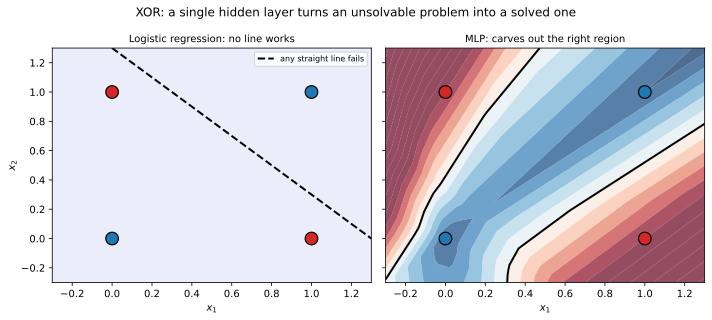
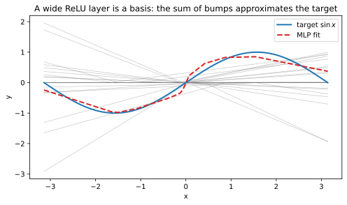
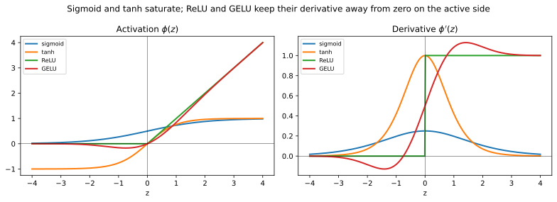
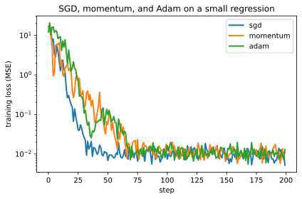
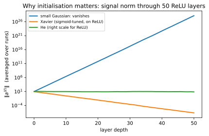
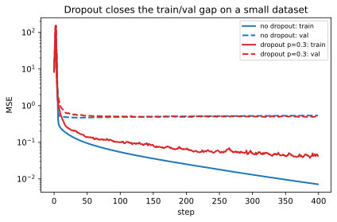

+++
title = "Neural Networks"
date = 2026-05-13
description = "A short note on feedforward neural networks: universal approximation, backpropagation, optimisation, and the practical pitfalls."

[taxonomies]
tags = ["machine-learning", "supervised-learning", "deep-learning"]
categories = ["notes"]

[extra]
math = true
+++

## From linear models to neural networks

The [linear regression](/blog/linear-regression/) and [logistic regression](/blog/logistic-regression/) posts share a common shape: a linear score $\boldsymbol{\theta}^{\top} \tilde{\mathbf{x}}$ feeds through an output transformation. The transformation is the identity for real-valued regression, the sigmoid for binary classification, and the [softmax](/blog/softmax-function/) for the multiclass case. Both models work well when the relationship between inputs and outputs is captured by such a linear score and they fail when it is not.

The textbook failure mode is the **XOR problem**: predict $y = x\_1 \oplus x\_2$ on $\\{0, 1\\}^{2}$. No straight line separates the positive class $\\{(0, 1), (1, 0)\\}$ from the negative class $\\{(0, 0), (1, 1)\\}$, so no logistic regressor can fit the dataset no matter how its parameters are tuned. The same limitation appears in regression whenever the target is a non-linear function of the inputs: the best line through a parabola is still a line.

<figure>

<figcaption>XOR is unsolvable with a single linear boundary; even a tiny MLP carves out the correct curved region.</figcaption>
</figure>

The classical fix is **feature engineering**. Apply a fixed non-linear map $\boldsymbol{\phi}: \mathbb{R}^{D} \to \mathbb{R}^{M}$ to the input before regressing, so the model becomes


f(\mathbf{x}) = g\big(\mathbf{w}^{\top} \boldsymbol{\phi}(\mathbf{x}) + b\big),


with $g$ the output transformation from above. With the right $\boldsymbol{\phi}$, even XOR becomes linearly separable: include $x\_1 x\_2$ as a third feature and the problem trivialises. The kernel methods that dominated classical machine learning take this idea to its limit, working in implicit and often infinite-dimensional feature spaces via the kernel trick.

Feature engineering only works when we already know what features to use. For images, audio, language, or any high-dimensional structured input, hand-engineering an effective $\boldsymbol{\phi}$ is a research programme of its own. The central insight of neural networks is to skip it: parametrise $\boldsymbol{\phi}$ and **learn it end-to-end** with the output head, against the same loss the head already uses.

The simplest way to parametrise $\boldsymbol{\phi}$ reuses the building block we already have. Each output coordinate of $\boldsymbol{\phi}$ is itself a logistic-regression-shaped unit applied to the input,


\phi_j(\mathbf{x}) = \tau\big(\mathbf{w}_j^{\top} \tilde{\mathbf{x}}\big), \qquad j = 1, \ldots, M,


with weights $\mathbf{w}\_j \in \mathbb{R}^{D+1}$ (absorbing the bias as before) and a scalar **activation function** $\tau: \mathbb{R} \to \mathbb{R}$ that need not be the sigmoid (the name comes from the biological metaphor of a neuron _activating_, ie, firing once its incoming signal crosses a threshold). The unit is called an **artificial neuron**, "artificial" only to flag that this is a deliberately stripped-down caricature of a biological neuron, not a faithful model of one. Stacking $M$ of them in parallel and arranging the weight vectors $\mathbf{w}\_j$ into the rows of a matrix $\mathbf{W}^{(1)} \in \mathbb{R}^{M \times (D+1)}$ produces a vector-valued **hidden layer** that maps $\mathbb{R}^{D}$ into $\mathbb{R}^{M}$ (it is _hidden_ because, unlike the input and output layers, its values are never directly observed or supervised, ie, the optimiser is free to use it however it likes). Feeding its output into the linear-or-logistic head from the prior posts gives a **single-hidden-layer neural network**, and stacking several hidden layers before the head gives a **multilayer perceptron** (MLP). The "perceptron" half of the name is a fossil of Rosenblatt's 1958 single-unit binary classifier; "multilayer" signals the modern depth.

Three observations follow directly from the construction. The output head is unchanged from what we had before, applied to learned features instead of raw inputs, so MSE for regression, BCE for binary classification, and categorical cross-entropy for multiclass classification all carry over verbatim. The hidden units share the shape of a logistic regressor but are trained jointly with the head against the global loss rather than fit to predict any particular target on their own. The maximum-likelihood machinery from the [linear-regression](/blog/linear-regression/) and [logistic-regression](/blog/logistic-regression/) posts continues to apply: the only thing we need to work out is how to compute the gradient of the loss with respect to parameters that now sit several composition layers deep.

What remains in this note is to formalise the architecture, justify why the construction is expressive enough to be worth bothering with, derive the gradient via backpropagation, walk through optimisation and initialisation in the regime where the loss surface is no longer convex, and address the regularisation techniques that keep deep networks generalising.

## Feedforward architecture

Let $L \geq 1$ denote the number of layers, $d\_0 = D$ the input dimension, and $d\_L$ the output dimension. Each layer $\ell \in \\{1, \ldots, L\\}$ has a weight matrix $\mathbf{W}^{(\ell)} \in \mathbb{R}^{d\_\ell \times d\_{\ell-1}}$, a bias vector $\mathbf{b}^{(\ell)} \in \mathbb{R}^{d\_\ell}$, and an activation $\phi^{(\ell)}$ applied elementwise. The forward pass is defined recursively by:


\mathbf{z}^{(\ell)} = \mathbf{W}^{(\ell)}\, \mathbf{a}^{(\ell-1)} + \mathbf{b}^{(\ell)}, \qquad \ell = 1, \ldots, L,



\mathbf{a}^{(\ell)} = \phi^{(\ell)}\big(\mathbf{z}^{(\ell)}\big), \qquad \mathbf{a}^{(0)} = \mathbf{x},


with the model output $\hat{\mathbf{y}} = \mathbf{a}^{(L)}$. The collection of all weights and biases is the parameter vector $\boldsymbol{\theta} = \big(\mathbf{W}^{(1)}, \mathbf{b}^{(1)}, \ldots, \mathbf{W}^{(L)}, \mathbf{b}^{(L)}\big)$, with total size $P = \sum\_{\ell=1}^{L} d\_\ell\, (d\_{\ell-1} + 1)$.

The choice of $\phi^{(L)}$ on the output layer is dictated by the task. Regression heads use the identity $\phi^{(L)}(\mathbf{z}) = \mathbf{z}$ to leave the prediction in $\mathbb{R}^{d\_L}$. Binary classification heads use the sigmoid, exactly as in the [logistic-regression](/blog/logistic-regression/) post, so $\hat{y}$ lives in $(0, 1)$. Multiclass heads use the [softmax](/blog/softmax-function/), so $\hat{\mathbf{y}}$ lies in the probability simplex. The hidden activations $\phi^{(1)}, \ldots, \phi^{(L-1)}$ are free design choices and are the subject of a later section.

## Universal approximation

Why bother stacking layers at all? The answer is that an MLP with even a single hidden layer is, in a precise sense, expressive enough to approximate any reasonable function on a bounded domain. The one-line version is that a wide enough hidden layer can draw any continuous curve to any tolerance you ask for; the catch is that "wide enough" can mean astronomically wide, which is why depth ends up mattering in practice.


Let $\phi: \mathbb{R} \to \mathbb{R}$ be a non-polynomial continuous function (for instance the sigmoid, $\tanh$, or ReLU). Let $K \subset \mathbb{R}^D$ be compact.A subset $K \subset \mathbb{R}^D$ is **compact** iff it is closed and bounded (Heine-Borel). The relevance is that every continuous $f: K \to \mathbb{R}$ is automatically bounded and uniformly continuous on $K$, so the supremum norm $\lVert g \rVert\_\infty = \sup\_{\mathbf{x} \in K} |g(\mathbf{x})|$ is finite for any continuous $g$ and the space $C(K)$ of continuous functions on $K$ is a Banach space under it. The theorem says nothing about extrapolation outside $K$: an MLP can match $f$ to any tolerance on a closed cube $[-R, R]^D$ but is free to do anything once $\lVert \mathbf{x} \rVert > R$.  Then for every continuous $f: K \to \mathbb{R}$ and every $\varepsilon > 0$, there exist a width $d\_1 \in \mathbb{N}$, weights $\mathbf{W}^{(1)} \in \mathbb{R}^{d\_1 \times D}$, $\mathbf{b}^{(1)} \in \mathbb{R}^{d\_1}$, $\mathbf{w}^{(2)} \in \mathbb{R}^{d\_1}$, and a bias $b^{(2)} \in \mathbb{R}$ such that the single-hidden-layer network
$$\hat{f}(\mathbf{x}) = \mathbf{w}^{(2)\top} \phi\big(\mathbf{W}^{(1)} \mathbf{x} + \mathbf{b}^{(1)}\big) + b^{(2)}$$
satisfies $\sup\_{\mathbf{x} \in K} |\hat{f}(\mathbf{x}) - f(\mathbf{x})| < \varepsilon$.


The original sigmoid version is due to Cybenko{{ reference(key="cybenko1989approximation") }}, and the extension to arbitrary non-polynomial activations is due to Leshno, Lin, Pinkus, and Schocken{{ reference(key="leshno1993multilayer") }}. Two extensions matter in practice. ReLU networks satisfy the same density result and are the standard modern proof target. Width is unbounded in the statement, so the theorem is one of existence, not efficiency.


Let $\mathcal{S}$ denote the linear span of all functions $\mathbf{x} \mapsto \phi(\mathbf{w}^{\top} \mathbf{x} + b)$ as $\mathbf{w} \in \mathbb{R}^D$ and $b \in \mathbb{R}$ range freely. Identifying the right-hand side of the theorem with such a linear combination plus a constant, the claim is equivalent to $\mathcal{S} + \mathbb{R}$ being dense in $C(K)$ under $\lVert \cdot \rVert\_\infty$.

Suppose for contradiction that the closure $\overline{\mathcal{S}}$ is a proper subspace of $C(K)$. By the Hahn-Banach theorem there exists a nonzero continuous linear functional $L: C(K) \to \mathbb{R}$ that vanishes on $\overline{\mathcal{S}}$. By the Riesz representation theorem, $L$ is integration against a signed regular Borel measure $\mu$ of bounded variation on $K$, ie $L(g) = \int\_K g(\mathbf{x})\, d\mu(\mathbf{x})$. The vanishing condition reads

$$\int\_K \phi(\mathbf{w}^{\top} \mathbf{x} + b)\, d\mu(\mathbf{x}) = 0 \quad \text{for all } \mathbf{w} \in \mathbb{R}^D,\, b \in \mathbb{R}.$$

The crux, due to Leshno et al., is that this forces $\mu = 0$ whenever $\phi$ is non-polynomial. Smoothing $\phi$ by convolution with a compactly supported mollifier preserves the vanishing condition and produces a $C^\infty$ function with the same property. Differentiating $k$ times under the integral sign with respect to $b$ at $b = 0$ gives

$$\int\_K \phi^{(k)}(\mathbf{w}^{\top} \mathbf{x})\, d\mu(\mathbf{x}) = 0 \quad \text{for all } k \geq 0,\, \mathbf{w} \in \mathbb{R}^D.$$

Because $\phi$ is non-polynomial, no smoothed version is annihilated by any finite-order differential operator, so some derivative $\phi^{(k\_0)}$ is itself non-polynomial in its argument; expanding it in a Taylor series and matching coefficients with respect to $\mathbf{w}$ shows that every monomial moment $\int\_K (\mathbf{w}^{\top} \mathbf{x})^m\, d\mu = 0$, and varying $\mathbf{w}$ forces every multi-index moment $\int\_K \mathbf{x}^\alpha\, d\mu = 0$. Polynomials are dense in $C(K)$ by the Stone-Weierstrass theorem, so $\mu$ annihilates every continuous function on $K$, hence $\mu = 0$. This contradicts $L \neq 0$, so $\overline{\mathcal{S}} = C(K)$ and the network can approximate any continuous $f$ to within $\varepsilon$ in the supremum norm. $\square$


<figure>

<figcaption>A wide single-hidden-layer ReLU MLP is a basis: each unit contributes a piecewise-linear bump (grey) and the head sums them into the target curve.</figcaption>
</figure>


The theorem guarantees that some MLP fits $f$ to arbitrary accuracy. It does not say that gradient descent on a finite dataset will find that MLP, that the required width $d\_1$ is feasible, or that the parameter values needed are stable under noise. In practice, **depth** trades off against width exponentially for many functions: deep networks compute hierarchies of features that a single wide layer would need exponentially more units to match.Telgarsky{{ reference(key="telgarsky2016benefits") }} gives explicit functions that a depth-$L$ ReLU network of width $O(L)$ computes but that any depth-$O(L^{1/3})$ network needs width $\Omega(2^L)$ to approximate. The combination of expressivity, optimisability, and statistical generalisation is what makes deep networks useful, and only the first of these is what universal approximation establishes.


## Activation functions

The hidden activations are where the network gets its non-linearity, and the choice meaningfully affects both expressivity and trainability. Four are worth knowing.


$\sigma(z) = (1 + e^{-z})^{-1}$ maps $\mathbb{R}$ into $(0, 1)$. Its derivative is $\sigma'(z) = \sigma(z)(1 - \sigma(z))$, bounded above by $1/4$ at $z = 0$ and decaying to zero as $|z| \to \infty$.


The sigmoid is historically how neural networks were trained, but its small derivative near the asymptotes causes gradients to vanish through deep stacks. It survives mostly on output gates, in attention mechanisms, and in binary classification heads.


$\tanh(z) = (e^{z} - e^{-z}) / (e^{z} + e^{-z}) = 2 \sigma(2z) - 1$ maps $\mathbb{R}$ into $(-1, 1)$. Its derivative is $\tanh'(z) = 1 - \tanh^2(z)$, bounded above by $1$ at $z = 0$.


The $\tanh$ is sigmoid recentred and rescaled. It is zero-mean, which speeds up gradient descent slightly by avoiding the systematic bias of sigmoid pre-activations, but it suffers from the same saturation problem.


$\mathrm{ReLU}(z) = \max(0, z)$. Its derivative is $1$ for $z > 0$, $0$ for $z < 0$, and undefined at $z = 0$ (any value in $[0, 1]$ is a valid subgradient and standard implementations pick $0$).


ReLU is the workhorse of modern deep learning. The "rectified" in the name comes from electrical engineering: a half-wave rectifier is the circuit that lets positive voltage through and clamps negative voltage to zero, which is exactly what $\max(0, z)$ does. The function does not saturate on the positive side, so gradients flow undiminished through long chains of active units. The cost is the **dying ReLU** failure mode (the unit is "dead" because no input can revive it): a unit whose pre-activation is consistently negative receives a zero gradient and never updates. Variants like leaky ReLU and PReLU add a small slope on the negative side to mitigate this.


$\mathrm{GELU}(z) = z\, \Phi(z)$, where $\Phi$ is the standard normal CDF. A common approximation is $\mathrm{GELU}(z) \approx 0.5 z\, \big(1 + \tanh\big(\sqrt{2/\pi}\,(z + 0.044715\, z^3)\big)\big)$. Its derivative is $\Phi(z) + z\, \varphi(z)$ with $\varphi$ the standard normal density.


GELU is smooth everywhere, behaves like ReLU for large $|z|$, and gates small inputs with a probability proportional to how positive they are. It is the default activation in modern transformer architectures, replacing ReLU because the smooth gating empirically improves convergence on language and vision tasks.

<figure>

<figcaption>Sigmoid and tanh saturate (their derivatives die away from zero); ReLU and GELU keep their derivative away from zero on the active side.</figcaption>
</figure>


Use **ReLU** as the default for hidden layers in feedforward and convolutional architectures. Use **GELU** in transformer-style architectures, where the smoothness pays off. Reserve **sigmoid** and **tanh** for places where bounded output is structurally required, such as binary heads, gating mechanisms, and classical recurrent cells. Avoid sigmoid and tanh in deep hidden stacks, where their saturation will throttle backpropagation.


## Loss functions

The loss machinery is unchanged from the prior posts. For a regression head with output $\hat{\mathbf{y}} \in \mathbb{R}^{d\_L}$ we use mean squared error, derived in the [linear-regression](/blog/linear-regression/) post as the negative log-likelihood under a Gaussian observation model. For a binary head with $\hat{y} \in (0, 1)$ we use binary cross-entropy, derived in the [logistic-regression](/blog/logistic-regression/) post as the negative log-likelihood under a Bernoulli model. For a multiclass head with $\hat{\mathbf{y}}$ in the simplex we use categorical cross-entropy, derived in the same post as the negative log-likelihood under a categorical model and computed numerically via the [softmax](/blog/softmax-function/) log-sum-exp identity.

In every case the empirical risk we minimise is the average per-sample loss over the training set:


J(\boldsymbol{\theta}) = \frac{1}{N} \sum\_{i=1}^{N} \ell\big(\mathbf{y}\_i, \hat{\mathbf{y}}\_i(\boldsymbol{\theta})\big),


with $\hat{\mathbf{y}}\_i = f\_{\boldsymbol{\theta}}(\mathbf{x}\_i)$ obtained from the forward pass {{ eqref(id="forward-pre") }} and {{ eqref(id="forward-act") }}. The gradient of $J$ with respect to every parameter is what we need to do gradient-based optimisation, and computing it efficiently is what backpropagation is for.

## Backpropagation

The forward pass evaluates $J(\boldsymbol{\theta})$. The backward pass evaluates $\nabla\_{\boldsymbol{\theta}} J$ in time that is essentially the same as the forward pass, by reusing intermediate activations and applying the chain rule once per layer in reverse. There is no magic in the algorithm: it is the chain rule walked backwards through the layers, paid for in memory by the activations the forward pass already had to compute. The trick is to track a single auxiliary quantity per layer, the gradient of the loss with respect to the pre-activation:


\boldsymbol{\delta}^{(\ell)} = \frac{\partial \ell}{\partial \mathbf{z}^{(\ell)}} \in \mathbb{R}^{d\_\ell}.


We work out three propositions: the boundary value $\boldsymbol{\delta}^{(L)}$ for a softmax head with cross-entropy loss, the recurrence relating $\boldsymbol{\delta}^{(\ell)}$ to $\boldsymbol{\delta}^{(\ell+1)}$, and the per-parameter gradients in terms of $\boldsymbol{\delta}^{(\ell)}$. The case of MSE and BCE heads is identical in form, since the propositions of the [logistic-regression](/blog/logistic-regression/) post already established that the output-layer error reduces to (prediction $-$ target) for all three canonical pairings of likelihood and link function.


Let the network end in a softmax head, $\hat{\mathbf{y}} = \mathrm{softmax}(\mathbf{z}^{(L)})$, and let $\ell$ be the categorical cross-entropy against a one-hot target $\mathbf{y}$. Then
$$\boldsymbol{\delta}^{(L)} = \hat{\mathbf{y}} - \mathbf{y}.$$
The same formula holds for an identity head with MSE loss (regression, with $\hat{\mathbf{y}} - \mathbf{y}$ as the residual) and for a sigmoid head with binary cross-entropy.



The softmax-and-cross-entropy case was proven directly in the [logistic-regression](/blog/logistic-regression/) post (Gradient of the categorical cross-entropy proposition) and gives $\partial \ell / \partial z^{(L)}\_j = \hat{y}\_j - y\_j$. The identity-and-MSE case follows from $\ell = \tfrac{1}{2} \lVert \mathbf{y} - \mathbf{z}^{(L)} \rVert^2$, whose gradient with respect to $\mathbf{z}^{(L)}$ is exactly $\mathbf{z}^{(L)} - \mathbf{y}$. The sigmoid-and-BCE case is the special $K = 2$ instance of the softmax derivation. $\square$



For $\ell = L - 1, L - 2, \ldots, 1$,
$$\boldsymbol{\delta}^{(\ell)} = \big(\mathbf{W}^{(\ell+1)\top}\, \boldsymbol{\delta}^{(\ell+1)}\big) \odot \phi^{(\ell)\prime}\big(\mathbf{z}^{(\ell)}\big),$$
where $\odot$ is the elementwise (Hadamard) product and $\phi^{(\ell)\prime}$ is applied elementwise.



Apply the chain rule to $\partial \ell / \partial z^{(\ell)}\_j$, summing over the units of layer $\ell + 1$ that depend on $z^{(\ell)}\_j$:

$$\delta^{(\ell)}\_j = \frac{\partial \ell}{\partial z^{(\ell)}\_j} = \sum\_{k=1}^{d\_{\ell+1}} \frac{\partial \ell}{\partial z^{(\ell+1)}\_k} \cdot \frac{\partial z^{(\ell+1)}\_k}{\partial z^{(\ell)}\_j}.$$

The first factor is $\delta^{(\ell+1)}\_k$ by definition. For the second factor, expand $z^{(\ell+1)}\_k = \sum\_m W^{(\ell+1)}\_{k,m}\, a^{(\ell)}\_m + b^{(\ell+1)}\_k$ and $a^{(\ell)}\_m = \phi^{(\ell)}(z^{(\ell)}\_m)$. Differentiating with respect to $z^{(\ell)}\_j$ leaves only the $m = j$ term:

$$\frac{\partial z^{(\ell+1)}\_k}{\partial z^{(\ell)}\_j} = W^{(\ell+1)}\_{k,j} \cdot \phi^{(\ell)\prime}\big(z^{(\ell)}\_j\big).$$

Substituting back,

$$\delta^{(\ell)}\_j = \phi^{(\ell)\prime}\big(z^{(\ell)}\_j\big) \cdot \sum\_{k=1}^{d\_{\ell+1}} W^{(\ell+1)}\_{k,j}\, \delta^{(\ell+1)}\_k = \phi^{(\ell)\prime}\big(z^{(\ell)}\_j\big) \cdot \big(\mathbf{W}^{(\ell+1)\top}\, \boldsymbol{\delta}^{(\ell+1)}\big)\_j.$$

Stacking over $j$ gives the claimed elementwise product. $\square$



For every layer $\ell$,
$$\frac{\partial \ell}{\partial \mathbf{W}^{(\ell)}} = \boldsymbol{\delta}^{(\ell)}\, \mathbf{a}^{(\ell-1)\top}, \qquad \frac{\partial \ell}{\partial \mathbf{b}^{(\ell)}} = \boldsymbol{\delta}^{(\ell)}.$$
The full empirical-risk gradient is the average of these single-sample gradients over the training set.



Differentiating $z^{(\ell)}\_j = \sum\_m W^{(\ell)}\_{j,m}\, a^{(\ell-1)}\_m + b^{(\ell)}\_j$ gives $\partial z^{(\ell)}\_j / \partial W^{(\ell)}\_{j,m} = a^{(\ell-1)}\_m$ and $\partial z^{(\ell)}\_j / \partial b^{(\ell)}\_j = 1$. By the chain rule,

$$\frac{\partial \ell}{\partial W^{(\ell)}\_{j,m}} = \delta^{(\ell)}\_j \cdot a^{(\ell-1)}\_m, \qquad \frac{\partial \ell}{\partial b^{(\ell)}\_j} = \delta^{(\ell)}\_j.$$

The first is the $(j, m)$ entry of the outer product $\boldsymbol{\delta}^{(\ell)}\, \mathbf{a}^{(\ell-1)\top}$. Averaging over the $N$ training samples gives the empirical risk gradient. $\square$


The three propositions collapse into a single algorithm. Run a forward pass, caching every $\mathbf{z}^{(\ell)}$ and $\mathbf{a}^{(\ell)}$. Initialise $\boldsymbol{\delta}^{(L)} = \hat{\mathbf{y}} - \mathbf{y}$. Walk backward through layers, alternating two operations at each step: read $\partial \ell / \partial \mathbf{W}^{(\ell)}$ and $\partial \ell / \partial \mathbf{b}^{(\ell)}$ from {{ mref(kind="proposition", id="bp-params") }}, and update $\boldsymbol{\delta}^{(\ell-1)}$ via {{ mref(kind="proposition", id="bp-recurrence") }}. The minibatch version vectorises every step over the batch dimension, replacing the per-sample outer product by a matrix-matrix product.

For a 2-layer ReLU regressor with MSE loss, the entire forward + backward pass fits in eleven lines of NumPy:

{{ include_code(path="content/blog/neural-network/plots.py", syntax="python", start=12, end=23) }}


Time is $O\!\left(B \sum\_{\ell=1}^{L} d\_\ell\, d\_{\ell-1}\right)$ for a batch of size $B$, dominated by the $L$ matrix multiplications in each direction. Memory is $O\!\left(B \sum\_{\ell=0}^{L} d\_\ell\right)$ to cache activations for the backward pass, plus $O(P)$ to hold the parameter gradients. The backward pass costs roughly twice the forward pass, since each layer produces two products (one against $\mathbf{a}^{(\ell-1)}$ and one against $\boldsymbol{\delta}^{(\ell+1)}$) instead of one. Activation memory is the practical bottleneck for very deep or wide networks, and **gradient checkpointing** (recomputing a subset of activations on the backward pass instead of caching them) trades extra computation for lower memory.


### A worked example by hand

To make the recurrence concrete, here is a single training step for a tiny network: $D = 2$ inputs, one hidden layer of width $d\_1 = 2$ with sigmoid activation, and one output unit with sigmoid activation trained against binary cross-entropy. The parameters are


\mathbf{W}^{(1)} = \begin{pmatrix} 0.5 & -0.5 \\ 1.0 & 0.5 \end{pmatrix}, \quad \mathbf{b}^{(1)} = \begin{pmatrix} 0 \\ 0 \end{pmatrix}, \quad \mathbf{w}^{(2)} = \begin{pmatrix} 1.0 \\ -1.0 \end{pmatrix}, \quad b^{(2)} = 0,


and the single training example is $\mathbf{x} = (1, 0)^{\top}$ with target $y = 1$. All numerical values below are rounded to four decimal places.

**Forward pass.** The hidden pre-activations are


\mathbf{z}^{(1)} = \mathbf{W}^{(1)} \mathbf{x} + \mathbf{b}^{(1)} = \begin{pmatrix} 0.5 \cdot 1 + (-0.5) \cdot 0 \\ 1.0 \cdot 1 + 0.5 \cdot 0 \end{pmatrix} = \begin{pmatrix} 0.5 \\ 1.0 \end{pmatrix},


and the hidden activations are


\mathbf{a}^{(1)} = \sigma(\mathbf{z}^{(1)}) = \begin{pmatrix} \sigma(0.5) \\ \sigma(1.0) \end{pmatrix} \approx \begin{pmatrix} 0.6225 \\ 0.7311 \end{pmatrix}.


The output unit then computes


z^{(2)} = \mathbf{w}^{(2)\top} \mathbf{a}^{(1)} + b^{(2)} \approx 1.0 \cdot 0.6225 + (-1.0) \cdot 0.7311 \approx -0.1086,



\hat{y} = \sigma(z^{(2)}) \approx \sigma(-0.1086) \approx 0.4729.


Since $y = 1$, the BCE loss for this sample is $\ell = -\log \hat{y} \approx 0.7491$.

**Backward pass.** From {{ mref(kind="proposition", id="bp-output") }}, the output-layer error is the residual


\delta^{(2)} = \hat{y} - y \approx 0.4729 - 1 = -0.5271.


The output-layer parameter gradients follow from {{ mref(kind="proposition", id="bp-params") }}:


\frac{\partial \ell}{\partial \mathbf{w}^{(2)}} = \delta^{(2)}\, \mathbf{a}^{(1)} \approx -0.5271 \cdot \begin{pmatrix} 0.6225 \\ 0.7311 \end{pmatrix} \approx \begin{pmatrix} -0.3281 \\ -0.3853 \end{pmatrix},



\frac{\partial \ell}{\partial b^{(2)}} = \delta^{(2)} \approx -0.5271.


Propagate the error back through the recurrence in {{ mref(kind="proposition", id="bp-recurrence") }}. The sigmoid derivative reuses the cached activations as $\sigma'(z^{(1)}\_j) = a^{(1)}\_j\,(1 - a^{(1)}\_j)$:


\sigma'(\mathbf{z}^{(1)}) = \mathbf{a}^{(1)} \odot (1 - \mathbf{a}^{(1)}) \approx \begin{pmatrix} 0.6225 \cdot 0.3775 \\ 0.7311 \cdot 0.2689 \end{pmatrix} \approx \begin{pmatrix} 0.2350 \\ 0.1966 \end{pmatrix}.


Combining,


\boldsymbol{\delta}^{(1)} = \big(\mathbf{w}^{(2)}\, \delta^{(2)}\big) \odot \sigma'(\mathbf{z}^{(1)}) \approx \begin{pmatrix} -0.5271 \\ 0.5271 \end{pmatrix} \odot \begin{pmatrix} 0.2350 \\ 0.1966 \end{pmatrix} \approx \begin{pmatrix} -0.1239 \\ 0.1036 \end{pmatrix}.


Finally, the hidden-layer parameter gradients:


\frac{\partial \ell}{\partial \mathbf{W}^{(1)}} = \boldsymbol{\delta}^{(1)}\, \mathbf{x}^{\top} \approx \begin{pmatrix} -0.1239 \\ 0.1036 \end{pmatrix} \begin{pmatrix} 1 & 0 \end{pmatrix} = \begin{pmatrix} -0.1239 & 0 \\ 0.1036 & 0 \end{pmatrix},



\frac{\partial \ell}{\partial \mathbf{b}^{(1)}} = \boldsymbol{\delta}^{(1)} \approx \begin{pmatrix} -0.1239 \\ 0.1036 \end{pmatrix}.


Two sanity checks fall out for free. The zero column of $\partial \ell / \partial \mathbf{W}^{(1)}$ matches the input being $x\_2 = 0$, so the second column of $\mathbf{W}^{(1)}$ has no influence on this prediction and receives no gradient. The signs of $\boldsymbol{\delta}^{(1)}$ also match what you would expect: the first hidden unit has positive weight into the output and the prediction is too low ($\hat{y} < y$), so its activation should rise, which calls for a negative gradient on its incoming weights. The reverse holds for the second unit. A single SGD step would update each parameter as $\boldsymbol{\theta} \leftarrow \boldsymbol{\theta} - \eta \nabla \ell$ with these six gradient blocks, and the procedure repeats with the next minibatch.

## Optimisation

Even with the gradient in hand, the loss surface of an MLP is not convex (the composition of affine maps with non-linearities destroys the convexity of the per-layer pieces) and there is no analogue of the IRLS or normal-equations closed form from the linear and logistic cases. We rely on first-order iterative methods. Three are foundational.

### Stochastic gradient descent

Computing $\nabla J$ exactly requires a full pass over the dataset, which is wasteful when $N$ is large and the gradient at each step is similar. Stochastic gradient descent (SGD) replaces the full gradient by an unbiased estimator $\widetilde{\nabla} J(\boldsymbol{\theta})$ obtained from a uniformly sampled minibatch $\mathcal{B} \subset \\{1, \ldots, N\\}$ of size $B$:


\widetilde{\nabla} J(\boldsymbol{\theta}) = \frac{1}{B} \sum*{i \in \mathcal{B}} \nabla \ell\big(\mathbf{y}\_i, \hat{\mathbf{y}}\_i(\boldsymbol{\theta})\big), \qquad \mathbb{E}*{\mathcal{B}}\!\left[\widetilde{\nabla} J\right] = \nabla J.


The update rule itself is unchanged from the deterministic case:


\boldsymbol{\theta}_{t+1} = \boldsymbol{\theta}_{t} - \eta*t\, \widetilde{\nabla} J(\boldsymbol{\theta}*{t}),


with a learning rate $\eta\_t > 0$. The minibatch is the central trade-off knob. A small $B$ makes each step cheap but gives a noisy gradient that wanders around the true descent direction. A large $B$ averages the noise out at higher per-step cost. Common choices fall in $B \in [32, 1024]$, large enough to use vector hardware efficiently and small enough that gradient noise still helps escape sharp minima.Keskar et al.{{ reference(key="keskar2017largebatch") }} observed empirically that small-batch SGD finds flatter minima that generalise better than the sharper minima found by very large batches. The mechanism is widely debated; the rule of thumb is to scale the learning rate proportionally with batch size, which keeps the implicit gradient-noise variance approximately constant.

A typical schedule for $\eta\_t$ starts at a constant value during a warm-up period and then decays, either piecewise (drop by a factor of 10 at preset epochs), inversely with $t$, or following a cosine curve. The cosine schedule has become the modern default since it requires only one hyperparameter (the total number of steps) and matches or beats the alternatives across a wide range of architectures.


Time is $O(B \cdot P)$ for one forward + backward pass over the minibatch, with the constant absorbing the layer-by-layer matmul costs from {{ mref(kind="proposition", id="bp-cost") }}. Memory is $O(B \cdot \sum\_\ell d\_\ell)$ for activations plus $O(P)$ for parameters and gradients. The optimiser itself stores nothing beyond what backpropagation already requires, which makes vanilla SGD the cheapest possible baseline.


### Momentum

SGD oscillates across narrow ravines in the loss surface, where the gradient flips sign step to step along the short axis but stays consistent along the long axis. **Momentum** averages out these oscillations by accumulating an exponentially weighted moving average of past gradients and stepping along that average instead.


\begin{aligned}
\mathbf{v}_{t+1} &= \beta\, \mathbf{v}_{t} + \widetilde{\nabla} J(\boldsymbol{\theta}_{t}), \\
\boldsymbol{\theta}_{t+1} &= \boldsymbol{\theta}_{t} - \eta\, \mathbf{v}_{t+1},
\end{aligned}


with $\beta \in [0, 1)$ the momentum coefficient (commonly $\beta = 0.9$) and $\mathbf{v}\_0 = \mathbf{0}$. Components of the gradient that point in a consistent direction over many steps reinforce in $\mathbf{v}\_t$, so the effective step size along that direction is amplified by a factor of roughly $1 / (1 - \beta) = 10$ for $\beta = 0.9$. Components that flip sign cancel out and contribute little to $\mathbf{v}\_t$. The result is a smoother trajectory that traverses ravines along their long axis.

The Nesterov variant evaluates the gradient at the **lookahead** point $\boldsymbol{\theta}\_t - \eta \beta \mathbf{v}\_t$ instead of $\boldsymbol{\theta}\_t$, which improves the worst-case rate on convex problems and is mildly preferable in practice on non-convex ones too.

### Adam

Different parameters in a deep network often need different learning rates: the gradient on a near-input layer can be orders of magnitude smaller than on a near-output layer, and a single global $\eta$ is a compromise that suits neither. **Adam** (Adaptive Moment Estimation) maintains exponentially-weighted estimates of the first and second moments of the gradient per parameter and uses them to rescale each coordinate of the update.Kingma and Ba{{ reference(key="kingma2015adam") }} introduced Adam. AdamW{{ reference(key="loshchilov2019adamw") }} decouples the weight-decay term from the gradient update and is the more standard variant in modern training pipelines.


\begin{aligned}
\mathbf{m}_{t+1} &= \beta_1\, \mathbf{m}_{t} + (1 - \beta*1)\, \widetilde{\nabla} J(\boldsymbol{\theta}*{t}), \\
\mathbf{v}_{t+1} &= \beta_2\, \mathbf{v}_{t} + (1 - \beta*2)\, \widetilde{\nabla} J(\boldsymbol{\theta}*{t})^{\odot 2},
\end{aligned}


where the squaring is elementwise. Both $\mathbf{m}\_t$ and $\mathbf{v}\_t$ are biased towards zero in the early steps because they start at $\mathbf{0}$, so Adam applies an explicit bias correction:


\hat{\mathbf{m}}_{t+1} = \frac{\mathbf{m}_{t+1}}{1 - \beta*1^{t+1}}, \qquad \hat{\mathbf{v}}*{t+1} = \frac{\mathbf{v}\_{t+1}}{1 - \beta_2^{t+1}}.


The parameter update divides the bias-corrected first moment by the elementwise square root of the bias-corrected second moment:


\boldsymbol{\theta}_{t+1} = \boldsymbol{\theta}_{t} - \eta\, \frac{\hat{\mathbf{m}}_{t+1}}{\sqrt{\hat{\mathbf{v}}_{t+1}} + \varepsilon},


with the small constant $\varepsilon \approx 10^{-8}$ guarding against division by zero. The standard hyperparameters $\beta\_1 = 0.9$, $\beta\_2 = 0.999$, $\eta = 10^{-3}$ work surprisingly well across architectures, which is the main reason Adam is the default optimiser in most deep-learning frameworks.

The intuition for the second-moment term is that $\sqrt{\hat{\mathbf{v}}\_t}$ approximates the per-coordinate standard deviation of the gradient over recent history, so dividing by it standardises every coordinate to a comparable scale. Parameters whose gradient has been consistently large get a smaller effective learning rate, and parameters whose gradient has been small get a larger one. The compact way to remember Adam is that it gives every parameter its own learning rate, for free, and recalibrates it every step.

In code the whole update is six lines, with the bias correction visible directly:

{{ include_code(path="content/blog/neural-network/plots.py", syntax="python", start=25, end=32) }}

<figure>

<figcaption>Adam typically reaches the optimum in fewer steps than SGD, and momentum sits between the two.</figcaption>
</figure>


Time is $O(B \cdot P)$ as for SGD, plus $O(P)$ for the elementwise updates of $\mathbf{m}$, $\mathbf{v}$, and the parameter update itself. The constant overhead is roughly $3\times$ that of SGD (three passes over the parameter buffer instead of one), which is invisible next to the matmul cost in any reasonably sized network. Memory is the real difference: Adam stores $\mathbf{m}$ and $\mathbf{v}$ at the same shape as $\boldsymbol{\theta}$, so optimiser state alone is $2P$ on top of the $P$-sized gradient buffer. For a model with $P = 10^9$ parameters in float32, this is 8 GB of optimiser state, often the bottleneck before activation memory becomes one. Mixed-precision training and 8-bit optimisers exist precisely to compress this footprint.


## Initialisation and the vanishing or exploding gradient problem

The forward and backward passes both reduce to a chain of matrix multiplications interleaved with elementwise non-linearities. A chain of $L$ matrices behaves geometrically: the norm of a propagated signal scales like the product of the per-matrix singular values. If those products are systematically far from $1$, the signal either explodes or vanishes through the depth, and the network cannot train. The numbers are unforgiving on this: $0.9^{50} \approx 0.005$ vanishes, $1.1^{50} \approx 117$ explodes, so the entire trick of training a deep network is keeping the per-layer multiplier hugging $1$.

For backpropagation specifically, the recurrence in {{ mref(kind="proposition", id="bp-recurrence") }} multiplies $\boldsymbol{\delta}^{(\ell+1)}$ by $\mathbf{W}^{(\ell+1)\top}$ and then by the diagonal matrix $\mathrm{diag}\big(\phi^{(\ell)\prime}(\mathbf{z}^{(\ell)})\big)$. With sigmoid or tanh hidden activations, the diagonal entries are bounded above by $1/4$ or $1$ respectively, so the gradient shrinks by at least that factor at every layer regardless of $\mathbf{W}^{(\ell+1)}$. With ReLU, the diagonal entries are exactly $1$ on active units and $0$ on inactive ones, so the only contraction or expansion comes from $\mathbf{W}^{(\ell+1)}$.

The standard remedy is to initialise the weights so that the variance of pre-activations is preserved across layers under the linearised dynamics. Two recipes cover the common cases.

<figure>

<figcaption>A small Gaussian init makes the signal vanish through 50 layers; Xavier (tuned for tanh) is too small for ReLU; He keeps the norm roughly constant.</figcaption>
</figure>

The two recipes below are named after their authors' first names: **Xavier** Glorot (with Bengio) for sigmoid/tanh networks, and Kaiming **He** for ReLU networks.


Suppose $\phi$ is approximately linear near zero (sigmoid, tanh) so that $\phi'(0) \approx 1$ for tanh and $\phi'(0) = 1/4$ for sigmoid (rescaled). For a layer with $d\_{\text{in}}$ inputs and $d\_{\text{out}}$ outputs, draw weights independently from
$$W\_{i,j} \sim \mathcal{N}\!\left(0, \frac{2}{d\_{\text{in}} + d\_{\text{out}}}\right).$$
Under the linearisation $\phi(z) \approx z$, this preserves the variance of the pre-activations on the forward pass and of the gradients on the backward pass, in the average sense over $d\_{\text{in}}$ and $d\_{\text{out}}$.



Assume the inputs $a\_j$ have variance $\mathrm{Var}(a\_j) = s^2$ and are zero-mean and uncorrelated. The pre-activation is $z\_i = \sum\_{j=1}^{d\_{\text{in}}} W\_{i,j}\, a\_j$. Under the independence assumptions on $W$ and $a$,
$$\mathrm{Var}(z\_i) = \sum\_{j=1}^{d\_{\text{in}}} \mathrm{Var}(W\_{i,j})\, \mathrm{Var}(a\_j) = d\_{\text{in}} \cdot \mathrm{Var}(W\_{i,j}) \cdot s^2.$$
Setting $\mathrm{Var}(z\_i) = s^2$ gives the **forward** condition $\mathrm{Var}(W\_{i,j}) = 1 / d\_{\text{in}}$. The symmetric calculation on the backward pass (where the multiplication is by $\mathbf{W}^{\top}$ instead of $\mathbf{W}$) gives the **backward** condition $\mathrm{Var}(W\_{i,j}) = 1 / d\_{\text{out}}$. Glorot and Bengio's compromise averages the two, $\mathrm{Var}(W\_{i,j}) = 2 / (d\_{\text{in}} + d\_{\text{out}})$. $\square$



Suppose $\phi$ is the ReLU. Draw weights independently from
$$W\_{i,j} \sim \mathcal{N}\!\left(0, \frac{2}{d\_{\text{in}}}\right).$$
This preserves the variance of pre-activations on the forward pass under the assumption that the input distribution to each layer is symmetric around zero.



Repeat the Xavier calculation, but account for the ReLU. If $z = \sum\_j W\_{i,j}\, a\_j$ with $a\_j = \mathrm{ReLU}(z'\_j)$ for some symmetrically distributed $z'\_j$, then $a\_j$ is zero with probability $1/2$ and equal to $z'\_j$ otherwise, so $\mathrm{Var}(a\_j) = \tfrac{1}{2} \mathrm{Var}(z'\_j)$. Substituting into $\mathrm{Var}(z) = d\_{\text{in}} \cdot \mathrm{Var}(W) \cdot \mathrm{Var}(a)$ and demanding $\mathrm{Var}(z) = \mathrm{Var}(z')$ gives $\mathrm{Var}(W) = 2 / d\_{\text{in}}$. $\square$


The factor-of-two correction matters in practice: a deep ReLU network initialised with Xavier rather than He weights typically suffers a noticeable drop in early-training gradient norms.

Initialisation alone is not always enough. The next section covers the techniques that stabilise and constrain training once the weights are off the ground.

## Regularisation

A network with enough parameters can drive its training loss arbitrarily close to zero, often by memorising idiosyncrasies of the training set that do not generalise. Regularisation is the umbrella term for techniques that close the gap between training and test performance, either by constraining the parameters, by injecting noise into training, or by normalising the per-layer statistics so that the optimiser sees a better-conditioned landscape. The last category overlaps with optimisation rather than with regularisation in the strict statistical sense, but the methods are normally taught together because they share the same place in the training loop and their effects compound.

### Weight decay

The simplest regulariser adds a quadratic penalty on the weights to the cost function:


J_{\mathrm{reg}}(\boldsymbol{\theta}) = J(\boldsymbol{\theta}) + \frac{\lambda}{2} \lVert \boldsymbol{\theta} \rVert_{2}^{2},


with strength $\lambda > 0$. The penalty has the same form as the ridge term that made the [logistic-regression](/blog/logistic-regression/) Hessian positive definite on separable data, and the same Bayesian interpretation: it is the negative log-prior under an independent zero-mean Gaussian prior on every weight. The gradient picks up an extra $\lambda \boldsymbol{\theta}$ term, so plain SGD with weight decay reduces to


\boldsymbol{\theta}_{t+1} = \boldsymbol{\theta}_{t} - \eta\, \big(\widetilde{\nabla} J(\boldsymbol{\theta}_{t}) + \lambda\, \boldsymbol{\theta}_{t}\big) = (1 - \eta \lambda)\, \boldsymbol{\theta}_{t} - \eta\, \widetilde{\nabla} J(\boldsymbol{\theta}_{t}),


a multiplicative shrinkage of the parameter vector at every step, hence the name. With Adam, mixing weight decay into the gradient as above interacts badly with the per-coordinate rescaling, so the **decoupled weight decay** of AdamW applies the shrinkage outside the moment buffers, $\boldsymbol{\theta}\_{t+1} \leftarrow \boldsymbol{\theta}\_{t+1} - \eta \lambda \boldsymbol{\theta}\_{t}$, after the standard Adam update. AdamW is the modern default and is essentially free to enable.

### Dropout

Dropout takes its name from the literal mechanism: at each forward pass a random subset of hidden units is _dropped out_ of the network, ie, their activations are set to zero. Introduced by Srivastava et al.{{ reference(key="srivastava2014dropout") }}, dropout replaces each hidden activation by a noisy version during training. For a layer output $\mathbf{a}^{(\ell)}$ and a drop probability $p \in [0, 1)$, draw an independent mask $\mathbf{m} \in \\{0, 1\\}^{d\_\ell}$ with $m\_j \sim \mathrm{Bernoulli}(1 - p)$ and replace


\tilde{\mathbf{a}}^{(\ell)} = \frac{1}{1 - p}\, \mathbf{m} \odot \mathbf{a}^{(\ell)}.


The factor $1 / (1 - p)$ ensures that $\mathbb{E}\_{\mathbf{m}}[\tilde{\mathbf{a}}^{(\ell)}] = \mathbf{a}^{(\ell)}$, so the mean activation seen by the next layer is unchanged. At inference time the mask is removed entirely (equivalently, $p = 0$), and the network runs deterministically.

The mechanism has two complementary interpretations. Statistically, dropout is an approximate ensemble: each minibatch trains a different subnetwork sampled from the $2^{d\_\ell}$ possible masks, and the test-time forward pass is a geometric-mean approximation over all of them. Optimisation-wise, dropout breaks the co-adaptation between hidden units, since no unit can rely on any specific other unit being present, which forces redundancy. The mental image worth keeping: no neuron should bet its career on a single coworker still being there tomorrow.

<figure>

<figcaption>Without dropout the train loss collapses to near zero while the validation loss climbs; dropout keeps the gap small.</figcaption>
</figure> Typical drop probabilities are $p = 0.1$ to $0.5$ in fully connected layers and lower in convolutional ones. Dropout is largely absent from the hidden states of modern transformers but remains standard inside attention as **attention dropout** on the softmax output.

### Batch normalisation

The name says where the statistics come from: per-unit mean and variance are computed over the current minibatch (the _batch_ axis), then used to standardise that unit. Ioffe and Szegedy{{ reference(key="ioffe2015batchnorm") }} observed that the distribution of pre-activations to each layer drifts during training as upstream weights change, which slows convergence. **Batch normalisation** counters this drift by standardising the pre-activations of each unit across the minibatch, then re-introducing controlled scale and shift via two learned parameters per unit.


For a minibatch of size $B$ and a single hidden unit with pre-activations $z\_1, \ldots, z\_B$, compute the batch mean and variance,
$$\mu\_{\mathcal{B}} = \frac{1}{B} \sum\_{i=1}^{B} z\_i, \qquad \sigma\_{\mathcal{B}}^{2} = \frac{1}{B} \sum\_{i=1}^{B} (z\_i - \mu\_{\mathcal{B}})^{2},$$
standardise,
$$\hat{z}\_i = \frac{z\_i - \mu\_{\mathcal{B}}}{\sqrt{\sigma\_{\mathcal{B}}^{2} + \varepsilon}},$$
and apply a per-unit learned affine transform,
$$\mathrm{BN}(z\_i) = \gamma\, \hat{z}\_i + \beta,$$
with parameters $\gamma, \beta \in \mathbb{R}$ trained jointly with the rest of the network. The constant $\varepsilon \approx 10^{-5}$ guards against division by zero.


The learned $\gamma$ and $\beta$ recover the network's ability to produce any mean and variance it wants on each unit, so batch norm does not, in principle, limit expressivity. What it does is decouple the optimisation of layer $\ell$ from the optimisation of all upstream layers: gradient updates that change the scale of upstream weights are absorbed into $\mu\_{\mathcal{B}}$ and $\sigma\_{\mathcal{B}}$ at the next batch, leaving the downstream loss unaffected. The picture is that batch norm standardises every unit and then hands the optimiser two knobs ($\gamma$ and $\beta$) per unit to undo the standardisation if it wants, so the optimiser pays for scale changes only when they actually help. In practice this lets the optimiser take much larger steps and dampens sensitivity to initialisation.


If the pre-activation of a unit is $z\_i = \mathbf{w}^{\top} \mathbf{a}\_i$ for some upstream activation $\mathbf{a}\_i$, then rescaling $\mathbf{w} \to \alpha \mathbf{w}$ for any $\alpha > 0$ leaves $\mathrm{BN}(z\_i)$ unchanged (in the limit $\varepsilon \to 0$).



Rescaling $\mathbf{w} \to \alpha \mathbf{w}$ sends $z\_i \to \alpha z\_i$, hence $\mu\_{\mathcal{B}} \to \alpha \mu\_{\mathcal{B}}$ and $\sigma\_{\mathcal{B}} \to \lvert \alpha \rvert \sigma\_{\mathcal{B}}$. The standardised value becomes $(\alpha z\_i - \alpha \mu\_{\mathcal{B}}) / (\lvert \alpha \rvert \sigma\_{\mathcal{B}}) = \mathrm{sign}(\alpha)\, \hat{z}\_i$, which equals $\hat{z}\_i$ for $\alpha > 0$. The affine layer $\gamma \hat{z}\_i + \beta$ then yields the same output regardless of $\alpha$. The downstream loss therefore depends on the upstream weights only through their direction, not their magnitude, so any gradient component that points along the rescaling direction has no effect on the loss. $\square$


At inference time, the batch statistics are not available (one might be processing a single example), so they are replaced by exponential moving averages collected during training,


\mu_{\mathrm{run}} \leftarrow (1 - \alpha)\, \mu_{\mathrm{run}} + \alpha\, \mu_{\mathcal{B}}, \qquad \sigma_{\mathrm{run}}^{2} \leftarrow (1 - \alpha)\, \sigma_{\mathrm{run}}^{2} + \alpha\, \sigma_{\mathcal{B}}^{2},


with momentum $\alpha \in [0.01, 0.1]$. Batch norm has a small regularising side effect because the per-batch noise in $\mu\_{\mathcal{B}}$ and $\sigma\_{\mathcal{B}}$ acts like injected noise on the activations.


Batch norm's statistics are only meaningful when $B$ is large enough that the empirical mean and variance are reasonable estimates of the population values. Tiny batches ($B < 16$) and per-device batches in distributed training make the statistics noisy and degrade performance. Recurrent networks fed variable-length sequences cannot share statistics across time steps cleanly. Both cases are exactly where layer normalisation comes in.


### Layer normalisation

Layer normalisation, due to Ba, Kiros, and Hinton{{ reference(key="ba2016layernorm") }}The same Jimmy Ba behind Adam., swaps the axis along which statistics are computed: instead of normalising each unit across the batch, it normalises the units of a single sample across the feature dimension.


For a single sample with hidden vector $\mathbf{z} \in \mathbb{R}^{d}$, compute
$$\mu = \frac{1}{d} \sum\_{j=1}^{d} z\_j, \qquad \sigma^{2} = \frac{1}{d} \sum\_{j=1}^{d} (z\_j - \mu)^{2},$$
and apply
$$\mathrm{LN}(\mathbf{z}) = \boldsymbol{\gamma} \odot \frac{\mathbf{z} - \mu}{\sqrt{\sigma^{2} + \varepsilon}} + \boldsymbol{\beta},$$
with per-feature learned vectors $\boldsymbol{\gamma}, \boldsymbol{\beta} \in \mathbb{R}^{d}$.


The two key practical differences from batch norm follow directly. The statistics depend on the sample alone, so layer norm behaves identically at training and inference time without any moving averages, and its quality is independent of the batch size. The trade-off is a weaker decoupling effect (no inter-sample averaging) and the assumption that all $d$ features within a sample are on a comparable scale, which is reasonable in transformers where the features come from a learned embedding and dubious in early CNN layers where channels have very different statistics.

Variants worth knowing exist for completeness. **RMSNorm** drops the mean-centring step and normalises by the root-mean-square alone, saving a few flops while preserving most of the benefits, and is the default in modern large language models. **Group normalisation** computes statistics over groups of channels within a single sample and is a useful CNN replacement for batch norm at small batch sizes.

### Early stopping

The cheapest regulariser is to monitor a held-out validation loss during training and stop the moment it starts increasing, even if the training loss is still decreasing. Because gradient descent moves the parameters away from their initialisation by an amount that grows with the number of steps, early stopping implicitly bounds $\lVert \boldsymbol{\theta}\_{t} - \boldsymbol{\theta}\_{0} \rVert$ and is therefore close cousins with weight decay around the initialisation point. It is essentially free, requires no architectural change, and ought to be enabled by default in any training run that has a validation set.


**AdamW with a small weight-decay coefficient** ($\lambda \in [10^{-4}, 10^{-2}]$) and **early stopping** are essentially free and should be the baseline for every training run. **Batch normalisation** is the standard choice in convolutional networks, where minibatches are large and channels have stable statistics. **Layer normalisation** (or RMSNorm) is the standard in transformers and recurrent networks, where batches vary and the per-sample statistics are meaningful. **Dropout** at $p \in [0.1, 0.3]$ remains useful in fully connected heads and inside attention, but is mostly redundant in well-normalised, well-regularised modern architectures with sufficient data. **Data augmentation**, although outside the scope of this note, is the most effective regulariser of all when the input modality admits invariances (random crops, flips, colour jitter for images and the like) and dwarfs the others in impact on test accuracy.



Three issues bite in practice. **Saturation in sigmoid and tanh hidden layers** kills the gradient through deep stacks; switch to ReLU or GELU and consider normalisation if depth is more than a handful of layers. **Exploding gradients** in recurrent or very deep networks are addressed by gradient clipping, which rescales the gradient whenever its norm exceeds a threshold, and by careful initialisation. **Numerically unstable losses** are avoided by computing cross-entropy directly from logits, never from explicit softmax probabilities, using the log-sum-exp identity from the [softmax](/blog/softmax-function/) post; the same applies to binary cross-entropy and the `binary_cross_entropy_with_logits` primitive, which combines the sigmoid and the log into a single stable expression.

