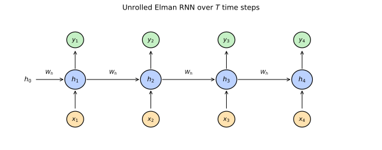
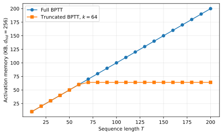
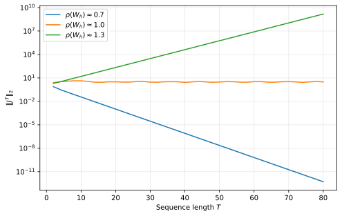
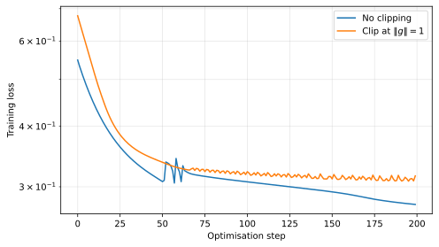
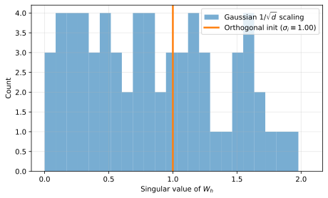

+++
title = "Recurrent Neural Networks"
date = 2026-05-13
description = "A short note on recurrent neural networks: the Elman cell, sequential inductive bias, backpropagation through time, vanishing and exploding gradients, gradient clipping, and orthogonal initialisation."

[taxonomies]
tags = ["machine-learning", "supervised-learning", "deep-learning", "sequence-modelling"]
categories = ["notes"]

[extra]
math = true
+++

## From independent samples to sequences

The [neural-network](/blog/neural-network/) post built a model that maps a fixed-length vector $\mathbf{x} \in \mathbb{R}^{D}$ to a prediction. That assumption breaks twice when the input is a sequence. The length is not fixed: a sentence may have five tokens or fifty, an audio clip may be two seconds or twenty. The order matters: "dog bites man" is not "man bites dog" with the words shuffled, and a Markov chain trained on shuffled inputs cannot recover what the order was telling it.

A first reflex is to flatten. Pad every sequence to a maximum length $T\_{\max}$, concatenate the per-step inputs into a vector of size $T\_{\max} \cdot D$, and feed it through an MLP. Two problems follow. The model has to learn separate parameters for each time step ($T\_{\max} \cdot D \cdot d$ weights for the first hidden layer alone), which is wasteful when the function we want is the same at every step ("does this token continue a noun phrase?" does not depend on whether the noun phrase started at position three or position thirty). And the model has no way to handle a sequence longer than $T\_{\max}$ at test time, since the input shape is wired into the architecture.

A **recurrent neural network** (RNN) fixes both issues by sharing parameters across time. A single update rule, with the same weights, is applied at every step to combine the current input with a hidden state carried forward from the previous step. The hidden state is the model's running summary of everything seen so far, and the parameter count is independent of sequence length, just as the parameter count of a [convolutional network](/blog/convolutional-network/) is independent of image size. The two architectures are mirror images: convolution shares weights across spatial positions, recurrence shares weights across time steps.

The trade-off is that the recurrent computation is inherently sequential. The hidden state at time $t$ depends on the hidden state at time $t - 1$, which depends on $t - 2$, and so on, so a sequence of length $T$ requires $T$ sequential matrix multiplications during the forward pass and another $T$ during the backward pass. Modern attention-based architectures sacrifice the linear-in-$T$ memory of an RNN for a quadratic-in-$T$ but fully parallel computation; we will revisit that contrast at the end of this post.

## The recurrent cell

The simplest recurrent layer is the **Elman cell**{{ reference(key="elman1990finding") }}, which combines the previous hidden state with the current input through a single nonlinear update. Let $\mathbf{x}\_t \in \mathbb{R}^{d\_{\text{in}}}$ denote the input at time $t \in \\{1, \ldots, T\\}$, $\mathbf{h}\_t \in \mathbb{R}^{d\_{\text{hid}}}$ the hidden state, and $\mathbf{y}\_t \in \mathbb{R}^{d\_{\text{out}}}$ the output. With $\mathbf{h}\_0 = \mathbf{0}$ as the initial state, the recurrent update is


\mathbf{z}_t = \mathbf{W}_x\, \mathbf{x}_t + \mathbf{W}_h\, \mathbf{h}_{t-1} + \mathbf{b},



\mathbf{h}_t = \phi(\mathbf{z}_t),


with $\phi$ an elementwise non-linearity. The output is read off from the hidden state through a separate affine layer,


\mathbf{y}_t = \mathbf{W}_y\, \mathbf{h}_t + \mathbf{c}.


The parameters are $\boldsymbol{\theta} = (\mathbf{W}\_x, \mathbf{W}\_h, \mathbf{b}, \mathbf{W}\_y, \mathbf{c})$, with shapes $\mathbf{W}\_x \in \mathbb{R}^{d\_{\text{hid}} \times d\_{\text{in}}}$, $\mathbf{W}\_h \in \mathbb{R}^{d\_{\text{hid}} \times d\_{\text{hid}}}$, $\mathbf{b} \in \mathbb{R}^{d\_{\text{hid}}}$, $\mathbf{W}\_y \in \mathbb{R}^{d\_{\text{out}} \times d\_{\text{hid}}}$, and $\mathbf{c} \in \mathbb{R}^{d\_{\text{out}}}$, none of which depend on $t$.

The standard activation choice is $\phi = \tanh$, which keeps $\mathbf{h}\_t$ bounded in $(-1, 1)^{d\_{\text{hid}}}$ and avoids the runaway growth that ReLU would cause when $\mathbf{W}\_h$ has any eigenvalue larger than $1$ in modulus. We will see in the vanishing/exploding section that this choice has consequences for gradient flow.

<figure>

<figcaption>The Elman RNN unrolled over four time steps. The shared weight matrix $\mathbf{W}_h$ connects each hidden state to the next; the same $\mathbf{W}_x$, $\mathbf{W}_y$, and biases are reused at every step.</figcaption>
</figure>

The forward pass over a length-$T$ sequence is a single Python loop:

{{ include_code(path="content/blog/recurrent-neural-network/plots.py", syntax="python", start=14, end=22) }}

Two design choices deserve names. **One-to-many** networks emit an output at every time step (sequence labelling, language modelling). **Many-to-one** networks emit a single output after the last step ($\mathbf{y} = \mathbf{W}\_y\, \mathbf{h}\_T + \mathbf{c}$, classification of an entire sentence). The forward pass is identical in both; the only difference is whether the output head is applied at every $t$ or only at $t = T$.

## Sequential inductive bias and parameter sharing

The recurrent update is **time-shift equivariant** in a sense exactly analogous to the [translation equivariance](/blog/convolutional-network/) of convolution. Define the time-shift operator $S\_{\Delta}$ by $(S\_\Delta \mathbf{x})\_t = \mathbf{x}\_{t - \Delta}$ on the integer time axis (taking inputs to be zero outside the observed range).


For any parameters $(\mathbf{W}\_x, \mathbf{W}\_h, \mathbf{b}, \mathbf{W}\_y, \mathbf{c})$, the Elman RNN initialised at $\mathbf{h}\_0 = \mathbf{0}$ satisfies
$$\mathrm{RNN}(S\_\Delta \mathbf{x}) = S\_\Delta\, \mathrm{RNN}(\mathbf{x})$$
on the bi-infinite time axis (and on a finite axis up to boundary effects from the choice of $\mathbf{h}\_0$).



Substitute $\mathbf{x}'\_t = \mathbf{x}\_{t - \Delta}$ into {{ eqref(id="rnn-pre") }}, {{ eqref(id="rnn-state") }}, and {{ eqref(id="rnn-out") }}. The recurrence

$$\mathbf{h}'\_t = \phi\big(\mathbf{W}\_x\, \mathbf{x}\_{t - \Delta} + \mathbf{W}\_h\, \mathbf{h}'\_{t-1} + \mathbf{b}\big)$$

is the same recurrence as the unshifted one, evaluated $\Delta$ steps later. Because the parameters do not depend on $t$, the solution is $\mathbf{h}'\_t = \mathbf{h}\_{t - \Delta}$ on the bi-infinite axis. The output $\mathbf{y}'\_t = \mathbf{W}\_y\, \mathbf{h}'\_t + \mathbf{c} = \mathbf{y}\_{t - \Delta}$ then follows. On a finite axis, the boundary effect is that $\mathbf{h}'\_0 = \mathbf{0}$ replaces what would otherwise be $\mathbf{h}\_{-\Delta}$, so equivariance holds exactly only after the recurrence has had time to "forget" the boundary condition. $\square$


Equivariance is what makes recurrence the right structural choice for a wide class of sequence problems. The same model can answer "is this token a noun?" at position three or position thirty without separate parameters, in the same way that a convolution can detect an edge regardless of its position in the image.

The sequence problems where equivariance is the wrong bias are also worth knowing. **Position-conditional tasks** ("what is the third word of every sentence?") need explicit position information that a vanilla RNN does not see; they are easier to handle with positional embeddings or attention. **Bidirectional context tasks** ("what is the most likely word given the words on both sides?") need information from after the current position, which a left-to-right RNN does not have; the standard fix is to run a second RNN right-to-left and concatenate the hidden states, giving a **bidirectional RNN**.

## Loss over sequences

Sequence losses are sums (or means) of per-step losses, with the per-step loss inherited unchanged from the [neural-network](/blog/neural-network/) post.

For per-step regression with target sequence $\mathbf{y}^{\star}\_1, \ldots, \mathbf{y}^{\star}\_T$ the loss is the mean squared error summed over time and averaged over the batch:


\ell = \frac{1}{T} \sum_{t=1}^{T} \frac{1}{2} \big\lVert \mathbf{y}_t - \mathbf{y}^{\star}_t \big\rVert^{2}.


For per-step categorical classification (language modelling is the canonical example, where the target at each step is the next token) the loss is the categorical cross-entropy summed over time:


\ell = -\frac{1}{T} \sum_{t=1}^{T} \log p_{\boldsymbol{\theta}}\big(\mathbf{y}^{\star}_t \,\big|\, \mathbf{x}_{1:t}\big),


with $p\_{\boldsymbol{\theta}}$ the [softmax](/blog/softmax-function/) over the output vocabulary at step $t$. For a many-to-one task the sum collapses to a single per-sequence term.

A choice that affects both training and inference is whether to feed the **ground-truth target** or the **model's own previous output** as the next-step input during training. **Teacher forcing** uses the ground-truth target, which gives a consistent training signal but leaves the model untrained on its own error trajectories; at inference time it has to extrapolate from inputs it never saw. **Free running** (or **scheduled sampling**) feeds the model's own samples, exposing it to its own mistakes but introducing high gradient variance early in training when those mistakes are wild. Most modern training pipelines use teacher forcing for stability and rely on training-data scale to bridge the train/test gap.

## Backpropagation through time

The gradient of the sequence loss with respect to the shared parameters is computed by **backpropagation through time** (BPTT), which is just the chain rule walked backwards through the unrolled computation graph in {{ eqref(id="rnn-pre") }} and {{ eqref(id="rnn-state") }}. The mechanics are identical to backpropagation in an MLP whose layer count happens to equal the sequence length and whose layer weights happen to be tied. The catch is that the tying turns the gradient into a sum over time steps, and that sum involves products of Jacobians that can vanish or explode.

We work out three propositions: the per-step output gradient at the head, the recurrence relating the hidden-state gradient at time $t$ to the gradient at time $t + 1$, and the per-parameter gradients in terms of the per-step quantities. As before, define the per-step pre-activation gradient


\boldsymbol{\delta}_t = \frac{\partial \ell}{\partial \mathbf{z}_t} \in \mathbb{R}^{d_{\text{hid}}},


with $\mathbf{z}\_t$ the pre-activation from {{ eqref(id="rnn-pre") }}.


For the per-step regression loss in {{ eqref(id="rnn-mse") }},
$$\frac{\partial \ell}{\partial \mathbf{y}\_t} = \frac{1}{T} (\mathbf{y}\_t - \mathbf{y}^{\star}\_t).$$
For the per-step categorical loss in {{ eqref(id="rnn-ce") }} with a softmax head,
$$\frac{\partial \ell}{\partial \mathbf{z}^{\text{out}}\_t} = \frac{1}{T} (\mathbf{p}\_t - \mathbf{y}^{\star}\_t),$$
with $\mathbf{p}\_t$ the softmax probabilities and $\mathbf{y}^{\star}\_t$ the one-hot target.


The proof is identical to the output-layer error proposition in the [neural-network](/blog/neural-network/) post; the $1/T$ factor is the only change.


For $t = T, T - 1, \ldots, 1$, let $\mathbf{e}\_t = \mathbf{W}\_y^{\top}\, \partial \ell / \partial \mathbf{y}\_t$ be the gradient of the loss with respect to $\mathbf{h}\_t$ contributed by the output head at time $t$ alone. Then
$$\boldsymbol{\delta}\_t = \big(\mathbf{e}\_t + \mathbf{W}\_h^{\top}\, \boldsymbol{\delta}\_{t+1}\big) \odot \phi'(\mathbf{z}\_t),$$
with $\boldsymbol{\delta}\_{T+1} = \mathbf{0}$ and $\odot$ the elementwise product.



Apply the chain rule to $\partial \ell / \partial z\_{t, j}$, summing over the two paths through which $z\_{t, j}$ influences the loss: directly via the output $\mathbf{y}\_t$ at the same step, and indirectly via the next pre-activation $\mathbf{z}\_{t+1}$:

$$
\begin{aligned}
\delta\_{t, j}
&= \frac{\partial \ell}{\partial z\_{t, j}} \\\\
&= \sum\_{i} \frac{\partial \ell}{\partial y\_{t, i}} \cdot \frac{\partial y\_{t, i}}{\partial z\_{t, j}} + \sum\_{k} \frac{\partial \ell}{\partial z\_{t+1, k}} \cdot \frac{\partial z\_{t+1, k}}{\partial z\_{t, j}}.
\end{aligned}
$$

Through the output head, $y\_{t, i} = \sum\_j W\_{y, ij}\, h\_{t, j} + c\_i$ and $h\_{t, j} = \phi(z\_{t, j})$, so the first sum is $\big(\mathbf{W}\_y^{\top} \partial \ell / \partial \mathbf{y}\_t\big)\_j \cdot \phi'(z\_{t, j}) = e\_{t, j} \phi'(z\_{t, j})$. Through the recurrence, $z\_{t+1, k} = \sum\_j W\_{h, kj}\, h\_{t, j} + \cdots$ and $h\_{t, j} = \phi(z\_{t, j})$, so the second sum is $\big(\mathbf{W}\_h^{\top} \boldsymbol{\delta}\_{t+1}\big)\_j \cdot \phi'(z\_{t, j})$. Adding the two paths and pulling out $\phi'(z\_{t, j})$ as a common factor gives the claimed elementwise product. $\square$



Summing the per-step contributions over time,
$$
\begin{aligned}
\frac{\partial \ell}{\partial \mathbf{W}\_x} &= \sum\_{t=1}^{T} \boldsymbol{\delta}\_t\, \mathbf{x}\_t^{\top}, \\\\
\frac{\partial \ell}{\partial \mathbf{W}\_h} &= \sum\_{t=1}^{T} \boldsymbol{\delta}\_t\, \mathbf{h}\_{t-1}^{\top}, \\\\
\frac{\partial \ell}{\partial \mathbf{b}}   &= \sum\_{t=1}^{T} \boldsymbol{\delta}\_t,
\end{aligned}
$$
and
$$\frac{\partial \ell}{\partial \mathbf{W}\_y} = \sum\_{t=1}^{T} \frac{\partial \ell}{\partial \mathbf{y}\_t}\, \mathbf{h}\_t^{\top}, \qquad \frac{\partial \ell}{\partial \mathbf{c}} = \sum\_{t=1}^{T} \frac{\partial \ell}{\partial \mathbf{y}\_t}.$$


The proof differentiates {{ eqref(id="rnn-pre") }} and {{ eqref(id="rnn-out") }} with respect to each parameter; the sum over time arises because every parameter appears in every step. The result mirrors the per-parameter gradient proposition in the [neural-network](/blog/neural-network/) post, with the additional sum.

The complete BPTT loop fits in twenty lines of NumPy:

{{ include_code(path="content/blog/recurrent-neural-network/plots.py", syntax="python", start=24, end=46) }}


Time is $O\big(B T\, (d\_{\text{hid}}^{2} + d\_{\text{hid}} d\_{\text{in}} + d\_{\text{hid}} d\_{\text{out}})\big)$ for a batch of size $B$ and sequence length $T$, dominated by the $T$ matrix multiplications by $\mathbf{W}\_h$ in each direction. Memory is $O(B T d\_{\text{hid}})$ to cache the hidden states for the backward pass, linear in the sequence length. **Truncated BPTT** runs the forward pass on the full sequence but backpropagates only $k$ steps at a time, capping the memory at $O(B k d\_{\text{hid}})$ at the cost of biased gradients for dependencies longer than $k$. Typical choices are $k \in [32, 256]$, balancing memory against the longest dependency the model can learn.


<figure>

<figcaption>Activation memory of full BPTT grows linearly with sequence length; truncated BPTT caps it at the truncation horizon $k$, at the cost of dropping any dependency longer than $k$.</figcaption>
</figure>

## Vanishing and exploding gradients

Walking the BPTT recurrence in {{ mref(kind="proposition", id="rnn-bptt-recurrence") }} backwards through $T$ time steps multiplies the gradient by the per-step Jacobian


\mathbf{J}_t = \mathbf{W}_h^{\top}\, \mathrm{diag}\big(\phi'(\mathbf{z}_t)\big)


at every step. The contribution to $\boldsymbol{\delta}\_t$ from a loss term $T - t$ steps in the future is therefore the product


\prod_{j=t+1}^{T} \mathbf{J}_j\, \cdot\, \mathbf{e}_T,


and the norm of this product depends on the spectral properties of the $\mathbf{J}\_j$.


Suppose $\mathbf{W}\_h$ has spectral radius $\rho(\mathbf{W}\_h)$ and the activation $\phi$ has bounded derivative $\lvert \phi' \rvert \le M$ (so $M = 1$ for $\tanh$). Let $\rho^{\star} = \rho(\mathbf{W}\_h) \cdot M$ denote the effective spectral radius of the per-step Jacobian. Then for any matrix norm $\lVert \cdot \rVert$ the product of $T$ Jacobians satisfies
$$\Big\lVert \prod\_{j=1}^{T} \mathbf{J}\_j \Big\rVert = \Theta\big((\rho^{\star})^{T}\big),$$
which decays exponentially to zero if $\rho^{\star} < 1$ and grows exponentially without bound if $\rho^{\star} > 1$.



Consider the homogeneous case $\phi'(\mathbf{z}\_t) = M$ for all $t$, so $\mathbf{J}\_t = M \mathbf{W}\_h^{\top}$. The product becomes $M^{T} (\mathbf{W}\_h^{\top})^{T}$. By the spectral radius formula, $\lVert (\mathbf{W}\_h^{\top})^{T} \rVert^{1/T} \to \rho(\mathbf{W}\_h)$ as $T \to \infty$, so the norm of the product behaves like $\big(M \rho(\mathbf{W}\_h)\big)^{T} = (\rho^{\star})^{T}$. The general case where $\phi'(\mathbf{z}\_t)$ varies across steps changes the constants but preserves the exponential rate as long as $\phi'$ is bounded above and below. Bengio, Simard, and Frasconi{{ reference(key="bengio1994learning") }} formalised this argument and identified it as the central obstacle to learning long-range dependencies with vanilla RNNs. $\square$


The consequence is severe. With $\tanh$ activation ($M = 1$) and a randomly initialised $\mathbf{W}\_h$ scaled to have $\rho(\mathbf{W}\_h) \approx 1$, the per-step Jacobian has $\rho^{\star} \approx 1$ and the product hovers around constant norm. Push $\rho(\mathbf{W}\_h)$ a few percent above $1$ and the gradient explodes, becoming numerically infinite within a few hundred steps; push it a few percent below $1$ and the gradient vanishes, becoming numerically zero just as fast.

<figure>

<figcaption>Spectral norm of the product of $T$ Jacobians, as a function of $T$, for three values of the spectral radius of $\mathbf{W}_h$. The vanilla RNN has no native mechanism to keep this near $1$ across long sequences.</figcaption>
</figure>

The practical effect of the exponential decay is that vanilla RNNs cannot learn dependencies that span more than a few dozen time steps. The gradient signal from a loss term at time $T$ is, by the time it reaches the parameters at time $t \ll T$, indistinguishable from noise. This was the standard observation that motivated **gated** recurrent variants (LSTM and GRU), which we discuss below.

## Mitigations

Three techniques manage the vanishing/exploding gradient problem in vanilla RNNs without changing the architecture. None of them solves it; the fix that does is to change the cell, which we defer to a future post.

### Gradient clipping

The fastest fix for explosions is to bound the gradient norm during optimisation. **Gradient clipping**{{ reference(key="pascanu2013difficulty") }} rescales the gradient whenever its norm exceeds a threshold $\tau$, leaving it untouched otherwise.


Let $\mathbf{g} = \nabla\_{\boldsymbol{\theta}} \ell$ be the gradient and $\tau > 0$ a threshold. The clipped gradient is
$$\widetilde{\mathbf{g}} = \min\!\left(1, \frac{\tau}{\lVert \mathbf{g} \rVert}\right) \cdot \mathbf{g}.$$
The optimiser uses $\widetilde{\mathbf{g}}$ in place of $\mathbf{g}$. Clipping rescales the magnitude but preserves the direction of the gradient, which is the property that makes it benign for first-order methods.


Typical thresholds are $\tau \in [1, 10]$ on a per-gradient or per-parameter-block basis. Clipping leaves the optimiser otherwise unchanged: SGD, momentum, or Adam from the [neural-network](/blog/neural-network/) post all work with the clipped gradient as a drop-in replacement.

<figure>

<figcaption>Training a vanilla RNN with spectral radius slightly above $1$. Without clipping, the gradient explodes and training diverges within a few dozen steps. With $\tau = 1$, the same setup descends to a low loss.</figcaption>
</figure>

Clipping addresses explosions but does nothing for vanishing gradients: a gradient of norm $10^{-12}$ is rescaled to itself, since it is already below any reasonable threshold. The two failure modes are not symmetric: explosion is loud (NaN losses, unbounded weights) and easy to detect; vanishing is quiet (loss plateaus, dependencies are silently ignored) and requires looking at gradient norms to diagnose.

### Orthogonal initialisation

A complementary fix for the initial spectral radius is to initialise $\mathbf{W}\_h$ as an orthogonal matrix. Orthogonal matrices have all singular values equal to $1$, so the per-step Jacobian at initialisation has $\rho^{\star} = M \le 1$ for any bounded-derivative activation, and the product of Jacobians stays at norm $1$ for as long as the activation derivative is close to $1$.


Draw $\mathbf{W}\_h$ as the orthogonal factor $\mathbf{Q}$ in the QR decomposition $\mathbf{A} = \mathbf{Q} \mathbf{R}$ of a Gaussian matrix $\mathbf{A} \in \mathbb{R}^{d\_{\text{hid}} \times d\_{\text{hid}}}$ with i.i.d. $\mathcal{N}(0, 1)$ entries. The resulting $\mathbf{W}\_h$ satisfies $\mathbf{W}\_h^{\top} \mathbf{W}\_h = \mathbf{I}$, so all of its singular values equal $1$ and its spectral radius is exactly $1$. Initialise $\mathbf{W}\_x$ with He or Xavier scaling depending on the activation, and initialise $\mathbf{b}, \mathbf{c}, \mathbf{W}\_y$ to small random or zero values.



The QR decomposition of any invertible matrix produces an orthogonal $\mathbf{Q}$. With probability $1$, a Gaussian matrix is invertible. The singular value decomposition of an orthogonal matrix is $\mathbf{Q} = \mathbf{U} \mathbf{I} \mathbf{V}^{\top}$, so all singular values are $1$. The spectral radius is the maximum absolute eigenvalue, which lies between the smallest and largest singular value, hence equals $1$. Saxe, McClelland, and Ganguli{{ reference(key="saxe2014exact") }} showed that this scaling preserves the gradient norm exactly through deep linear networks, and that the property degrades gracefully for shallow non-linear networks. $\square$


<figure>

<figcaption>Singular values of $\mathbf{W}_h$ at initialisation. Gaussian scaling with $\sigma = 1/\sqrt{d}$ gives a Marchenko-Pastur-shaped distribution with several singular values well above $1$ and several near $0$. Orthogonal init pins every singular value to exactly $1$.</figcaption>
</figure>

Orthogonal init is a useful start, but it is preserved only at $t = 0$. Gradient updates push the matrix off the orthogonal manifold, and after a few hundred optimisation steps the spectral radius drifts. **Unitary RNNs** and **Householder parameterisations** keep $\mathbf{W}\_h$ on the orthogonal manifold throughout training at the cost of a more expensive update rule, but they are rarely used in modern practice; the standard solution is to switch to a gated cell that does not need orthogonality to behave well.

### Why ReLU is rare in vanilla RNN hidden states

Convolutional and feedforward networks default to ReLU because the unbounded positive side keeps gradients alive through deep stacks. The same property is a liability in a recurrent cell. With ReLU and any $\mathbf{W}\_h$ that has eigenvalue larger than $1$, the hidden state can grow without bound across time, producing numerical overflow and gradients that explode for the same reason as the unclipped Jacobian product. The standard choice is therefore $\tanh$, whose bounded range $(-1, 1)$ keeps the hidden state numerically stable at the cost of a derivative that saturates and contributes to the vanishing problem. **IRNN** initialises $\mathbf{W}\_h = \mathbf{I}$ with ReLU activations and clipping, and was a brief mid-2010s alternative; it was superseded by gated cells.

## Stable variants exist

The vanishing-gradient diagnosis points directly at a fix: change the cell so that the per-step Jacobian has a guaranteed eigenvalue near $1$ along the directions that carry useful information. The two standard answers are the **long short-term memory** cell{{ reference(key="hochreiter1997lstm") }} and the **gated recurrent unit**. Both replace the single hidden state with a pair of vectors (a hidden state and a separate "memory cell") and introduce learnt **gates** that control how much of the previous memory is preserved, how much is overwritten, and how much is read out. The gates are sigmoidal and the memory update is (close to) additive rather than multiplicative, which keeps the Jacobian product near identity along the gate-protected directions and lets the model learn dependencies spanning thousands of steps in practice.

A separate response gives up on the recurrent computation entirely. **Attention**, the building block of the [transformer](/blog/transformer/) architecture, lets every output position read directly from every input position with no Jacobian product in between. The cost is the quadratic-in-$T$ memory and compute, but the absence of any vanishing path through time turns out to be worth it for any task where parallel hardware is available and sequence length is bounded by tens of thousands of tokens rather than millions. Modern large language models are essentially attention-only, with recurrent components surviving mostly in low-resource or streaming-inference settings where the linear-in-$T$ memory of an RNN is the deciding factor.

Both LSTM/GRU and attention deserve their own notes. We mention them here only to be honest about where the limit of the vanilla RNN sits, and to flag that the choices in this post (gradient clipping, orthogonal init, $\tanh$ activation) are mitigations for an architecture that has been largely retired in favour of the alternatives.

### A worked example by hand

To make BPTT concrete, here is a single training step for a tiny network: scalar input ($d\_{\text{in}} = 1$), scalar hidden state ($d\_{\text{hid}} = 1$), scalar output ($d\_{\text{out}} = 1$), $\tanh$ activation, two-step sequence, MSE loss. The parameters are


W_x = 0.5, \qquad W_h = 0.8, \qquad b = 0, \qquad W_y = 1.0, \qquad c = 0,


and the inputs and targets are $x\_1 = 1$, $x\_2 = 0.5$, $y^{\star}\_1 = 0.3$, $y^{\star}\_2 = 0.6$. All numerical values below are rounded to four decimal places. With $h\_0 = 0$:

**Forward pass.** At time $1$,


\begin{aligned}
z_1 &= 0.5 \cdot 1 + 0.8 \cdot 0 + 0 = 0.5, \\
h_1 &= \tanh(0.5) \approx 0.4621, \\
y_1 &= 1.0 \cdot 0.4621 + 0 \approx 0.4621.
\end{aligned}


At time $2$,


\begin{aligned}
z_2 &= 0.5 \cdot 0.5 + 0.8 \cdot 0.4621 + 0 \approx 0.6197, \\
h_2 &= \tanh(0.6197) \approx 0.5510, \\
y_2 &= 1.0 \cdot 0.5510 + 0 \approx 0.5510.
\end{aligned}


The per-step residuals are $y\_1 - y^{\star}\_1 \approx 0.1621$ and $y\_2 - y^{\star}\_2 \approx -0.0490$, so the loss is $\ell = \tfrac{1}{2 \cdot 2} (0.1621^{2} + 0.0490^{2}) \approx 0.0072$.

**Backward pass.** The output gradients are $\partial \ell / \partial y\_t = (y\_t - y^{\star}\_t) / T$:


\frac{\partial \ell}{\partial y_1} \approx 0.0810, \qquad \frac{\partial \ell}{\partial y_2} \approx -0.0245.


The hidden-state contributions from the head are $e\_t = W\_y \cdot \partial \ell / \partial y\_t$:


e_1 \approx 0.0810, \qquad e_2 \approx -0.0245.


Initialise $\delta\_3 = 0$ and walk the BPTT recurrence in {{ mref(kind="proposition", id="rnn-bptt-recurrence") }} backwards. The $\tanh$ derivative reuses the cached states as $\phi'(z\_t) = 1 - h\_t^{2}$:


1 - h_1^{2} \approx 0.7864, \qquad 1 - h_2^{2} \approx 0.6964.


At time $2$,


\delta_2 = (e_2 + W_h \cdot 0) \cdot (1 - h_2^{2}) \approx -0.0245 \cdot 0.6964 \approx -0.0171.


At time $1$,


\delta_1 = (e_1 + W_h\, \delta_2) \cdot (1 - h_1^{2}) \approx (0.0810 + 0.8 \cdot (-0.0171)) \cdot 0.7864 \approx 0.0530.


The per-parameter gradients now sum the per-step contributions from {{ mref(kind="proposition", id="rnn-grads") }}:


\begin{aligned}
\frac{\partial \ell}{\partial W_x} &= \delta_1\, x_1 + \delta_2\, x_2 \approx 0.0530 \cdot 1 + (-0.0171) \cdot 0.5 \approx 0.0445, \\
\frac{\partial \ell}{\partial W_h} &= \delta_1\, h_0 + \delta_2\, h_1 \approx 0 + (-0.0171) \cdot 0.4621 \approx -0.0079, \\
\frac{\partial \ell}{\partial b}   &= \delta_1 + \delta_2 \approx 0.0359, \\
\frac{\partial \ell}{\partial W_y} &= \frac{\partial \ell}{\partial y_1}\, h_1 + \frac{\partial \ell}{\partial y_2}\, h_2 \approx 0.0810 \cdot 0.4621 + (-0.0245) \cdot 0.5510 \approx 0.0240, \\
\frac{\partial \ell}{\partial c}   &= \frac{\partial \ell}{\partial y_1} + \frac{\partial \ell}{\partial y_2} \approx 0.0566.
\end{aligned}


A single SGD step would update each parameter as $\theta \leftarrow \theta - \eta\, \nabla \ell$, with the same gradient blocks reused at every step of the loop over the sequence. The structure scales without modification to vector-valued $\mathbf{x}\_t$, $\mathbf{h}\_t$, $\mathbf{y}\_t$ and to longer sequences; only the matrix sizes change.

## Practical pitfalls


Five issues bite in practice. **Layer norm beats batch norm** for variable-length sequences and small batches: batch normalisation cannot share statistics cleanly across time steps and degrades on per-device batches smaller than $16$, exactly as flagged in the [neural-network](/blog/neural-network/) post; layer normalisation applied per time step works in both regimes. **Gradient-clipping threshold tuning** is unavoidable: too small a $\tau$ throws away useful gradient information, too large a $\tau$ lets explosions through; start at $\tau \in [1, 5]$ and adjust based on the unclipped norm distribution. **Initial hidden state choices** matter for short sequences, where the recurrence has not had time to wash out the boundary; using a learnt initial state $\mathbf{h}\_0 = \boldsymbol{\theta}\_{h\_0}$ rather than a hard-coded zero recovers a few percentage points on tasks with sequence lengths under $20$. **Padding masks** are required when batching sequences of different lengths together: the per-step loss must be set to zero on padding positions, otherwise the model learns to predict the padding token. **Teacher forcing exposure bias** lets the model accumulate small per-step errors at inference time that it never saw during training; scheduled sampling and reinforcement-learning-style fine-tuning are the standard fixes when the gap shows up in evaluation metrics.

