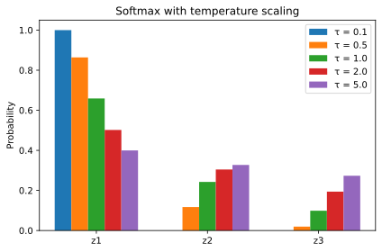

+++
title = "The Softmax Function"
date = 2026-04-19
description = "A short note on the softmax function, its properties, and a numerically stable implementation."

[taxonomies]
tags = ["machine-learning", "math"]
categories = ["notes"]

[extra]
math = true
+++

## Definition

The softmax function maps a vector $\mathbf{z} \in \mathbb{R}^K$ to a probability distribution over $K$ classes:


\sigma(\mathbf{z})_i = \frac{e^{z_i}}{\sum_{j=1}^{K} e^{z_j}}, \quad i = 1, \dots, K.


Each output satisfies $\sigma(\mathbf{z})\_i \in (0, 1)$ and $\sum\_i \sigma(\mathbf{z})\_i = 1$.

## Temperature scaling

A temperature parameter $\tau > 0$ controls the sharpness of the distribution:


\sigma(\mathbf{z}; \tau)_i = \frac{e^{z_i / \tau}}{\sum_{j=1}^{K} e^{z_j / \tau}}.


As $\tau \to 0$, the output approaches a one-hot vector (argmax). As $\tau \to \infty$, the output approaches a uniform distribution.

## Numerical stability

A naive implementation overflows for large logits. The standard trick is to subtract $\max\_j z\_j$ before exponentiating, which does not change the result:


\sigma(\mathbf{z})_i = \frac{e^{z_i - \max_j z_j}}{\sum_{j=1}^{K} e^{z_j - \max_j z_j}}.


## Implementation

{{ include_code(path="content/blog/softmax-function/plots.py", syntax="python", start=10, end=18) }}

<figure>

<figcaption>Softmax output for different temperature values</figcaption>
</figure>

## Connection to cross-entropy

The cross-entropy loss for a sample with true class $y$ is:


\mathcal{L} = -\log \sigma(\mathbf{z})_y = -z_y + \log \sum_{j=1}^{K} e^{z_j},


which is the negative log-likelihood under the softmax model. Its gradient with respect to the logits has a particularly clean form:


\frac{\partial \mathcal{L}}{\partial z_i} = \sigma(\mathbf{z})\_i - \mathbb{1}[i = y].

