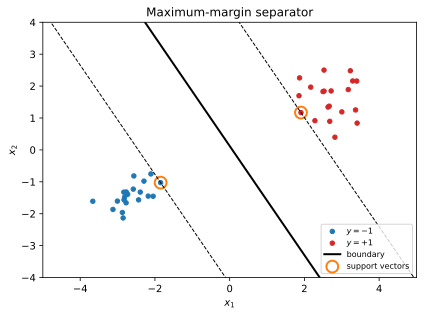
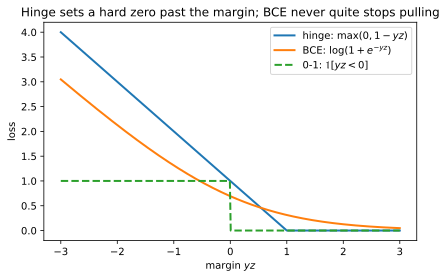
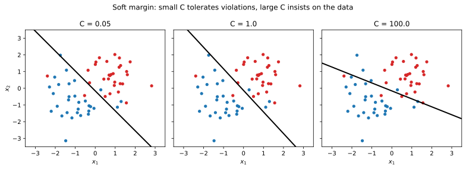
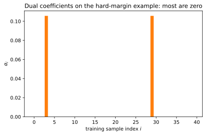
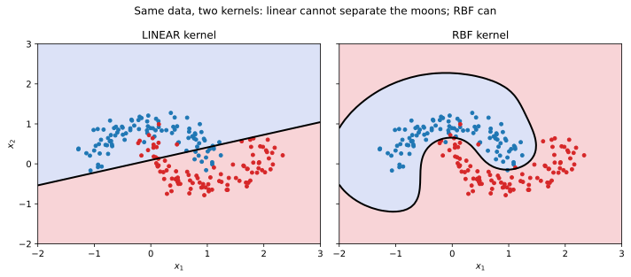
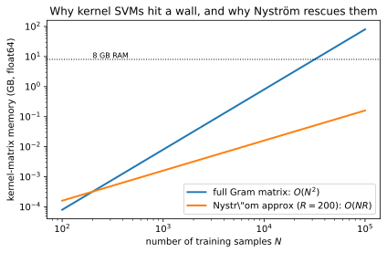

+++
title = "Support Vector Machine"
date = 2026-05-13
description = "A short note on support vector machines, the hinge loss, the dual problem, and kernels."

[taxonomies]
tags = ["machine-learning", "supervised-learning", "classification"]
categories = ["notes"]

[extra]
math = true
+++

## Univariate Hard-Margin SVM

We turn to a different angle on binary classification.
As in the [logistic regression note](/blog/logistic-regression/), the inputs are scalars $x \in \mathbb{R}$ and the labels are binary, but we now relabel the two classes as $y \in \\{-1, +1\\}$ rather than $\\{0, 1\\}$.
The reason is cosmetic.
With $\pm 1$ labels the per-sample correctness condition collapses to a single product $y\_i (\theta\_0 + \theta\_1 x\_i) > 0$, whereas the $\\{0, 1\\}$ encoding would force a case split for every formulation that follows.

Let $z(x) = \theta\_0 + \theta\_1 x$ denote the linear score and write the decision rule as


f_{\theta}(x) = \mathrm{sign}(\theta_0 + \theta_1 x).


The decision boundary is the level set $z = 0$, a single point in $\mathbb{R}$ (and a hyperplane in higher dimensions).
For a sample $(x\_i, y\_i)$, the product $y\_i z\_i$ is positive exactly when the classifier is correct, with magnitude $|z\_i|$ measuring how confidently the score sits away from the boundary.

### Functional and Geometric Margin

Logistic regression squashes the score through a sigmoid and asks for the parameters that maximise the joint label likelihood.
SVMs ignore probabilities entirely and ask a more geometric question instead: among all separating boundaries, which one sits as far as possible from the closest training point?
The intuition is that a wider margin leaves more room for the boundary to wiggle without misclassifying anything new, so the worst-case test point is harder to flip. Statistical learning theory makes this precise via VC-style generalisation bounds that decrease with margin width, which is what SVMs are built around: maximise the margin first, fit the labels second.

The two notions of margin defined below answer different questions. The **functional** margin is the raw signed score $y\_i z\_i$, ie, the value of the function $z$ at the point: it tells us whether a sample is correct and by how much under the current parameterisation, but it doubles when we double the parameters. The **geometric** margin is the actual Euclidean distance from the point to the boundary, the only quantity with a coordinate-free meaning. We optimise the geometric margin because it is what generalisation depends on, but we work with the functional margin because it is what the model directly outputs.


The **functional margin** of a sample $(x\_i, y\_i)$ under parameters $\boldsymbol{\theta}$ is $\hat{\gamma}\_i = y\_i (\theta\_0 + \theta\_1 x\_i)$.
The **geometric margin** is the signed Euclidean distance from $x\_i$ to the boundary, $\gamma\_i = \hat{\gamma}\_i / |\theta\_1|$.
The margin of the dataset is the smallest geometric margin, $\gamma = \min\_i \gamma\_i$.


The functional margin is sensitive to rescaling: multiplying $(\theta\_0, \theta\_1)$ by any positive constant $c$ scales every $\hat{\gamma}\_i$ by $c$ without moving the boundary.
The geometric margin removes that ambiguity by dividing through by $|\theta\_1|$.
This is the quantity we want to maximise.

### The Hard-Margin Program

Maximising $\gamma = \min\_i \hat{\gamma}\_i / |\theta\_1|$ over $(\theta\_0, \theta\_1)$ is awkward because the objective is invariant under positive rescaling.
The standard trick is to fix the scale by demanding that the closest point sits at functional margin exactly $1$:


\min_i\, y_i (\theta_0 + \theta_1 x_i) = 1.


Under this normalisation the geometric margin becomes $1 / |\theta\_1|$, so maximising it is equivalent to minimising $|\theta\_1|$, which is in turn equivalent to minimising $\tfrac{1}{2}\theta\_1^2$ (a smooth strictly convex objective).
The hard-margin SVM is therefore the constrained quadratic program


\min_{\theta_0, \theta_1}\; \tfrac{1}{2}\, \theta_1^2 \quad \text{subject to} \quad y_i (\theta_0 + \theta_1 x_i) \geq 1, \quad i = 1, \ldots, N.


The samples for which the constraint holds with equality are called **support vectors**, named because they alone _support_ (in the load-bearing sense) the optimal hyperplane: they are the only points that touch the margin and, as we will see in the dual, the only points whose data actually shapes the solution. Removing any non-support point leaves the boundary untouched.

<figure>

<figcaption>The hard-margin SVM picks the hyperplane that sits as far as possible from the closest points. Only the circled support vectors determine its position.</figcaption>
</figure>


The program {{ eqref(id="hard-margin") }} has a unique optimal $\theta\_1^{\ast}$ whenever the data is linearly separable, and is infeasible otherwise.



**(Feasibility.)** A feasible $(\theta\_0, \theta\_1)$ exists if and only if some hyperplane separates the two classes with strictly positive margin, which is the definition of linear separability.

**(Uniqueness of $\theta\_1^{\ast}$.)** The objective $\tfrac{1}{2}\theta\_1^2$ is strictly convex in $\theta\_1$, and the feasible set is the intersection of $N$ closed half-spaces, hence convex.
A strictly convex objective on a convex set has at most one minimiser. $\theta\_0^{\ast}$ may not be unique on its own (the bias can shift along the orthogonal direction whenever support vectors of a single class are absent), but the pair $(\theta\_0^{\ast}, \theta\_1^{\ast})$ is unique whenever support vectors exist on both sides, which is the generic case. $\square$


The linear-separability assumption is fragile.
A single mislabelled point or a small overlap between classes is enough to make {{ eqref(id="hard-margin") }} infeasible, and even when separability holds, the solution can swing wildly when one outlier sits close to the wrong side.
The soft margin fixes both problems.

## Univariate Soft-Margin SVM

We relax the constraint $y\_i z\_i \geq 1$ by allowing each sample to violate the margin by a non-negative slack $\xi\_i \geq 0$ (so named because $\xi\_i$ takes up the _slack_ between the demanded margin of $1$ and the score the model actually achieves), then pay a linear penalty $C \xi\_i$ for the violation. The constraint is now **soft** rather than hard: it can be broken at a finite cost instead of being absolutely forbidden. This is what lets the program survive non-separable data and ignore the occasional outlier that would otherwise dictate the entire solution.
The hyperparameter $C > 0$ controls the trade-off between margin width and constraint violations.


\min_{\theta_0, \theta_1, \boldsymbol{\xi}}\; \tfrac{1}{2}\, \theta_1^2 + C \sum_{i=1}^{N} \xi_i \quad \text{subject to} \quad y_i (\theta_0 + \theta_1 x_i) \geq 1 - \xi_i,\; \xi_i \geq 0.


At the optimum the slacks take the smallest value compatible with the constraints, namely $\xi\_i^{\ast} = \max(0, 1 - y\_i (\theta\_0 + \theta\_1 x\_i))$.
Substituting this back into {{ eqref(id="soft-margin") }} eliminates the $\xi\_i$ entirely and turns the program into an unconstrained minimisation in $(\theta\_0, \theta\_1)$:


\min_{\theta_0, \theta_1}\; \tfrac{1}{2}\, \theta_1^2 + C \sum_{i=1}^{N} \max\!\big(0,\; 1 - y_i (\theta_0 + \theta_1 x_i)\big).


The per-sample term is the **hinge loss**:


\ell_{\mathrm{hinge}}(y, z) = \max(0,\; 1 - y z).


It is zero whenever the score lands on the correct side of the margin ($y z \geq 1$), grows linearly into the margin and across the boundary, and has a non-differentiable kink at $y z = 1$. The name comes from the shape of its graph: a flat zero arm out to the right that bends sharply at $y z = 1$ and then drops linearly to the left, like a hinge swinging open.

<figure>

<figcaption>Hinge is exactly zero past $yz = 1$; BCE keeps pulling forever; the 0-1 loss is the discontinuous target both surrogates relax.</figcaption>
</figure>


The two losses solve the same binary classification problem but disagree on what counts as a "good enough" prediction.
BCE is positive everywhere on $(0, 1)$ and rewards pushing $\hat{p}$ ever closer to $y$, even for samples that are already confidently correct.
Hinge is exactly zero once $y z \geq 1$ and contributes nothing to the gradient from then on, so the optimal $\boldsymbol{\theta}$ depends only on the small subset of points sitting on or inside the margin (the support vectors).
This sparsity is what makes SVMs robust to outliers far from the boundary, but it also costs us calibrated probabilities: the score $z$ no longer carries any probabilistic interpretation.
Both losses are convex; only BCE is differentiable everywhere.



Let $\ell\_{\mathrm{hinge}}(y, z) = \max(0, 1 - y z)$ for $y \in \\{-1, +1\\}$ and $z \in \mathbb{R}$. Then $\ell\_{\mathrm{hinge}}$ is:

1. non-negative,
2. zero if and only if $y z \geq 1$,
3. convex in $z$, and
4. differentiable everywhere except at $y z = 1$, where it admits the sub-gradient $\partial\_z \ell\_{\mathrm{hinge}}(y, z) \in [-y, 0]$.
   


**(i)** $\ell\_{\mathrm{hinge}}$ is the maximum of $0$ and a real number, hence non-negative.

**(ii)** $\max(0, 1 - y z) = 0$ iff $1 - y z \leq 0$ iff $y z \geq 1$.

**(iii)** Both $z \mapsto 0$ and $z \mapsto 1 - y z$ are convex (the second is affine).
The pointwise maximum of convex functions is convex.

**(iv)** Where $y z > 1$ the loss equals zero with derivative $0$.
Where $y z < 1$ the loss equals $1 - y z$ with derivative $-y$.
At $y z = 1$ the two pieces meet at value $0$; any value in the convex hull $[-y, 0]$ of the two one-sided derivatives is a valid sub-gradient. $\square$


Setting the gradient to zero, as we did with the BCE cost, would solve the smooth part of the problem.
The hinge kink breaks this approach: at every active sample ($y\_i z\_i = 1$) the gradient is set-valued rather than a single vector, so the first-order optimality condition becomes a sub-differential inclusion rather than a system of equations.
There is no closed form, and we have to optimise iteratively.

## Multivariate Soft-Margin SVM

We now generalise to a vector input $\mathbf{x} \in \mathbb{R}^D$.
Unlike in the regression and logistic notes, we keep the bias $b$ separate from the weight vector $\mathbf{w}$ rather than absorbing it into an augmented $\boldsymbol{\theta}$, because the regulariser penalises $\mathbf{w}$ but not $b$.
A penalised bias would shrink the boundary towards the origin for no good reason.
With $\mathbf{w} \in \mathbb{R}^D$ and $b \in \mathbb{R}$, the model is


f_{\mathbf{w}, b}(\mathbf{x}) = \mathrm{sign}(\mathbf{w}^{\top} \mathbf{x} + b).


Stack the inputs row-wise into $\mathbf{X} \in \mathbb{R}^{N \times D}$ and the labels into $\mathbf{y} \in \\{-1, +1\\}^{N}$.
The vector of scores is $\mathbf{z} = \mathbf{X}\mathbf{w} + b\, \mathbf{1}$, and the soft-margin cost in matrix form is


J(\mathbf{w}, b) = \tfrac{1}{2}\, \lVert \mathbf{w} \rVert_2^2 + \frac{C}{N} \sum_{i=1}^{N} \max\!\big(0,\; 1 - y_i (\mathbf{w}^{\top} \mathbf{x}_i + b)\big).


The factor of $1/N$ is a normalisation choice that makes the trade-off independent of the dataset size; some references absorb it into $C$ or write the penalty as $\lambda \lVert \mathbf{w} \rVert\_2^2 / 2$ with $\lambda = 1/(NC)$.

<figure>

<figcaption>Small $C$ tolerates many margin violations and prefers a wide margin; large $C$ refuses to violate constraints and tracks the data tightly.</figcaption>
</figure>

### Sub-gradient of the Cost

The hinge loss is convex but not differentiable at the kink, so we work with the sub-differential rather than the gradient.


Let $z\_i = \mathbf{w}^{\top} \mathbf{x}\_i + b$ and define the **active set** $\mathcal{A}(\mathbf{w}, b) = \\{i : y\_i z\_i < 1\\}$.
A sub-gradient of $J$ at $(\mathbf{w}, b)$ is

$$\partial\_{\mathbf{w}} J = \mathbf{w} - \frac{C}{N} \sum\_{i \in \mathcal{A}} y\_i\, \mathbf{x}\_i, \qquad \partial\_b J = -\frac{C}{N} \sum\_{i \in \mathcal{A}} y\_i.$$



The regulariser $\tfrac{1}{2} \lVert \mathbf{w} \rVert\_2^2$ is smooth with gradient $\mathbf{w}$ in $\mathbf{w}$ and zero in $b$.
The hinge term $\ell\_i = \max(0, 1 - y\_i z\_i)$ is, by the chain rule applied piecewise, differentiable with gradient $-y\_i \mathbf{x}\_i$ in $\mathbf{w}$ and $-y\_i$ in $b$ when $y\_i z\_i < 1$, identically zero when $y\_i z\_i > 1$, and set-valued at $y\_i z\_i = 1$ where any element of the convex hull of the two one-sided gradients is a valid sub-gradient.
Picking the zero element at the kink (a measure-zero set) and summing over $i$ gives the stated expression. $\square$


The structure of $\partial\_{\mathbf{w}} J$ mirrors the prediction-error gradient of the logistic cost: a sum of $-y\_i \mathbf{x}\_i$ over the misclassified-or-near-misclassified samples, plus a regularisation pull $\mathbf{w}$.
Confidently correct samples contribute nothing.


The cost $J(\mathbf{w}, b)$ in {{ eqref(id="svm-cost-multi") }} is convex in $(\mathbf{w}, b)$, and strongly convex in $\mathbf{w}$ with parameter $\mu \geq 1$.



The regulariser $\tfrac{1}{2} \lVert \mathbf{w} \rVert\_2^2$ is $1$-strongly convex in $\mathbf{w}$ (its Hessian is $\mathbf{I}$).
Each hinge term is the composition of the convex function $\max(0, \cdot)$ with the affine map $(\mathbf{w}, b) \mapsto 1 - y\_i (\mathbf{w}^{\top} \mathbf{x}\_i + b)$, hence convex.
A non-negative sum of convex functions is convex, and adding a $1$-strongly convex term keeps the sum strongly convex along the $\mathbf{w}$ axis with the same parameter. $\square$


Strong convexity in $\mathbf{w}$ guarantees a unique optimal $\mathbf{w}^{\ast}$ for any $C > 0$, regardless of whether the data is separable.
This is the structural reason the soft-margin SVM is so much better behaved than the hard-margin version.

### Numerical Solution

The cost is convex but non-smooth, so we cannot use Newton's method directly (the Hessian is undefined at every active sample).
Three families of solvers dominate practice: stochastic sub-gradient methods on the primal, coordinate descent on the primal, and dual coordinate descent.

#### Sub-Gradient Descent and Pegasos

The simplest option is stochastic sub-gradient descent on the per-sample loss.
**Pegasos**{{ reference(key="shalev2007pegasos") }} is the canonical example: at iteration $t$ pick a random sample $i\_t$, set the step size $\eta\_t = 1 / (\lambda t)$ with $\lambda = 1/(NC)$, and update


\mathbf{w}_{t+1} = (1 - \eta_t \lambda)\, \mathbf{w}_t + \eta_t\, C\, y_{i_t}\, \mathbf{x}_{i_t}\, \mathbb{1}[y_{i_t} z_{i_t} < 1]


followed by an optional projection onto the ball $\lVert \mathbf{w} \rVert\_2 \leq 1 / \sqrt{\lambda}$, which keeps the iterates inside a region known to contain the optimum.
The bias $b$ is updated analogously.


Time $O(D)$ and memory $O(D)$.

_Time._ Each step touches a single sample: one inner product $\mathbf{w}\_t^{\top} \mathbf{x}\_{i\_t}$ for the score ($O(D)$), one scalar comparison for the active-set test, and one rank-one update to $\mathbf{w}\_t$ ($O(D)$).
The $(1 - \eta\_t \lambda)$ scaling is a single scalar multiply applied lazily across the vector.
For sparse $\mathbf{x}\_i$ with $s$ non-zeros, the per-step cost drops to $O(s)$, which is what makes Pegasos competitive on text classification with $D$ in the millions.

_Memory._ Only $\mathbf{w}\_t$ and $b\_t$ need to be stored, both $O(D)$. The design matrix lives on disk or is streamed.


Each Pegasos step is cheap, and the algorithm needs no kernel cache.
The price is the sub-linear convergence rate inherent to first-order methods on non-smooth objectives, which we quantify below.

#### Coordinate Descent on the Primal

A complementary approach is to update one coordinate of $\mathbf{w}$ at a time, holding the others fixed.
For each coordinate $j$ the one-dimensional sub-problem is convex piecewise-quadratic and admits a closed-form minimiser via a soft-thresholding operation, similar in spirit to the per-coordinate updates used in coordinate-descent solvers for the lasso.
The method is attractive when the design matrix is sparse and column-accessed, and is the engine behind LIBLINEAR's primal solvers for linear SVM.
We do not derive the per-coordinate update here.

#### Dual Coordinate Descent and SMO

The third route is to attack the dual.
Why bother with a dual at all? Two reasons. First, the dual depends on the data only through inner products $\mathbf{x}\_i^{\top} \mathbf{x}\_j$, which is exactly the structural opening that lets us swap in a kernel later and learn non-linear boundaries without touching the algorithm. Second, the number of dual variables is $N$ (one per sample) rather than $D$ (one per feature), which is the right scaling whenever $N \ll D$ (text classification with sparse high-dimensional inputs is the canonical example). Put briefly: the primal carries one weight per feature, the dual carries one weight per training point, and the dual only ever looks at the data through pairwise similarities.
Form the Lagrangian of {{ eqref(id="soft-margin") }} with multipliers $\boldsymbol{\alpha} \in \mathbb{R}^{N}\_{\geq 0}$ for the margin constraints and $\boldsymbol{\beta} \in \mathbb{R}^{N}\_{\geq 0}$ for the slack non-negativity:


\mathcal{L}(\mathbf{w}, b, \boldsymbol{\xi}, \boldsymbol{\alpha}, \boldsymbol{\beta}) = \tfrac{1}{2} \lVert \mathbf{w} \rVert_2^2 + C \sum_i \xi_i - \sum_i \alpha_i \big[y_i (\mathbf{w}^{\top} \mathbf{x}_i + b) - 1 + \xi_i\big] - \sum_i \beta_i \xi_i.


The KKT stationarity conditions $\nabla\_{\mathbf{w}} \mathcal{L} = \mathbf{0}$, $\partial \mathcal{L} / \partial b = 0$, and $\partial \mathcal{L} / \partial \xi\_i = 0$ give the three identities


\mathbf{w} = \sum_{i=1}^{N} \alpha_i y_i \mathbf{x}_i, \qquad \sum_{i=1}^{N} \alpha_i y_i = 0, \qquad \alpha_i + \beta_i = C.


The first identity is the **representer theorem** for SVMs: the optimal weight vector lies in the span of the training inputs, weighted by the Lagrange multipliers.
The third combined with $\beta\_i \geq 0$ collapses to the box constraint $0 \leq \alpha\_i \leq C$.
Substituting the three identities back into the Lagrangian eliminates $\mathbf{w}$, $b$, and $\boldsymbol{\xi}$ entirely and produces the **dual problem**:


\max_{\boldsymbol{\alpha}}\; \sum_{i=1}^{N} \alpha_i - \tfrac{1}{2} \sum_{i, j = 1}^{N} \alpha_i \alpha_j\, y_i y_j\, \mathbf{x}_i^{\top} \mathbf{x}_j \quad \text{subject to} \quad 0 \leq \alpha_i \leq C,\; \sum_{i=1}^{N} \alpha_i y_i = 0.


This is a convex QP in $\boldsymbol{\alpha}$ with a Gram-matrix structure: every entry is the inner product of two training inputs.
The KKT complementary-slackness conditions classify each sample by where its $\alpha\_i$ lands. Samples with $\alpha\_i = 0$ sit strictly outside the margin and play no role in the solution. Samples with $0 < \alpha\_i < C$ are **support vectors on the margin**, satisfying $y\_i z\_i = 1$. Samples with $\alpha\_i = C$ sit inside the margin or on the wrong side, with $\xi\_i \geq 0$.

**Sequential Minimal Optimisation** (SMO){{ reference(key="platt1998smo") }} is a coordinate-ascent method for {{ eqref(id="svm-dual") }} that exploits a clever observation.
The "minimal" in the name refers to the working set: the equality constraint $\sum\_i \alpha\_i y\_i = 0$ means we cannot update a single $\alpha\_i$ in isolation (changing one breaks the constraint), so a pair is the smallest possible working set that can move while keeping the equality satisfied.
SMO updates a pair $(\alpha\_p, \alpha\_q)$ at a time, using the constraint to express $\alpha\_q$ as a function of $\alpha\_p$, then minimising the resulting one-dimensional quadratic in $\alpha\_p$.
The per-pair sub-problem has a closed-form solution after clipping to the box $[0, C]^2$. The whole pair update is short enough to read in one go:

{{ include_code(path="content/blog/support-vector-machine/plots.py", syntax="python", start=12, end=31) }}


Per pair update: time $O(N)$ (kernel-cache hit) or $O(N D)$ (cold), memory dominated by the kernel cache.

_Time, per pair._ Updating $(\alpha\_p, \alpha\_q)$ requires the two rows $K\_{p, :}$ and $K\_{q, :}$ of the Gram matrix to evaluate the gradient terms.
With a kernel cache holding the most recently used rows, this is an $O(N)$ lookup; without it, computing each row from scratch costs $O(N D)$ for the linear kernel.
The closed-form solve for the clipped one-dimensional minimiser is $O(1)$.

_Time, per epoch._ A full sweep over heuristically chosen pairs touches $O(N)$ updates and costs $O(N^2)$ kernel work in the warm-cache regime.

_Memory._ The kernel cache, when used, occupies $O(N^2)$ in the worst case for a fully kernelised SVM.
LIBSVM caches a configurable subset; a typical default holds $\sim$200 MB regardless of $N$, falling back to recomputation on misses.


In practice one does not form $\mathbf{w}$ explicitly during SMO. The decision rule is evaluated through the dual representation $\mathbf{w} = \sum\_i \alpha\_i y\_i \mathbf{x}\_i$, which leads naturally into the kernel trick.

<figure>

<figcaption>Most $\alpha_i$ are exactly zero; only the support vectors carry weight in the dual sum.</figcaption>
</figure>

### Convergence Guarantees

The convexity of $J$ and the structure of the hinge loss admit clean convergence statements for each of the three solvers.


Let $J$ be convex with bounded sub-gradient norm $G$.
Run sub-gradient descent with step size $\eta\_t = c / \sqrt{t}$ from $\boldsymbol{\theta}\_0$.
Let $\bar{\boldsymbol{\theta}}\_T = \tfrac{1}{T} \sum\_{t=1}^{T} \boldsymbol{\theta}\_t$ be the running average. Then
$$J(\bar{\boldsymbol{\theta}}\_T) - J(\boldsymbol{\theta}^{\ast}) \leq O\!\left(\frac{G\, \lVert \boldsymbol{\theta}\_0 - \boldsymbol{\theta}^{\ast} \rVert\_2}{\sqrt{T}}\right).$$



Standard textbook result for the projected sub-gradient method on convex Lipschitz objectives. The argument bounds $\lVert \boldsymbol{\theta}\_{t+1} - \boldsymbol{\theta}^{\ast} \rVert\_2^2$ by $\lVert \boldsymbol{\theta}\_t - \boldsymbol{\theta}^{\ast} \rVert\_2^2 - 2 \eta\_t (J(\boldsymbol{\theta}\_t) - J(\boldsymbol{\theta}^{\ast})) + \eta\_t^2 G^2$ via convexity, telescopes over $t$, and applies Jensen's inequality to the running average.
See Nesterov{{ reference(key="nesterov2004convex") }}, §3.2. $\square$


The $O(1/\sqrt{T})$ rate is the price of non-smoothness: it is information-theoretically optimal for the class of convex Lipschitz problems and cannot be improved without exploiting more structure.
Pegasos does exploit more structure (strong convexity in $\mathbf{w}$) and achieves a faster rate.


Run Pegasos {{ eqref(id="pegasos-update") }} on the regularised hinge cost with $\lambda$-strong convexity and step size $\eta\_t = 1/(\lambda t)$.
After $T$ iterations,
$$\mathbb{E}[J(\bar{\mathbf{w}}\_T)] - J(\mathbf{w}^{\ast}) \leq O\!\left(\frac{\log T}{\lambda T}\right),$$
where the expectation is over the random sampling of indices.



The strong convexity of $J$ in $\mathbf{w}$ gives the bound $\lVert \mathbf{w}\_{t+1} - \mathbf{w}^{\ast} \rVert\_2^2 \leq (1 - \eta\_t \lambda) \lVert \mathbf{w}\_t - \mathbf{w}^{\ast} \rVert\_2^2 + \eta\_t^2 G\_t^2$ in expectation over $i\_t$, where $G\_t$ is the per-sample sub-gradient norm bound.
Substituting $\eta\_t = 1/(\lambda t)$ and unrolling produces a telescoping sum that decays as $O(1/(\lambda T))$, with the extra $\log T$ factor coming from the harmonic-series term.
Original analysis in Shalev-Shwartz et al.{{ reference(key="shalev2007pegasos") }}, tightened by Rakhlin et al.{{ reference(key="rakhlin2012making") }} to remove the log factor under specific averaging schemes. $\square$



Run dual coordinate ascent (e.g., SMO) on {{ eqref(id="svm-dual") }}.
Then $\boldsymbol{\alpha}\_t \to \boldsymbol{\alpha}^{\ast}$ globally, and the dual objective converges at a **linear rate**: there exist constants $c \in (0, 1)$ and $C\_0 > 0$ such that
$$D(\boldsymbol{\alpha}^{\ast}) - D(\boldsymbol{\alpha}\_t) \leq C\_0\, c^{\,t}.$$



The dual is a strongly concave QP on the polytope defined by the box and equality constraints (under mild assumptions on the data).
Cyclic or randomised coordinate ascent on a strongly concave smooth objective converges linearly; the proof reduces to bounding the per-step decrease via the Polyak-Lojasiewicz inequality.
Hsieh et al.{{ reference(key="hsieh2008dual") }} gave the first sharp linear-rate analysis for SVM dual coordinate descent, and the result underpins LIBLINEAR's default solver for $L\_2$-loss linear SVM. $\square$


The hierarchy mirrors the logistic case: a slow but cheap first-order method (Pegasos), a moderately expensive but fast specialised solver (SMO / dual coordinate descent), and the plain sub-gradient method as a baseline floor.


Three issues bite in practice.
**The choice of $C$** controls the bias-variance trade-off and has no good default: it must be tuned by cross-validation, ideally on a logarithmic grid spanning $10^{-3}$ to $10^{3}$.
**Feature scaling** matters because the margin is a Euclidean quantity and is not invariant under per-feature rescaling: standardising the inputs to zero mean and unit variance is almost always the right first step.
**Kernel cache memory** scales as $O(N^2)$ in the worst case, which blocks naive kernelised SVMs on datasets with $N \gtrsim 10^5$.
The standard remedies are sub-sampling, the Nyström approximation, or random Fourier features{{ reference(key="rahimi2007random") }}, which approximate the kernel by an explicit low-dimensional embedding and reduce the problem back to a linear SVM.


## Kernels

The dual problem {{ eqref(id="svm-dual") }} depends on the data only through the inner products $\mathbf{x}\_i^{\top} \mathbf{x}\_j$.
This is the structural fact that the **kernel trick** exploits.
Suppose we map the inputs into a higher-dimensional **feature space** $\mathcal{H}$ via some embedding $\phi: \mathbb{R}^D \to \mathcal{H}$, and define the **kernel function** $k(\mathbf{x}, \mathbf{x}') = \langle \phi(\mathbf{x}), \phi(\mathbf{x}') \rangle\_{\mathcal{H}}$.
Replacing $\mathbf{x}\_i^{\top} \mathbf{x}\_j$ with $k(\mathbf{x}\_i, \mathbf{x}\_j)$ in the dual produces an SVM that operates in $\mathcal{H}$ without ever forming $\phi(\mathbf{x})$ explicitly.
For embeddings into infinite-dimensional spaces (which the radial basis function kernel induces) this is the only computationally feasible route.


The word "trick" is earned. Naively, learning in a $10^6$-dimensional polynomial feature space looks impossible: even writing down a single $\phi(\mathbf{x})$ would not fit in memory. The kernel trick says we never have to: every place the algorithm asks for $\phi(\mathbf{x})^{\top} \phi(\mathbf{x}')$ we can substitute a closed-form $k(\mathbf{x}, \mathbf{x}')$ that is cheap to evaluate in the original $D$-dimensional space. The implicit feature map is real (Mercer's theorem promises this) but is never materialised. The way to keep this in your head is that we get the expressive power of an enormous feature space at the price of the small one we started in: the geometry is there, we just never have to write it down.


Positive definiteness is the right condition because the entries of any inner-product Gram matrix are themselves positive semidefinite, so a function that fails the condition cannot possibly arise from any feature map and is unusable as a kernel.


A symmetric function $k: \mathbb{R}^D \times \mathbb{R}^D \to \mathbb{R}$ is a **positive-definite kernel** if for any finite set of inputs $\\{\mathbf{x}\_1, \ldots, \mathbf{x}\_N\\}$ the **Gram matrix** $\mathbf{K} \in \mathbb{R}^{N \times N}$ with entries $K\_{ij} = k(\mathbf{x}\_i, \mathbf{x}\_j)$ is positive semidefinite.


Mercer's theorem is what licences the kernel trick: it says that any function passing the positive-definiteness test really does arise from _some_ feature map, so we can stay in the original input space and trust that an honest geometry exists somewhere behind the kernel.


A continuous symmetric function $k$ on a compact domain is a positive-definite kernel if and only if there exists a Hilbert space $\mathcal{H}$ and a feature map $\phi: \mathbb{R}^D \to \mathcal{H}$ such that $k(\mathbf{x}, \mathbf{x}') = \langle \phi(\mathbf{x}), \phi(\mathbf{x}') \rangle\_{\mathcal{H}}$.



The "if" direction is immediate: the Gram matrix of inner products in any Hilbert space is positive semidefinite.
The "only if" direction is the content of the theorem.
The classical proof uses the spectral decomposition of the integral operator $T\_k f(\mathbf{x}) = \int k(\mathbf{x}, \mathbf{x}') f(\mathbf{x}')\, d\mathbf{x}'$, whose eigenvalues $\lambda\_i$ and eigenfunctions $\psi\_i$ give the explicit feature map $\phi(\mathbf{x}) = (\sqrt{\lambda\_1}\, \psi\_1(\mathbf{x}), \sqrt{\lambda\_2}\, \psi\_2(\mathbf{x}), \ldots)$.
A more modern construction goes via the **reproducing kernel Hilbert space** of $k$, in which the feature map is $\phi(\mathbf{x}) = k(\mathbf{x}, \cdot)$ and the inner product is defined precisely so that $\langle k(\mathbf{x}, \cdot), k(\mathbf{x}', \cdot) \rangle = k(\mathbf{x}, \mathbf{x}')$.
See Schölkopf and Smola{{ reference(key="scholkopf2002learning") }}, Chapter 2. $\square$


The standard catalogue of kernels is short and well understood.
The **linear kernel** $k(\mathbf{x}, \mathbf{x}') = \mathbf{x}^{\top} \mathbf{x}'$ is the trivial choice and recovers the linear SVM; it is the right default whenever $D$ is large relative to $N$, as in text classification, where the inputs are already high-dimensional sparse bag-of-words vectors and the implicit feature map adds nothing.
The **polynomial kernel** $k(\mathbf{x}, \mathbf{x}') = (\mathbf{x}^{\top} \mathbf{x}' + c)^d$ implicitly maps to the space of all monomials of degree up to $d$ in the input coordinates, with the constant $c \geq 0$ trading off lower-order against higher-order terms.
The **radial basis function** (RBF) kernel $k(\mathbf{x}, \mathbf{x}') = \exp(-\gamma \lVert \mathbf{x} - \mathbf{x}' \rVert\_2^2)$ is the workhorse default for low-dimensional dense data: its implicit feature space is infinite-dimensional, and the bandwidth $\gamma$ controls how quickly similarity decays with Euclidean distance. The name says exactly what the function is: similarity depends only on the radius (the Euclidean distance) between the two points, and each training input acts as a localised "basis function" centred on itself, with influence falling off as you move away.

The kernelised decision rule follows by substituting $\mathbf{w} = \sum\_i \alpha\_i y\_i \phi(\mathbf{x}\_i)$ from {{ eqref(id="kkt-stationarity") }} into $f(\mathbf{x}) = \mathrm{sign}(\mathbf{w}^{\top} \phi(\mathbf{x}) + b)$:


f(\mathbf{x}) = \mathrm{sign}\!\left( \sum_{i \in \mathrm{SV}} \alpha_i\, y_i\, k(\mathbf{x}_i, \mathbf{x}) + b \right),


where the sum runs over the support set $\mathrm{SV} = \\{i : \alpha\_i > 0\\}$.
The evaluation is sparse in the support vectors and never touches the implicit feature map. In code, prediction is one row of the kernel between the query point and the training set, multiplied by the signed dual coefficients:

{{ include_code(path="content/blog/support-vector-machine/plots.py", syntax="python", start=33, end=36) }}

<figure>

<figcaption>Same data, two kernels: the linear kernel cannot separate the moons, but the RBF kernel sees them as linearly separable in its implicit feature space.</figcaption>
</figure>


The identity $\mathbf{w}^{\ast} = \sum\_i \alpha\_i y\_i \phi(\mathbf{x}\_i)$ is a special case of a more general result, the **representer theorem**{{ reference(key="kimeldorf1971representer") }}{{ reference(key="scholkopf2001generalized") }}.
For any regularised empirical risk problem of the form $\min\_{f \in \mathcal{H}} \sum\_i L(y\_i, f(\mathbf{x}\_i)) + \Omega(\lVert f \rVert\_{\mathcal{H}})$ with $\Omega$ strictly increasing, the optimal $f^{\ast}$ admits a finite expansion $f^{\ast}(\cdot) = \sum\_i c\_i k(\mathbf{x}\_i, \cdot)$ in the kernel basis.
The intuition is that any component of $f$ orthogonal to the span of $\\{k(\mathbf{x}\_i, \cdot)\\}\_{i=1}^N$ leaves the data-fitting term untouched (it evaluates to zero on every training input) but increases $\lVert f \rVert\_{\mathcal{H}}$ and hence the penalty, so the optimum throws those orthogonal components away.
The takeaway is that the optimal solution lives in the data: anything orthogonal to the training points is wasted norm, the penalty knows it, and the optimiser puts it back to zero.
That is what reduces a search over a (possibly infinite-dimensional) function space to a finite-dimensional optimisation in $N$ coefficients, and what justifies dual formulations more broadly, not just for SVMs.



Time $O(N^2 D)$ to fill the Gram matrix, $O(N\_{\mathrm{SV}} D)$ per prediction, and $O(N^2)$ memory for the cached kernel matrix.

_Training._ Filling $\mathbf{K}$ requires $N(N+1)/2$ kernel evaluations, each costing $O(D)$ for linear, polynomial, and RBF kernels. SMO sweeps then operate on $\mathbf{K}$ in $O(N^2)$ work per epoch.

_Prediction._ Evaluating the decision rule {{ eqref(id="kernel-decision") }} costs $O(N\_{\mathrm{SV}} D)$ per query, which is fast when the support set is small but degenerates as more samples sit on the margin.

_Memory._ The Gram matrix at $N \times N$ is the bottleneck and blocks naive kernel SVMs above $N \sim 10^5$ on commodity hardware.
**Random Fourier features**{{ reference(key="rahimi2007random") }} and the **Nyström approximation**{{ reference(key="williams2001nystrom") }} (the latter named after the Nyström method for numerically solving integral equations: it samples $R \ll N$ landmark inputs and reconstructs the full Gram matrix from a low-rank factorisation of the $R \times R$ block on those landmarks) sidestep this by approximating $k(\mathbf{x}, \mathbf{x}') \approx \phi\_R(\mathbf{x})^{\top} \phi\_R(\mathbf{x}')$ for an explicit $R$-dimensional feature map $\phi\_R$, after which a linear SVM solver suffices.


<figure>

<figcaption>The full Gram matrix grows quadratically and crosses any reasonable RAM budget at $N \sim 10^5$; Nyström keeps memory linear.</figcaption>
</figure>

## Multiclass SVM

The cleanest extension to $K > 2$ classes is **one-vs-rest**: train $K$ binary SVMs, the $k$-th distinguishing class $k$ from the union of the others, and predict $\hat{y} = \arg\max\_k (\mathbf{w}\_k^{\top} \mathbf{x} + b\_k)$.
Each sub-problem is independent and the training trivially parallelises across $K$ workers.
The drawback is calibration: the $K$ scores live on incomparable scales (each binary SVM was trained against a different negative population), so the argmax is principled only in the asymptotic regime where one classifier dominates.
For modest $K$ this works well in practice and is the default in scikit-learn for multiclass SVMs.

The principled alternative is **Crammer-Singer**, a single joint program with one weight vector $\mathbf{w}\_k$ per class and a multiclass margin loss


\ell_{\mathrm{CS}}(\mathbf{x}, y; \mathbf{W}) = \max_{k \neq y}\, \max\!\big(0,\; 1 + \mathbf{w}_k^{\top} \mathbf{x} - \mathbf{w}_y^{\top} \mathbf{x}\big).


The loss is zero when the score of the true class beats every other class by at least $1$, and otherwise penalises the gap to the most-violating wrong class.
The structure mirrors the categorical cross-entropy of the [softmax model](/blog/logistic-regression/), with the maximum playing the role of the soft-max: per-sample sub-gradients touch only the true class and the most-violating wrong class, leading to an analogous "prediction-error" structure $\sum\_i (\mathbb{1}\_{k = k\_i^{\ast}} - \mathbb{1}\_{k = y\_i})\, \mathbf{x}\_i$ where $k\_i^{\ast}$ is the most-violating class for sample $i$.
The same dualisation and kernelisation apply, producing a joint QP of size $NK$ with the box and equality structure of {{ eqref(id="svm-dual") }} replicated per class.
The full derivation is in Crammer and Singer{{ reference(key="crammer2001algorithmic") }} and is omitted here.
